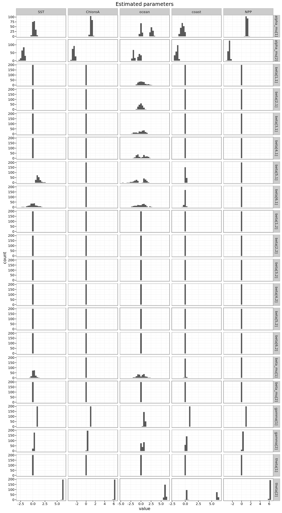
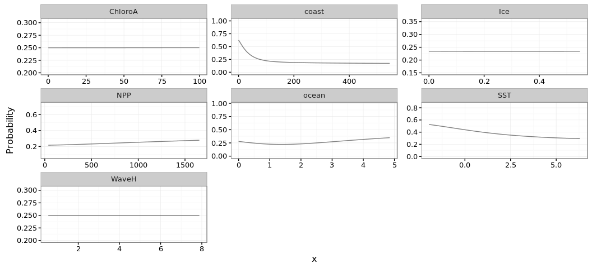

# Antarctic Whale Project: Data Exploration
Ben Weinstein  
`r Sys.time()`  


<!-- -->

##By Month

<!-- -->

#Correlated random walk

*Process Model*

$$ d_{t} \sim T*d_{t-1} + Normal(0,\Sigma)$$
$$ x_t = x_{t-1} + d_{t} $$

## Parameters

For each individual:

$$\theta = \text{Mean turning angle}$$
$$\gamma = \text{Move persistence} $$

For both behaviors process variance is:
$$ \sigma_{latitude} = 0.1$$
$$ \sigma_{longitude} = 0.1$$

##Behavioral States

$$ \text{For each individual i}$$
$$ Behavior_1 = \text{traveling}$$
$$ Behavior_2 = \text{foraging}$$

$$ \alpha_{i,1,1} = \text{Probability of remaining traveling when traveling}$$
$$\alpha_{i,2,1} = \text{Probability of switching from Foraging to traveling}$$

$$\begin{matrix}
  \alpha_{i,1,1} & 1-\alpha_{i,1,1} \\
  \alpha_{i,2,1} & 1-\alpha_{i,2,1} \\
\end{matrix}
$$

##Environment

Behavioral states are a function of local environmental conditions. The first environmental condition is ocean depth. I then build a function for preferential foraging in shallow waters.

It generally follows the form, conditional on behavior at t -1:

$$Behavior_t \sim Multinomial([\phi_{traveling},\phi_{foraging}])$$

With the probability of switching states:

$$logit(\phi_{traveling}) = \alpha_{Behavior_{t-1}} + \beta_{Month,1} * Environment_{y[t,]}$$

$$logit(\phi_{foraging}) = \alpha_{Behavior_{t-1}} $$

Following Bestley in preferring to describe the switch into feeding, but no estimating the resumption of traveling.

The effect of the environment is temporally variable such that

$$ \beta_{Month,2} \sim ~ Normal(\beta_{\mu},\beta_\tau)$$


##Continious tracks

The transmitter will often go dark for 10 to 12 hours, due to weather, right in the middle of an otherwise good track. The model requires regular intervals to estimate the turning angles and temporal autocorrelation. As a track hits one of these walls, call it the end of a track, and begin a new track once the weather improves. We can remove any micro-tracks that are less than three days.
Specify a duration, calculate the number of tracks and the number of removed points. Iteratively.


How did the filter change the extent of tracks?

<!-- -->

#Environmental Models

Looping through each covariate.

* Bathymetry
* Distance to coast
* Sea surface temperature
* Chlorophyl A
* Wave Height
* Primary Productivity
* Sea Ice Cover (%)


##Chains
<!-- -->


<!-- -->


## Parameter Summary
<!-- -->

#Behavior and environment

##Hierarchical 

<!-- --><!-- -->

## By Month

<!-- --><!-- -->


```
##                              Type     Size    PrettySize   Rows Columns
## monthall               data.frame 39710360 [1] "37.9 Mb" 763590       8
## mdat                   data.frame 27898432 [1] "26.6 Mb"  57230      61
## d          SpatialPointsDataFrame 23986392 [1] "22.9 Mb"  49938      68
## oxy                    data.frame 23184296 [1] "22.1 Mb"  49938      68
## sxy                          list 19249184 [1] "18.4 Mb"    188      NA
## mxy                        tbl_df 16704512 [1] "15.9 Mb"  34484      71
## m                           ggmap 13116624 [1] "12.5 Mb"   1280    1280
## plotall                data.frame  6111224  [1] "5.8 Mb" 127265       7
## pc                     data.frame  1126952  [1] "1.1 Mb"  28000       9
## posteriors                   list  1051328    [1] "1 Mb"      7      NA
```

```
##            used  (Mb) gc trigger   (Mb)  max used   (Mb)
## Ncells  1536619  82.1   26806501 1431.7  43588708 2327.9
## Vcells 52620450 401.5  617177466 4708.7 803549827 6130.6
```
