# Antarctic Whale Project: Data Exploration
Ben Weinstein  
`r Sys.time()`  


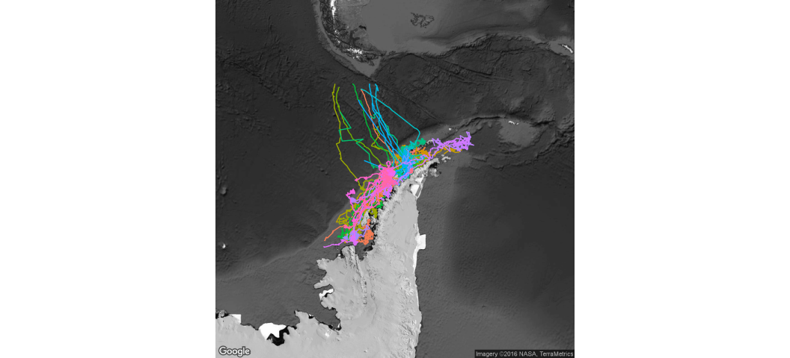<!-- -->

##By Month

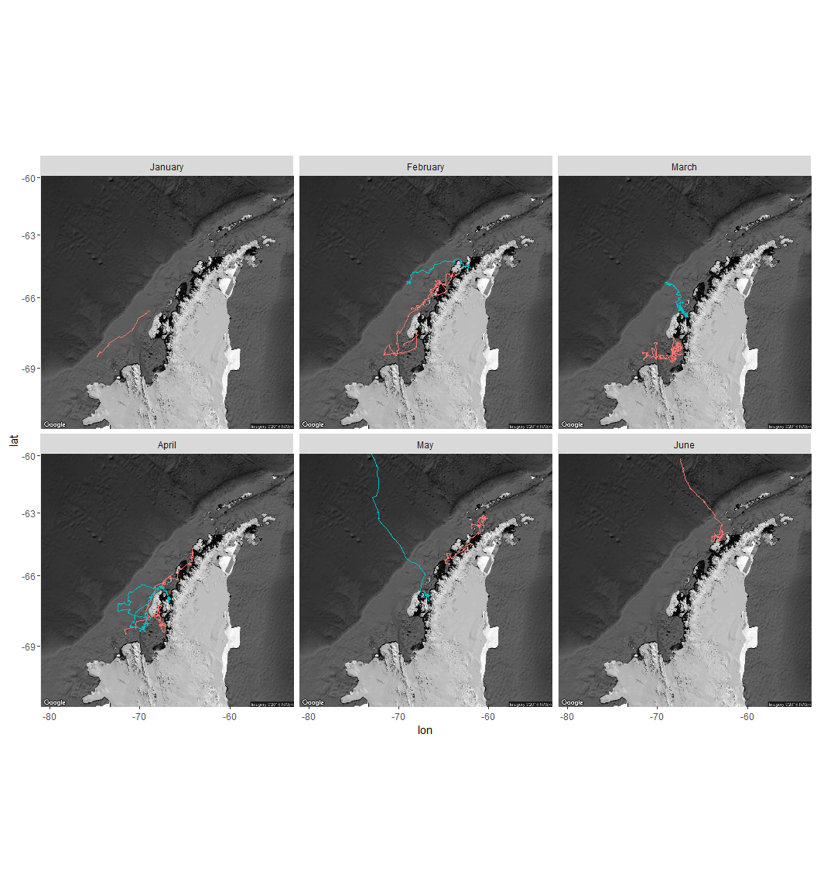<!-- -->

#Correlated random walk

*Process Model*

$$ d_{t} \sim T*d_{t-1} + Normal(0,\Sigma)$$
$$ x_t = x_{t-1} + d_{t} $$

## Parameters

For each individual:

$$\theta = \text{Mean turning angle}$$
$$\gamma = \text{Move persistence} $$

For both behaviors process variance is:
$$ \sigma_{latitude} = 0.1$$
$$ \sigma_{longitude} = 0.1$$

##Behavioral States

$$ \text{For each individual i}$$
$$ Behavior_1 = \text{traveling}$$
$$ Behavior_2 = \text{foraging}$$

$$ \alpha_{i,1,1} = \text{Probability of remaining traveling when traveling}$$
$$\alpha_{i,2,1} = \text{Probability of switching from Foraging to traveling}$$

$$\begin{matrix}
  \alpha_{i,1,1} & 1-\alpha_{i,1,1} \\
  \alpha_{i,2,1} & 1-\alpha_{i,2,1} \\
\end{matrix}
$$

##Environment

Behavioral states are a function of local environmental conditions. The first environmental condition is ocean depth. I then build a function for preferential foraging in shallow waters.

It generally follows the form, conditional on behavior at t -1:

$$Behavior_t \sim Multinomial([\phi_{traveling},\phi_{foraging}])$$

With the probability of switching states:

$$logit(\phi_{traveling}) = \alpha_{Behavior_{t-1}} + \beta_{Month,1} * Environment_{y[t,]}$$

$$logit(\phi_{foraging}) = \alpha_{Behavior_{t-1}} $$

Following Bestley in preferring to describe the switch into feeding, but no estimating the resumption of traveling.

The effect of the environment is temporally variable such that

$$ \beta_{Month,2} \sim ~ Normal(\beta_{\mu},\beta_\tau)$$


##Continious tracks

The transmitter will often go dark for 10 to 12 hours, due to weather, right in the middle of an otherwise good track. The model requires regular intervals to estimate the turning angles and temporal autocorrelation. As a track hits one of these walls, call it the end of a track, and begin a new track once the weather improves. We can remove any micro-tracks that are less than three days.
Specify a duration, calculate the number of tracks and the number of removed points. Iteratively.


How did the filter change the extent of tracks?

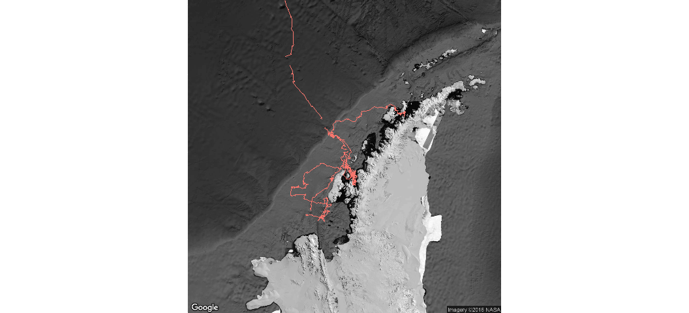<!-- -->

#Environmental Models

Looping through each covariate.

* Bathymetry
* Distance to coast
* Sea surface temperature
* Chlorophyl A
* Wave Height
* Primary Productivity
* Sea Ice Cover (%)


```
## automatically exporting the following variables from the local environment:
##   mxy, names_of_vars, runModel 
## numValues: 4, numResults: 1, stopped: FALSE
## returning status FALSE
## numValues: 5, numResults: 2, stopped: FALSE
## returning status FALSE
## numValues: 5, numResults: 2, stopped: TRUE
## numValues: 5, numResults: 3, stopped: TRUE
## returning status FALSE
## numValues: 5, numResults: 4, stopped: TRUE
## returning status FALSE
## numValues: 5, numResults: 5, stopped: TRUE
## calling combine function
## evaluating call object to combine results:
##   fun(accum, result.1, result.2, result.3, result.4, result.5)
## returning status TRUE
```

##Chains
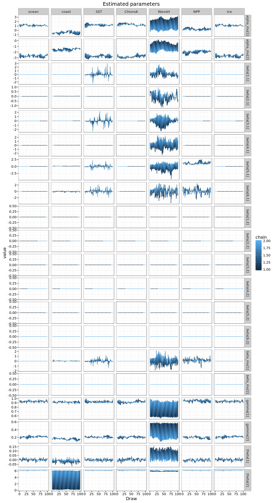<!-- -->

<!-- -->

## Parameter Summary
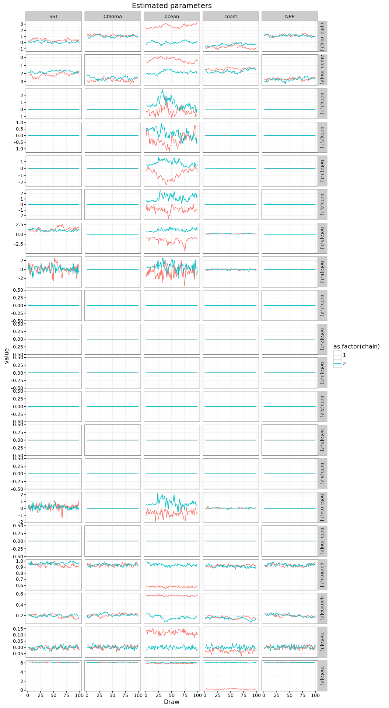<!-- -->

## Which estimates do not overlap with zero?


```
##         L1        par Significant
## 1      SST  beta[1,1]        TRUE
## 2      SST  beta[2,1]        TRUE
## 3      SST  beta[3,1]        TRUE
## 4      SST  beta[4,1]        TRUE
## 5      SST  beta[5,1]        TRUE
## 6      SST  beta[6,1]        TRUE
## 7      SST beta_mu[1]        TRUE
## 8  ChloroA  beta[1,1]        TRUE
## 9  ChloroA  beta[2,1]        TRUE
## 10 ChloroA  beta[3,1]        TRUE
## 11 ChloroA  beta[4,1]        TRUE
## 12 ChloroA  beta[5,1]        TRUE
## 13   ocean  beta[1,1]        TRUE
## 14   ocean  beta[2,1]        TRUE
## 15   ocean  beta[4,1]        TRUE
## 16   ocean  beta[5,1]        TRUE
## 17     NPP  beta[1,1]        TRUE
## 18     NPP  beta[2,1]        TRUE
## 19     NPP  beta[3,1]        TRUE
## 20     NPP  beta[4,1]        TRUE
## 21     NPP  beta[5,1]        TRUE
```

#Behavior and environment

##Hierarchical 

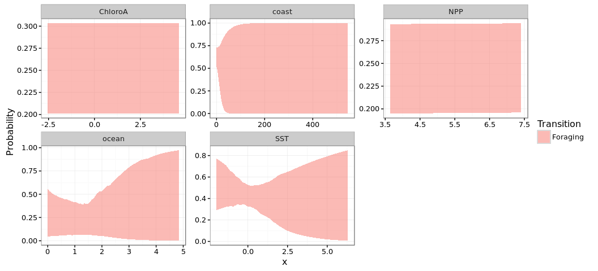<!-- -->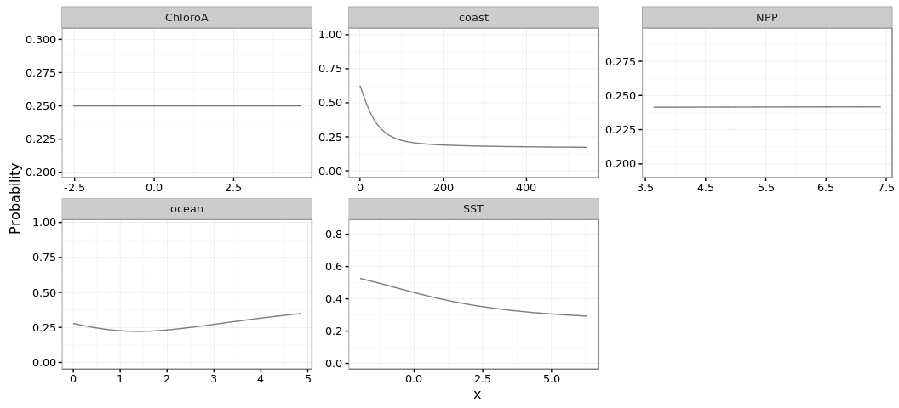<!-- -->

### Zoom in


```
## [[1]]
```

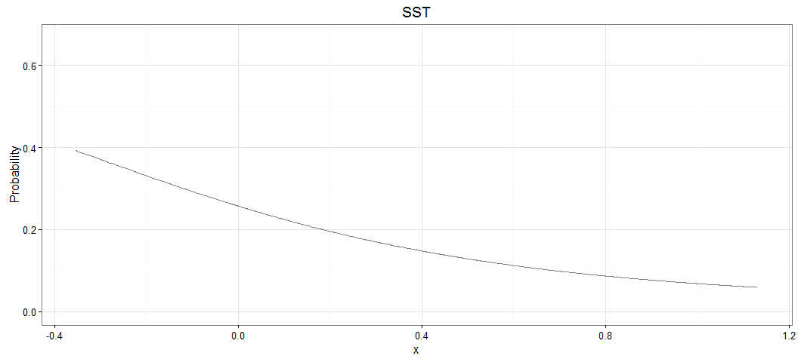<!-- -->

```
## 
## [[2]]
```

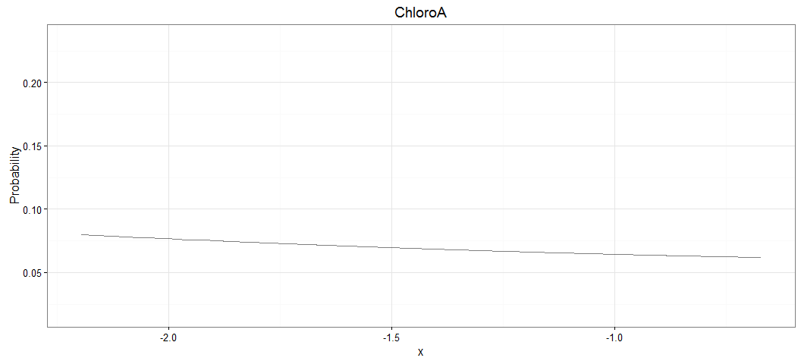<!-- -->

```
## 
## [[3]]
```

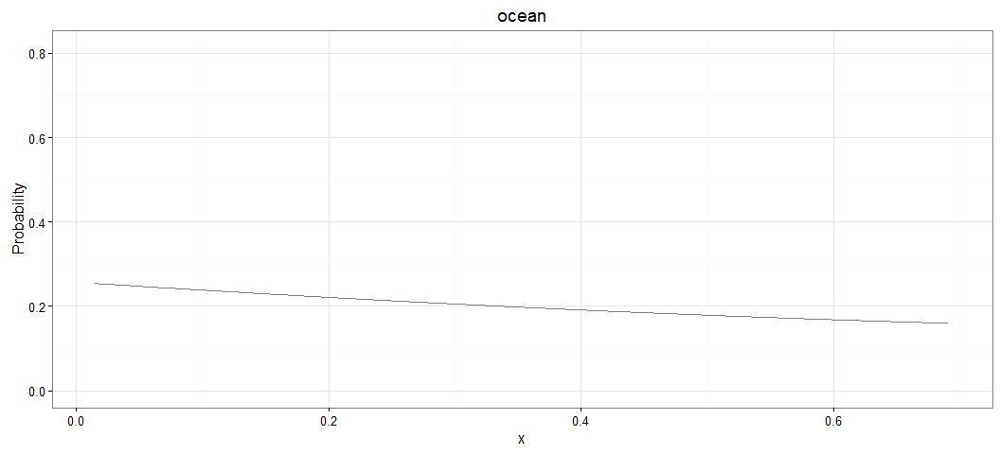<!-- -->

```
## 
## [[4]]
```

<!-- -->

```
## 
## [[5]]
```

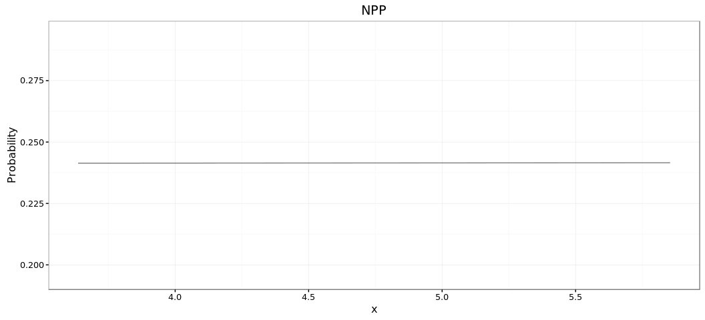<!-- -->


```
## [[1]]
```

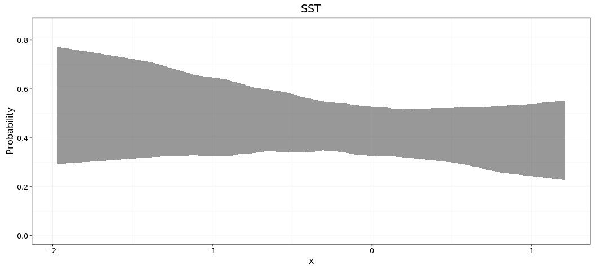<!-- -->

```
## 
## [[2]]
```

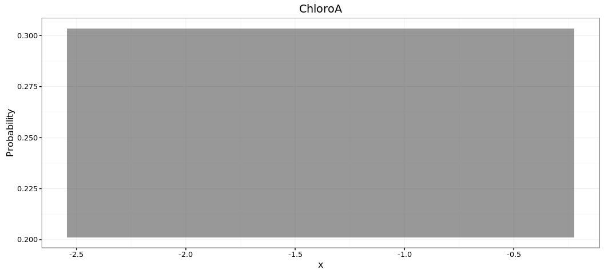<!-- -->

```
## 
## [[3]]
```

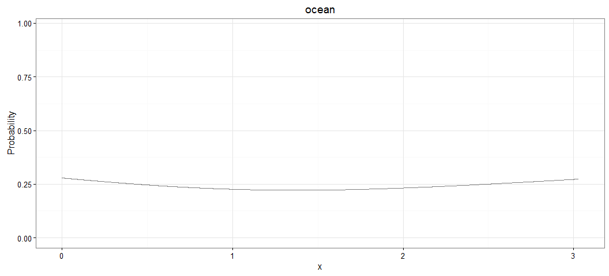<!-- -->

```
## 
## [[4]]
```

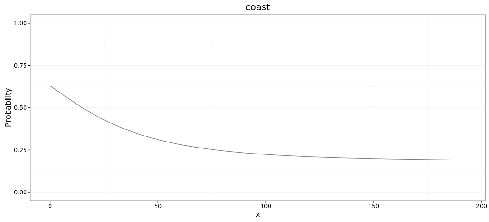<!-- -->

```
## 
## [[5]]
```

<!-- -->

## By Month

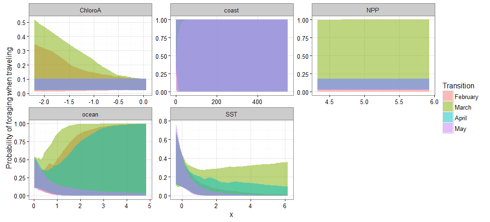<!-- -->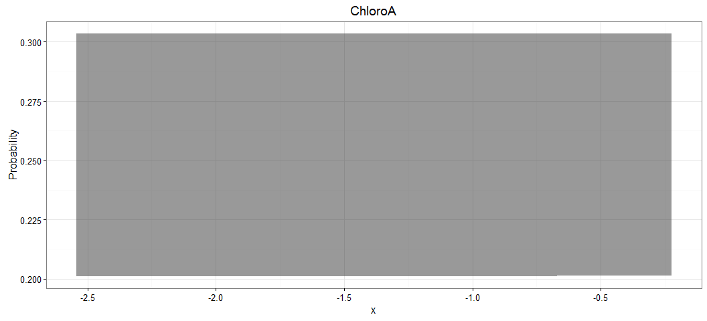<!-- -->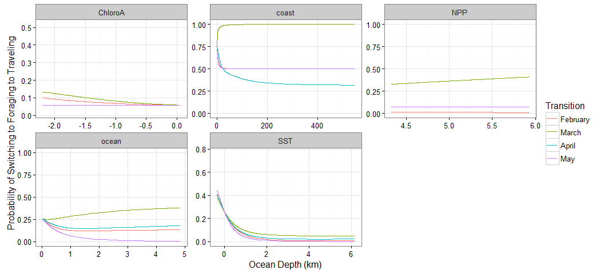<!-- -->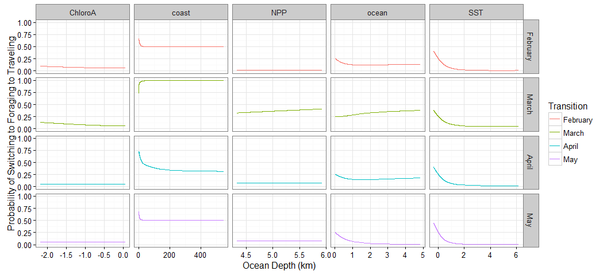<!-- -->


```
##                            Type     Size    PrettySize   Rows Columns
## monthall             data.frame 28512896 [1] "27.2 Mb" 548256       8
## mdat                 data.frame 26982544 [1] "25.7 Mb"  57230      59
## d        SpatialPointsDataFrame 23187176 [1] "22.1 Mb"  49938      66
## oxy                  data.frame 22385080 [1] "21.3 Mb"  49938      66
## sxy                        list 18658304 [1] "17.8 Mb"    188      NA
## mxy                      tbl_df 16152560 [1] "15.4 Mb"  34484      69
## m                         ggmap 13116624 [1] "12.5 Mb"   1280    1280
## p                          list  4868472  [1] "4.6 Mb"      5      NA
## pribbon                    list  4868472  [1] "4.6 Mb"      5      NA
## plotall              data.frame  4388448  [1] "4.2 Mb"  91376       7
```

```
##            used  (Mb) gc trigger   (Mb)  max used   (Mb)
## Ncells  1541608  82.4   27858283 1487.8  47136036 2517.4
## Vcells 51975586 396.6  617908278 4714.3 827726610 6315.1
```
