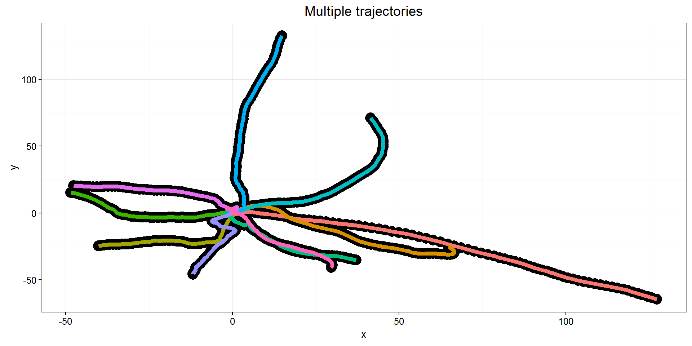
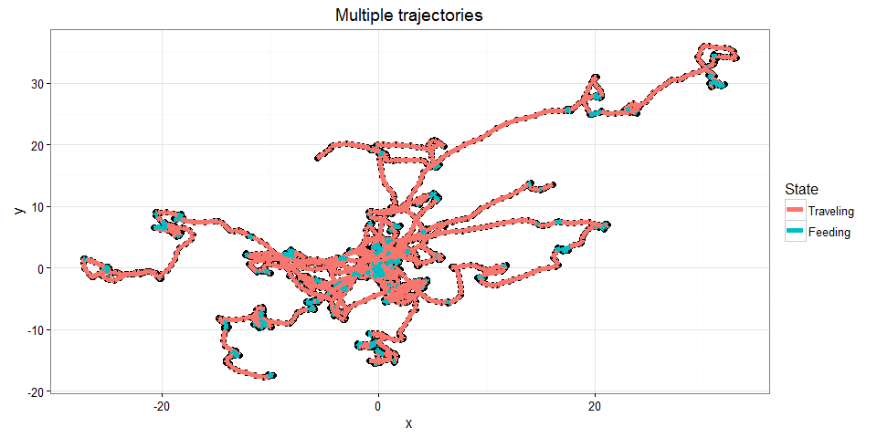
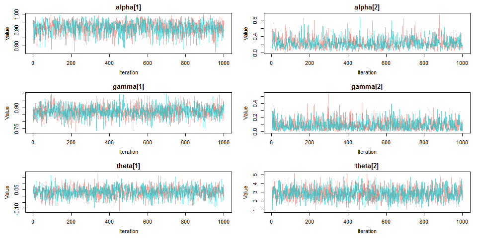
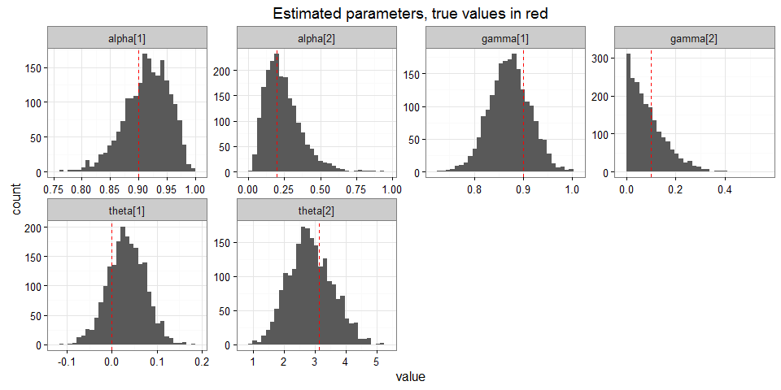
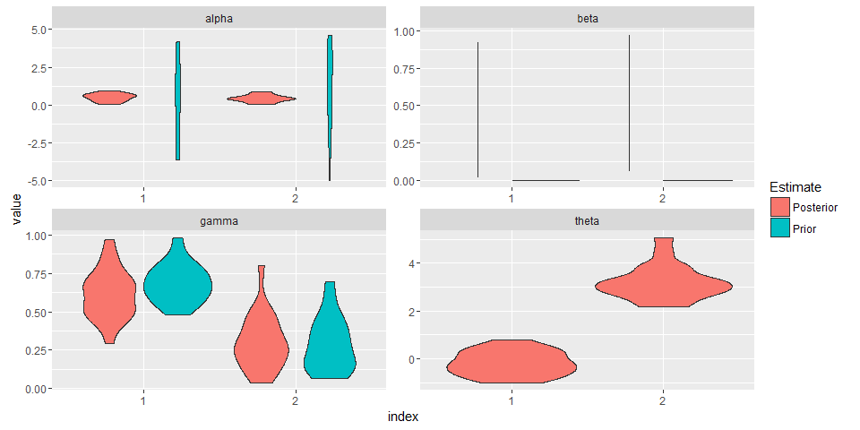

# Antarctic Whale Project: Simulation
Ben Weinstein  
May 5th, 2016  


```
## Compiling model graph
##    Resolving undeclared variables
##    Allocating nodes
## Graph information:
##    Observed stochastic nodes: 199
##    Unobserved stochastic nodes: 207
##    Total graph size: 23117
## 
## Initializing model
## 
## Adapting
```

#Abstract
I simulated correlated random walks with similar properties to previous marine pinnepid studies. The virtue of the simulation is that we can build complexity slowly. At each step we can verify that the model captures the true, known, relationship. Once we have developed a model that satisfies our aims, we can then apply it to the observed data.

#Correlated random walk

*Process Model*

$$ d_{t} \sim T*d_{t-1} + Normal(0,\Sigma)$$
$$ x_t = x_{t-1} + d_{t} $$

## Parameters

$$\theta = \text{Mean turning angle}$$
$$\gamma = \text{Move persistence} $$


###Behavioral States
$$ 1 = \text{traveling}$$
$$ 2 = \text{foraging}$$

I will then increase complexity to include:

* Environmental features that predict behavioral states.
* Hierarchical variance among individuals
* Observation Error


#Simulation

##Behavioral States
$$ \alpha_{1,1} = \text{High probability of remaining traveling when traveling)} = 0.9$$
$$\alpha_{2,1} = \text{Low probability of switching from feeding to traveling} = 0.2$$

Essentially, whales travel long straight distances to find food sources, but then stay in those patches for a long time. 

From these probabilities we can compute the full transition matrix.

$$\begin{matrix}
  \alpha_{1,1} & 1-\alpha_{1,1} \\
  \alpha_{2,1} & 1-\alpha_{2,1} \\
\end{matrix}
$$

## Traveling
$$\gamma_1 = 0.9 = \text{Strong Movement Persistence}$$
$$\theta_1 = 0 = \text{No preference in turns}$$

## Foraging
$$\gamma_2 = 0.1 = \text{Weak Movement Persistence}$$
$$\theta_2 = pi = \text{Many reversals in turns}$$

For both behaviors process variance is:
$$ \sigma_{latitude} = 0.1$$
$$ \sigma_{longitude} = 0.1$$

Values come from Jonsen (2005) and Jonsen (2016) fit for foraging seals.

<!-- -->

### Multiple trajectories.
<!-- -->

#Model Fitting

The goal of the model is to capture the true parameter we simulated above. As we increase complexity, we will be able to monitor the validity of our approach.


```
##  [1] sink("Bayesian/RW.jags")                                                      
##  [2] cat("                                                                         
##  [3]     model{                                                                    
##  [4]                                                                               
##  [5]     #Constants                                                                
##  [6]     pi <- 3.141592653589                                                      
##  [7]                                                                               
##  [8]     ###First Step###                                                          
##  [9]     #First movement - random walk.                                            
## [10]     y[2,1:2] ~ dmnorm(y[1,1:2],iSigma)                                        
## [11]                                                                               
## [12]     ###First Behavioral State###                                              
## [13]     state[1] ~ dcat(lambda[]) ## assign state for first obs                   
## [14]                                                                               
## [15]     #Process Model for movement                                               
## [16]     for(t in 2:(steps-1)){                                                    
## [17]                                                                               
## [18]       #Turning covariate                                                      
## [19]       #Transition Matrix for turning angles                                   
## [20]       T[t,1,1] <- cos(theta[state[t]])                                        
## [21]       T[t,1,2] <- (-sin(theta[state[t]]))                                     
## [22]       T[t,2,1] <- sin(theta[state[t]])                                        
## [23]       T[t,2,2] <- cos(theta[state[t]])                                        
## [24]                                                                               
## [25]       #Behavioral State at time T                                             
## [26]       phi[t,1] <- alpha[state[t-1]]                                           
## [27]       phi[t,2] <- 1 - alpha[state[t-1]]                                       
## [28]       state[t] ~ dcat(phi[t,])                                                
## [29]                                                                               
## [30]       #Correlation in movement change                                         
## [31]       d[t,1:2] <- y[t,] + gamma[state[t]] * T[t,,] %*% (y[t,1:2] - y[t-1,1:2])
## [32]                                                                               
## [33]       #Gaussian Displacement                                                  
## [34]       y[t+1,1:2] ~ dmnorm(d[t,1:2],iSigma)                                    
## [35]                                                                               
## [36]     }                                                                         
## [37]                                                                               
## [38]     #Priors                                                                   
## [39]     #Process Variance                                                         
## [40]     iSigma ~ dwish(R,2)                                                       
## [41]     Sigma <- inverse(iSigma)                                                  
## [42]                                                                               
## [43]     ##Mean Angle                                                              
## [44]                                                                               
## [45]     tmp[1] ~ dbeta(10, 10)                                                    
## [46]     tmp[2] ~ dbeta(10, 10)                                                    
## [47]                                                                               
## [48]     # prior for theta in 'traveling state'                                    
## [49]     theta[1] <- (2 * tmp[1] - 1) * pi                                         
## [50]                                                                               
## [51]     # prior for theta in 'foraging state'                                     
## [52]     theta[2] <- (tmp[2] * pi * 2)                                             
## [53]                                                                               
## [54]     ##Move persistance                                                        
## [55]     # prior for gamma (autocorrelation parameter) in state 1                  
## [56]     gamma[1] ~ dbeta(1,1)                                                     
## [57]                                                                               
## [58]     # prior for gamma in state 2                                              
## [59]     gamma[2] ~ dbeta(1,1)                                                     
## [60]                                                                               
## [61]     ##Behavioral States                                                       
## [62]     # prob of being in state 1 at t, given in state 1 at t-1                  
## [63]     alpha[1] ~ dbeta(1,1)                                                     
## [64]                                                                               
## [65]     # prob of being in state 1 at t, given in state 2 at t-1                  
## [66]     alpha[2] ~ dbeta(1,1)                                                     
## [67]                                                                               
## [68]     #Probability of behavior switching                                        
## [69]     lambda[1] ~ dbeta(1,1)                                                    
## [70]     lambda[2] <- 1 - lambda[1]                                                
## [71]                                                                               
## [72]     }"                                                                        
## [73]     ,fill=TRUE)                                                               
## [74] sink()
```

```
##    user  system elapsed 
##  348.17    0.08  351.38
```

```
## NOTE: Stopping adaptation
```

##Chains
<!-- -->

##Posteriors

<!-- -->

##Prediction - no error

<!-- -->

Point Density


