# Antarctic Whale Project: MultiSpecies Simulation
Ben Weinstein  
`r Sys.time()`  


#Abstract
I simulated correlated random walks with similar properties to previous marine pinnepid studies. The virtue of the simulation is that we can build complexity slowly. At each step we can verify that the model captures the true, known, relationship. Once we have developed a model that satisfies our aims, we can then apply it to the observed data.

## Current State

A dynamic correlated random walk with two states (traveling, feeding) that are a function of local environmental conditions. There are multiple individuals whose covariates are drawn from a group level mean.

## To add
* Observation Error
* Posterior Model Checks
* Seasonal Variation
** Variation in process error (Breed 2012)
** Variation in diel?

#Correlated random walk

*Process Model*

$$ d_{t} \sim T*d_{t-1} + Normal(0,\Sigma)$$
$$ x_t = x_{t-1} + d_{t} $$

## Parameters

For each individual:

$$\theta = \text{Mean turning angle}$$
$$\gamma = \text{Move persistence} $$

For both behaviors process variance is:
$$ \sigma_{latitude} = 0.1$$
$$ \sigma_{longitude} = 0.1$$

###Behavioral States

$$ \text{For each individual i}$$
$$ Behavior_1 = \text{traveling}$$
$$ Behavior_2 = \text{foraging}$$

$$ \alpha_{i,1,1} = \text{Probability of remaining traveling when traveling}$$
$$\alpha_{i,2,1} = \text{Probability of switching from feeding to traveling}$$

$$\begin{matrix}
  \alpha_{i,1,1} & 1-\alpha_{i,1,1} \\
  \alpha_{i,2,1} & 1-\alpha_{i,2,1} \\
\end{matrix}
$$

###Environment

Behavioral states are a function of local environmental conditions. The first environmental condition is ocean depth. I then build a function for preferential foraging in shallow waters.

It generally follows the form, conditional on behavior at t -1:

$$Behavior_t \sim Multinomial([\phi_{traveling},\phi_{foraging}])$$
$$logit(\phi_{traveling}) = \alpha_{Behavior_{t-1}} + \beta_1 * Ocean_{y[t,]}$$
$$logit(\phi_{foraging}) = \alpha_{Behavior_{t-1}} + \beta_2 * Ocean_{y[t,]}$$


#Simulation

Values come from Jonsen (2005) and Jonsen (2016) fit for foraging seals.

##Behavioral States
### Traveling
$$\gamma_1 = 0.9 = \text{Strong Movement Persistence}$$
$$\theta_1 = 0 = \text{No preference in turns}$$

### Foraging
$$\gamma_2 = 0.1 = \text{Weak Movement Persistence}$$
$$\theta_2 = pi = \text{Many reversals in turns}$$

Essentially, whales travel long straight distances to find food sources, but then stay in those patches for a long time. 

### Environment
Whales tend to travel in deep habitats, slighlty weaker effect of ocean depth. The importance of this effect varies by individual.

$$\alpha_{i,1,1} \sim Normal(-2,0.2)$$
$$\beta_1{i,1,1} \sim Normal(1,0.1)$$

$$\alpha_{i,2,1} \sim Normal(-2,0.2)$$
$$\beta_1_{i,2,1} \sim Normal(1,0.1)$$
The intercept alpha determines the crossing point, i.e the depth at which a foraging whale is likely to begin foraging. Here is set to be around 2000m water following 
[dive profile based on Stimpert (2012).](http://journals.plos.org/plosone/article?id=10.1371/journal.pone.0051214)

This is easiest to understand graphically.


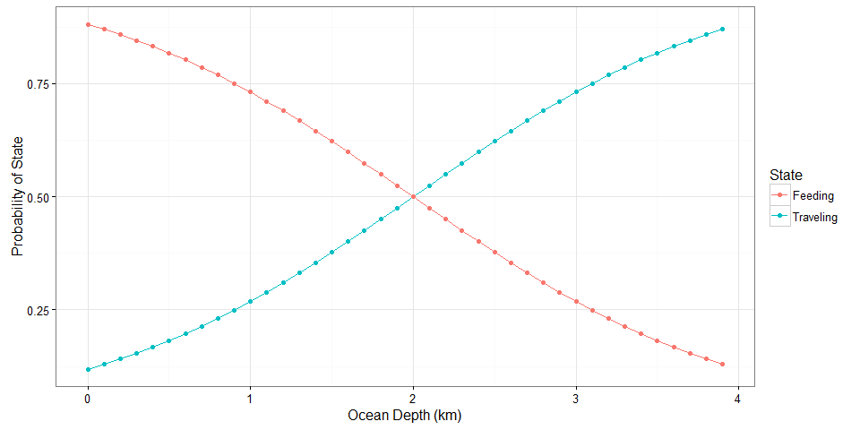<!-- -->

```
## null device 
##           1
```

### Multiple trajectories.
<!-- -->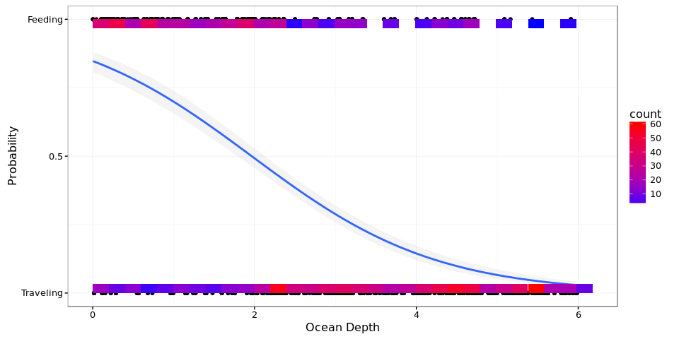<!-- -->

#Model Fitting

The goal of the model is to capture the true parameter we simulated above. As we increase complexity, we will be able to monitor the validity of our approach.


```
##   [1] sink("Bayesian/Multi_RW.jags")                                                                                  
##   [2] cat("                                                                                                           
##   [3]     model{                                                                                                      
##   [4]                                                                                                                 
##   [5]     #Constants                                                                                                  
##   [6]     pi <- 3.141592653589                                                                                        
##   [7]                                                                                                                 
##   [8]     for(i in 1:ind){                                                                                            
##   [9]                                                                                                                 
##  [10]     ###First Step###                                                                                            
##  [11]     #First movement - random walk.                                                                              
##  [12]     y[i,2,1:2] ~ dmnorm(y[i,1,1:2],iSigma)                                                                      
##  [13]                                                                                                                 
##  [14]     ###First Behavioral State###                                                                                
##  [15]     state[i,1] ~ dcat(lambda[]) ## assign state for first obs                                                   
##  [16]                                                                                                                 
##  [17]     #Process Model for movement                                                                                 
##  [18]     for(t in 2:(steps[i]-1)){                                                                                   
##  [19]                                                                                                                 
##  [20]     #Behavioral State at time T                                                                                 
##  [21]     logit(phi[i,t,1]) <- lalpha[i,state[i,t-1]] + lbeta[i,state[i,t-1]] * ocean[i,t]                            
##  [22]     phi[i,t,2] <- 1-phi[i,t,1]                                                                                  
##  [23]     state[i,t] ~ dcat(phi[i,t,])                                                                                
##  [24]                                                                                                                 
##  [25]     #Turning covariate                                                                                          
##  [26]     #Transition Matrix for turning angles                                                                       
##  [27]     T[i,t,1,1] <- cos(theta[state[i,t]])                                                                        
##  [28]     T[i,t,1,2] <- (-sin(theta[state[i,t]]))                                                                     
##  [29]     T[i,t,2,1] <- sin(theta[state[i,t]])                                                                        
##  [30]     T[i,t,2,2] <- cos(theta[state[i,t]])                                                                        
##  [31]                                                                                                                 
##  [32]     #Correlation in movement change                                                                             
##  [33]     d[i,t,1:2] <- y[i,t,] + gamma[state[i,t]] * T[i,t,,] %*% (y[i,t,1:2] - y[i,t-1,1:2])                        
##  [34]                                                                                                                 
##  [35]     #Gaussian Displacement                                                                                      
##  [36]     y[i,t+1,1:2] ~ dmnorm(d[i,t,1:2],iSigma)                                                                    
##  [37]     }                                                                                                           
##  [38]     #Final behavior state                                                                                       
##  [39]     logit(phi[i,steps[i],1]) <- lalpha[i,state[i,steps[i]-1]] + lbeta[i,state[i,steps[i]-1]] * ocean[i,steps[i]]
##  [40]     phi[i,steps[i],2] <- 1-phi[i,steps[i],1]                                                                    
##  [41]     state[i,steps[i]] ~ dcat(phi[i,steps[i],])                                                                  
##  [42]     }                                                                                                           
##  [43]                                                                                                                 
##  [44]     #Priors                                                                                                     
##  [45]     #Process Variance                                                                                           
##  [46]     iSigma ~ dwish(R,2)                                                                                         
##  [47]     Sigma <- inverse(iSigma)                                                                                    
##  [48]                                                                                                                 
##  [49]     ##Mean Angle                                                                                                
##  [50]     tmp[1] ~ dbeta(10, 10)                                                                                      
##  [51]     tmp[2] ~ dbeta(10, 10)                                                                                      
##  [52]                                                                                                                 
##  [53]     # prior for theta in 'traveling state'                                                                      
##  [54]     theta[1] <- (2 * tmp[1] - 1) * pi                                                                           
##  [55]                                                                                                                 
##  [56]     # prior for theta in 'foraging state'                                                                       
##  [57]     theta[2] <- (tmp[2] * pi * 2)                                                                               
##  [58]                                                                                                                 
##  [59]     ##Move persistance                                                                                          
##  [60]     # prior for gamma (autocorrelation parameter) in state 1                                                    
##  [61]     gamma[1] ~ dbeta(5,2)                                                                                       
##  [62]                                                                                                                 
##  [63]     # prior for gamma in state 2                                                                                
##  [64]     gamma[2] ~ dbeta(2,5)                                                                                       
##  [65]                                                                                                                 
##  [66]     ##Behavioral States                                                                                         
##  [67]     # Following lunn 2012 p85                                                                                   
##  [68]                                                                                                                 
##  [69]     #Hierarchical structure                                                                                     
##  [70]     #Intercepts                                                                                                 
##  [71]     lalpha_mu[1] ~ dnorm(0,0.386)                                                                               
##  [72]     lalpha_mu[2] ~ dnorm(0,0.386)                                                                               
##  [73]                                                                                                                 
##  [74]     #Variance                                                                                                   
##  [75]     lalpha_tau[1] ~ dt(0,1,1)I(0,)                                                                              
##  [76]     lalpha_tau[2] ~ dt(0,1,1)I(0,)                                                                              
##  [77]                                                                                                                 
##  [78]     #Slopes                                                                                                     
##  [79]     lbeta_mu[1] ~ dnorm(0,0.386)                                                                                
##  [80]     lbeta_mu[2] ~ dnorm(0,0.386)                                                                                
##  [81]                                                                                                                 
##  [82]     #Variance                                                                                                   
##  [83]     lbeta_tau[1] ~ dt(0,1,1)I(0,)                                                                               
##  [84]     lbeta_tau[2] ~ dt(0,1,1)I(0,)                                                                               
##  [85]                                                                                                                 
##  [86]     #For each individual                                                                                        
##  [87]     for(i in 1:ind){                                                                                            
##  [88]       # prob of being in state 1 at t, given in state 1 at t-1                                                  
##  [89]       #Individual Intercept                                                                                     
##  [90]       lalpha[i,1] ~ dnorm(lalpha_mu[1],lalpha_tau[1])                                                           
##  [91]       logit(alpha[i,1]) <- lalpha[i,1]                                                                          
##  [92]                                                                                                                 
##  [93]       #effect of ocean on traveling -> traveling                                                                
##  [94]       lbeta[i,1] ~ dnorm(lbeta_mu[1],lbeta_tau[1])                                                              
##  [95]       logit(beta[i,1]) <- lbeta[i,1]                                                                            
##  [96]                                                                                                                 
##  [97]       #Prob of transition to state 1 given state 2 at t-1                                                       
##  [98]       lalpha[i,2] ~ dnorm(lalpha_mu[2],lalpha_tau[2])                                                           
##  [99]       logit(alpha[i,2]) <- lalpha[i,2]                                                                          
## [100]                                                                                                                 
## [101]       #effect of ocean on feeding -> traveling                                                                  
## [102]       lbeta[i,2] ~ dnorm(lbeta_mu[2],lbeta_tau[2])                                                              
## [103]       logit(beta[i,2]) <- lbeta[i,2]                                                                            
## [104]                                                                                                                 
## [105]     }                                                                                                           
## [106]                                                                                                                 
## [107]     #Probability of behavior switching                                                                          
## [108]     lambda[1] ~ dbeta(1,1)                                                                                      
## [109]     lambda[2] <- 1 - lambda[1]                                                                                  
## [110]                                                                                                                 
## [111]     }"                                                                                                          
## [112]     ,fill=TRUE)                                                                                                 
## [113] sink()
```

##Chains
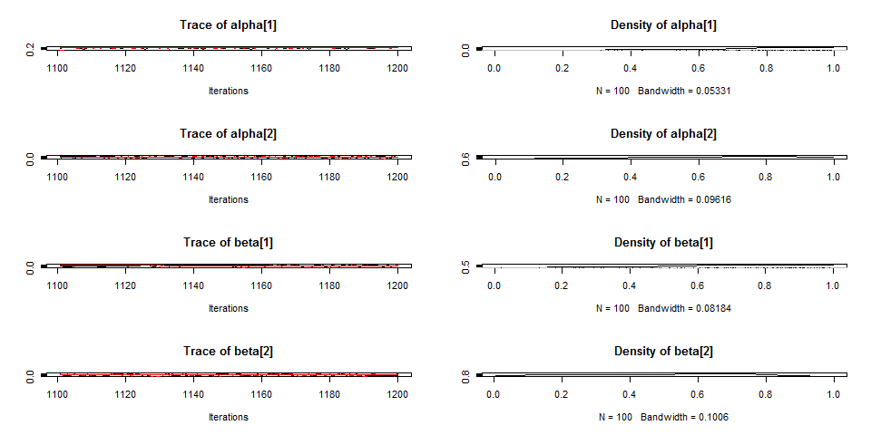<!-- -->

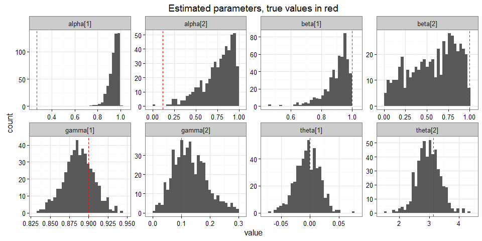<!-- -->

###Compare to priors

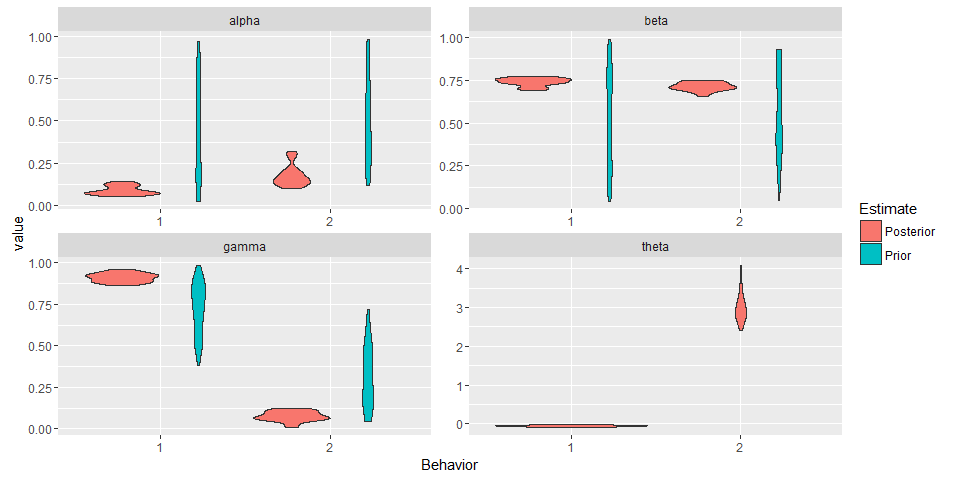<!-- -->

##Prediction - environmental function

<!-- -->

#Behavioral Prediction

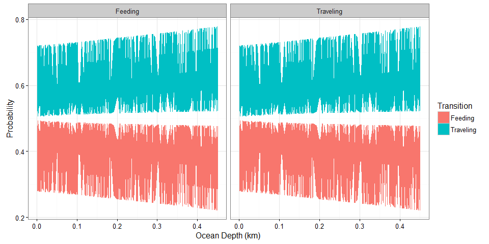<!-- -->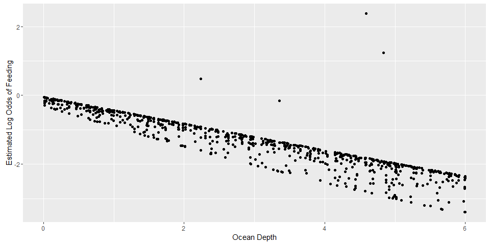<!-- -->

##Autocorrelation in behavior

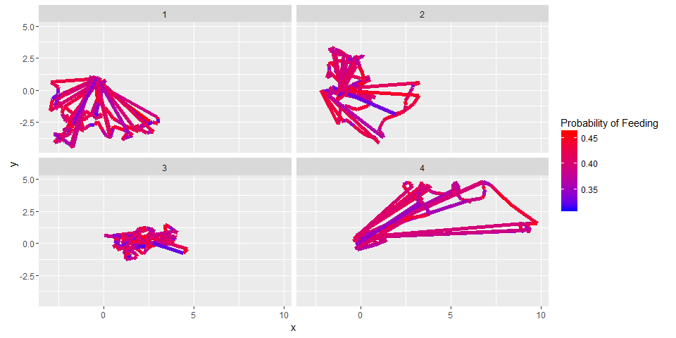<!-- -->

##Phase prediction
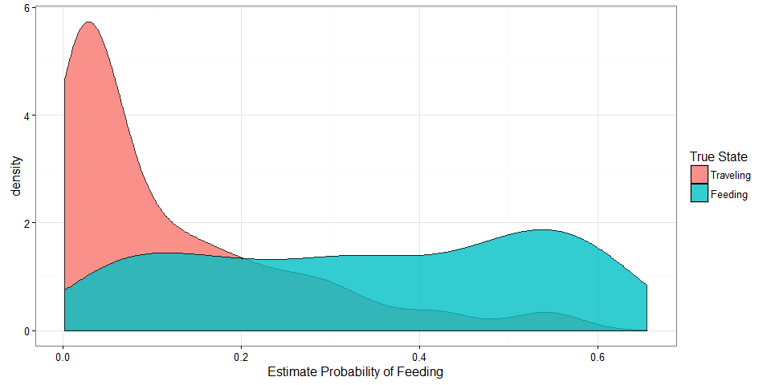<!-- -->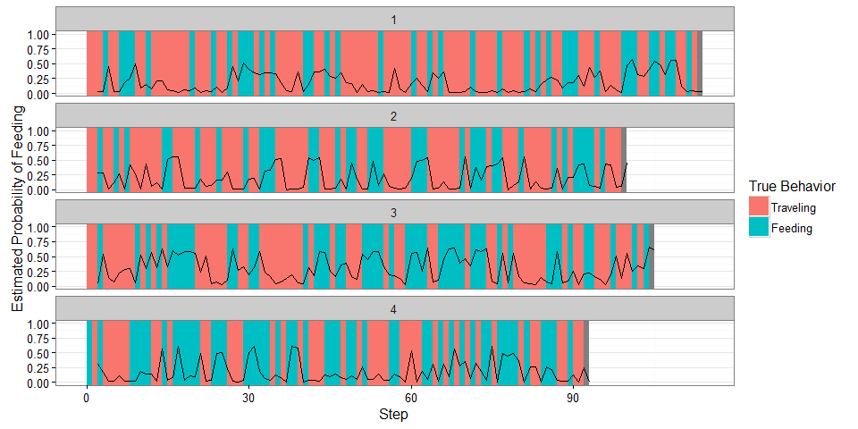<!-- -->

##Behavioral description

###Average time in phase

To calculate this, while propogating uncertainty, we can either save the state variable in jags, or draw multinomial draws from phi. Here we recreate it from phi.

* For each draw, create a behavioral sequence, calulate the average runs for each behavior

## Failure time analysis

* Fit a curve to the runs as a function of time to get 'patch time'
* the curve could be a function of temporal covariates.
* per draw? How to get confidence intervals?
* cox regression - see jenica allen and jeff diez.

## Predicted Run Length
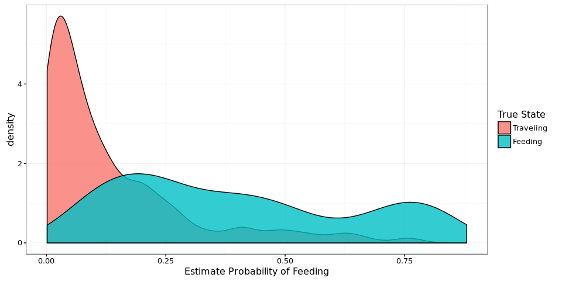<!-- -->

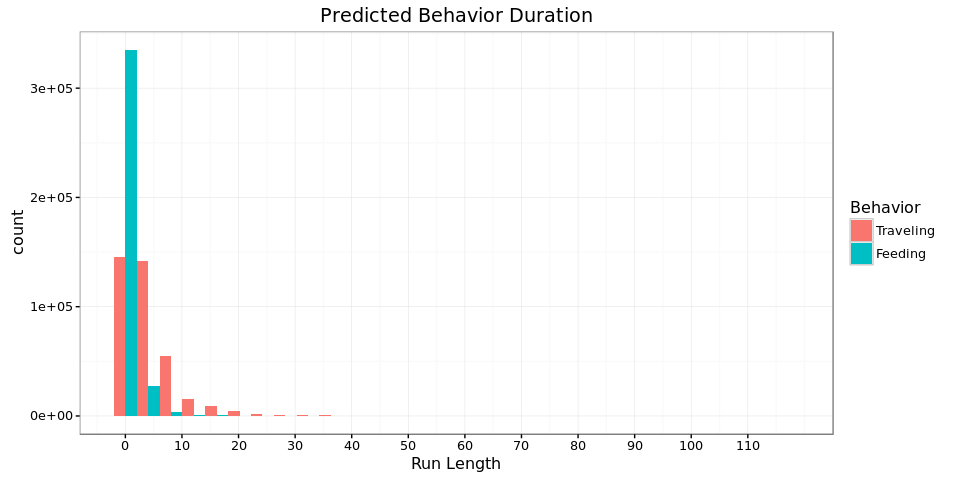<!-- -->

###Proportional Hazards

Survival analysis typically examines the relationship between time to death as a function of covariates. From this we can get the instantaneous rate of death at time t f(t), which is the cumulative distribution of the liklihood of death.

Let T represent survival time.

$$ P(t) = Pr(T<t)$$ 
with a pdf
$$p(t) = \frac{dP(t)}{dt}$$

The instantaneous risk of death at time t, confitional on survival to that time:

$$log (h_i(t)) = \alpha + \beta_i *x$$

The cox model has no intercept, making it semi-parametric
$$ log(h_i(t)) = h_0(t) + \beta_1 * x$$


```
## Call:
## coxph(formula = Surv(time = feedr$runs, event = feedr$status) ~ 
##     feedr$Animal)
## 
##   n= 90579, number of events= 90579 
## 
##                    coef exp(coef)  se(coef)      z Pr(>|z|)    
## feedr$Animal2  0.320580  1.377927  0.009122 35.144  < 2e-16 ***
## feedr$Animal3  0.243239  1.275373  0.009734 24.987  < 2e-16 ***
## feedr$Animal4 -0.049136  0.952052  0.008963 -5.482 4.21e-08 ***
## ---
## Signif. codes:  0 '***' 0.001 '**' 0.01 '*' 0.05 '.' 0.1 ' ' 1
## 
##               exp(coef) exp(-coef) lower .95 upper .95
## feedr$Animal2    1.3779     0.7257    1.3535    1.4028
## feedr$Animal3    1.2754     0.7841    1.2513    1.2999
## feedr$Animal4    0.9521     1.0504    0.9355    0.9689
## 
## Concordance= 0.584  (se = 0.003 )
## Rsquare= 0.024   (max possible= 1 )
## Likelihood ratio test= 2156  on 3 df,   p=0
## Wald test            = 2191  on 3 df,   p=0
## Score (logrank) test = 2209  on 3 df,   p=0
```

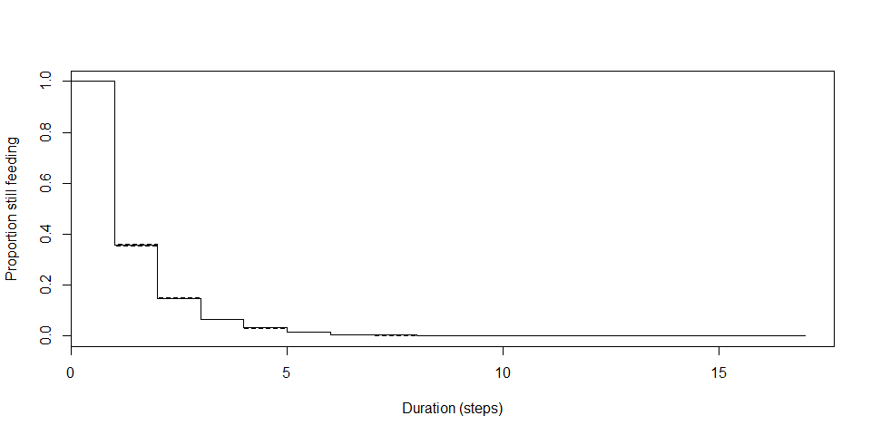<!-- -->


