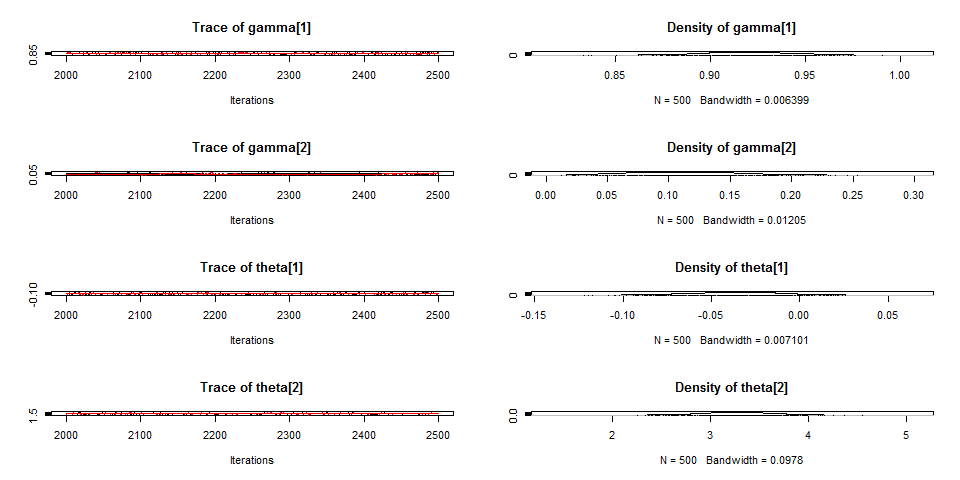

# Antarctic Whale Project: MultiSpecies Simulation
Ben Weinstein  
May 5th, 2016  


#Abstract
I simulated correlated random walks with similar properties to previous marine pinnepid studies. The virtue of the simulation is that we can build complexity slowly. At each step we can verify that the model captures the true, known, relationship. Once we have developed a model that satisfies our aims, we can then apply it to the observed data.

## To add
* Add coastline?
* Hierarchical variance among individuals
* Observation Error
* Posterior Model Checks

#Correlated random walk

*Process Model*

$$ d_{t} \sim T*d_{t-1} + Normal(0,\Sigma)$$
$$ x_t = x_{t-1} + d_{t} $$

## Parameters

For 10 individuals:

$$\theta = \text{Mean turning angle}$$
$$\gamma = \text{Move persistence} $$

For both behaviors process variance is:
$$ \sigma_{latitude} = 0.1$$
$$ \sigma_{longitude} = 0.1$$

###Behavioral States

$$ Behavior_1 = \text{traveling}$$
$$ Behavior_2 = \text{foraging}$$

$$ \alpha_{1,1} = \text{Probability of remaining traveling when traveling}$$
$$\alpha_{2,1} = \text{Probability of switching from feeding to traveling}$$

$$\begin{matrix}
  \alpha_{1,1} & 1-\alpha_{1,1} \\
  \alpha_{2,1} & 1-\alpha_{2,1} \\
\end{matrix}
$$

###Environment

Behavioral states are a function of local environmental conditions. The first environmental condition is ocean depth. I then build a function for preferential foraging in shallow waters.

It generally follows the form, conditional on behavior at t -1:

$$Behavior_t \sim Multinomial([\phi_{traveling},\phi_{foraging}])$$
$$logit(\phi_{traveling}) = \alpha_{Behavior_{t-1}} + \beta_1 * Ocean_{y[t-1,]}$$
$$logit(\phi_{foraging}) = \alpha_{Behavior_{t-1}} + \beta_2 * Ocean_{y[t-1,]}$$


#Simulation

Values come from Jonsen (2005) and Jonsen (2016) fit for foraging seals.

##Behavioral States
### Traveling
$$\gamma_1 = 0.9 = \text{Strong Movement Persistence}$$
$$\theta_1 = 0 = \text{No preference in turns}$$

### Foraging
$$\gamma_2 = 0.1 = \text{Weak Movement Persistence}$$
$$\theta_2 = pi = \text{Many reversals in turns}$$

Essentially, whales travel long straight distances to find food sources, but then stay in those patches for a long time. 

### Environment
Whales tend to travel in deep habitats
$$\alpha_1 = -2$$
$$\beta_1=10$$

Whales tend to forage in shallow habitats
$$\alpha_1 = -2$$
$$\beta_2=10$$

The intercept alpha determines the crossing point, i.e the depth at which a foraging whale is likely to begin foraging. Here is set to be around 200m water following 
[dive profile based on Stimpert (2012).](http://journals.plos.org/plosone/article?id=10.1371/journal.pone.0051214)

This is easiest to understand graphically.


<!-- -->

```
## null device 
##           1
```

### Multiple trajectories.
<!-- --><!-- -->

#Model Fitting

The goal of the model is to capture the true parameter we simulated above. As we increase complexity, we will be able to monitor the validity of our approach.


```
##  [1] sink("Bayesian/Multi_RW.jags")                                                          
##  [2] cat("                                                                                   
##  [3]     model{                                                                              
##  [4]                                                                                         
##  [5]     #Constants                                                                          
##  [6]     pi <- 3.141592653589                                                                
##  [7]                                                                                         
##  [8]     for(i in 1:ind){                                                                    
##  [9]                                                                                         
## [10]     ###First Step###                                                                    
## [11]     #First movement - random walk.                                                      
## [12]     y[i,2,1:2] ~ dmnorm(y[i,1,1:2],iSigma)                                              
## [13]                                                                                         
## [14]     ###First Behavioral State###                                                        
## [15]     state[i,1] ~ dcat(lambda[]) ## assign state for first obs                           
## [16]                                                                                         
## [17]     #Process Model for movement                                                         
## [18]     for(t in 2:(steps-1)){                                                              
## [19]                                                                                         
## [20]     #Turning covariate                                                                  
## [21]     #Transition Matrix for turning angles                                               
## [22]     T[i,t,1,1] <- cos(theta[state[i,t]])                                                
## [23]     T[i,t,1,2] <- (-sin(theta[state[i,t]]))                                             
## [24]     T[i,t,2,1] <- sin(theta[state[i,t]])                                                
## [25]     T[i,t,2,2] <- cos(theta[state[i,t]])                                                
## [26]                                                                                         
## [27]     #Behavioral State at time T                                                         
## [28]     logit(phi[i,t,1]) <- alpha[state[i,t-1]] + beta[state[i,t-1]] * ocean[i,t-1]        
## [29]     phi[i,t,2] <- 1-phi[i,t,1]                                                          
## [30]     state[i,t] ~ dcat(phi[i,t,])                                                        
## [31]                                                                                         
## [32]     #Correlation in movement change                                                     
## [33]     d[i,t,1:2] <- y[i,t,] + gamma[state[i,t]] * T[i,t,,] %*% (y[i,t,1:2] - y[i,t-1,1:2])
## [34]                                                                                         
## [35]     #Gaussian Displacement                                                              
## [36]     y[i,t+1,1:2] ~ dmnorm(d[i,t,1:2],iSigma)                                            
## [37]                                                                                         
## [38]     }                                                                                   
## [39]     }                                                                                   
## [40]                                                                                         
## [41]     #Priors                                                                             
## [42]     #Process Variance                                                                   
## [43]     iSigma ~ dwish(R,2)                                                                 
## [44]     Sigma <- inverse(iSigma)                                                            
## [45]                                                                                         
## [46]     ##Mean Angle                                                                        
## [47]     tmp[1] ~ dbeta(10, 10)                                                              
## [48]     tmp[2] ~ dbeta(10, 10)                                                              
## [49]                                                                                         
## [50]     # prior for theta in 'traveling state'                                              
## [51]     theta[1] <- (2 * tmp[1] - 1) * pi                                                   
## [52]                                                                                         
## [53]     # prior for theta in 'foraging state'                                               
## [54]     theta[2] <- (tmp[2] * pi * 2)                                                       
## [55]                                                                                         
## [56]     ##Move persistance                                                                  
## [57]     # prior for gamma (autocorrelation parameter) in state 1                            
## [58]     gamma[1] ~ dbeta(5,2)                                                               
## [59]                                                                                         
## [60]     # prior for gamma in state 2                                                        
## [61]     gamma[2] ~ dbeta(2,5)                                                               
## [62]                                                                                         
## [63]     ##Behavioral States                                                                 
## [64]     # Following lunn 2012 p85                                                           
## [65]                                                                                         
## [66]     # prob of being in state 1 at t, given in state 1 at t-1                            
## [67]     lalpha[1] ~ dnorm(0,0.386)                                                          
## [68]     logit(alpha[1]) <- lalpha[1]                                                        
## [69]                                                                                         
## [70]     lbeta[1] ~ dnorm(0,0.386)                                                           
## [71]     logit(beta[1]) <- lbeta[1]                                                          
## [72]                                                                                         
## [73]     # prob of being in state 1 at t, given in state 2 at t-1                            
## [74]     lalpha[2] ~ dnorm(0,0.386)                                                          
## [75]     logit(alpha[2]) <- lalpha[2]                                                        
## [76]                                                                                         
## [77]     lbeta[2] ~ dnorm(0,0.386)                                                           
## [78]     logit(beta[2]) <- lbeta[2]                                                          
## [79]                                                                                         
## [80]     #Probability of behavior switching                                                  
## [81]     lambda[1] ~ dbeta(1,1)                                                              
## [82]     lambda[2] <- 1 - lambda[1]                                                          
## [83]                                                                                         
## [84]     }"                                                                                  
## [85]     ,fill=TRUE)                                                                         
## [86] sink()
```

```
## Compiling model graph
##    Resolving undeclared variables
##    Allocating nodes
## Graph information:
##    Observed stochastic nodes: 596
##    Unobserved stochastic nodes: 606
##    Total graph size: 101316
## 
## Initializing model
```

```
##    user  system elapsed 
## 4678.86    0.55 4695.01
```

##Chains
<!-- --><!-- -->

##Posteriors

<!-- -->

Compare to priors

<!-- -->

##Prediction - environmental function


<!-- -->

#Behavioral Prediction

<!-- -->

##Autocorrelation in behavior

<!-- -->


