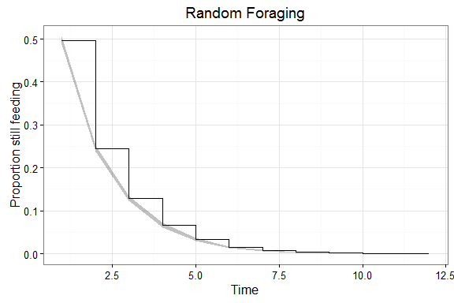
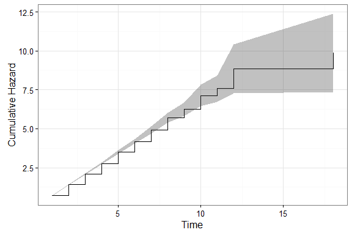
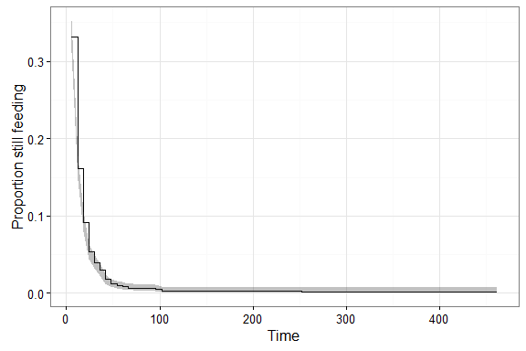
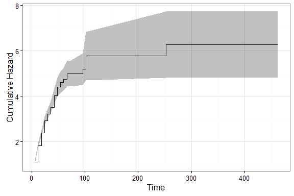
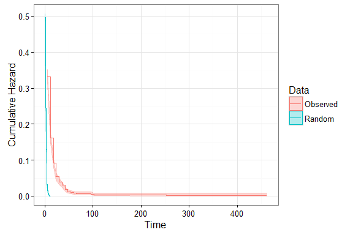
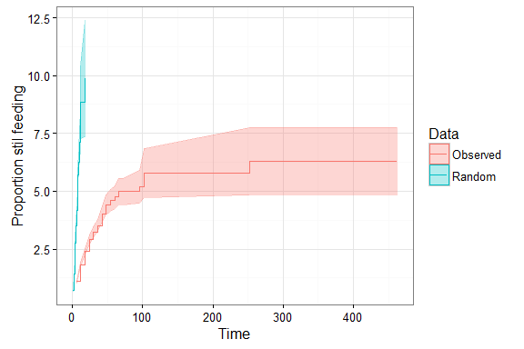
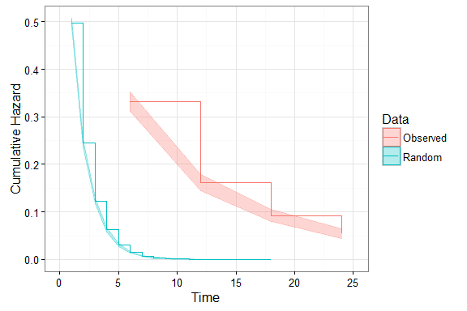
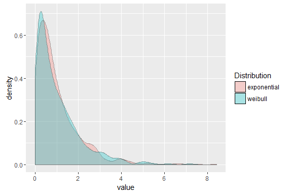
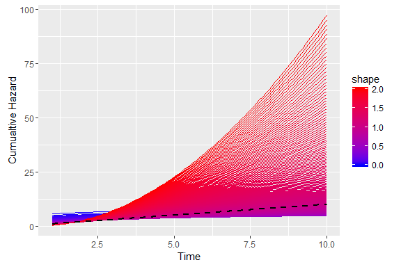
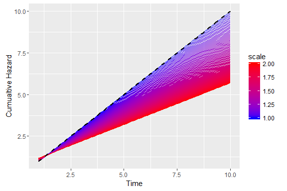

# Antarctic Whale Project: Patch Dynamics
Ben Weinstein  
`r Sys.time()`  

#Aim

#Proportional Hazards

Survival analysis typically examines the relationship between time to death as a function of covariates. From this we can get the instantaneous rate of death at time t f(t), which is the cumulative distribution of the likelihood of death.

Let T represent survival time.

$$ P(t) = Pr(T<t)$$ 
with a pdf
$$p(t) = \frac{dP(t)}{dt}$$

The instantaneous risk of death at time t (h(t)), conditional on survival to that time:

$$ h(t) = \lim{\Delta_t\to 0} \frac{Pr[(t<T<t + \Delta_t)]|T>t}{\Delta t}$$

with covariates:
$$log (h_i(t)) = \alpha + \beta_i *x$$

The cox model has no intercept, making it semi-parametric
$$ log(h_i(t)) = h_0(t) + \beta_1 * x$$

#Random foraging.

If behavioral states were distributed at random, what would the survival and hazard functions look like?

## Hazard function

$$\text{Cumulative Hazard} = -log(Survival)$$

# Observed Data

## Survival

## Cumulative Hazard

Zoom and compare to random foraging

#Comparison

## Survival

## Hazards

# Zoom in

# The Weibull Distribution

The Weibull distribution with shape parameter a and scale parameter b has density given by

$$f(x) = \frac{a}{b} * \frac{x}{b}^(a-1) \exp{-\frac{x}{b}^a}$$

The cumulative hazard function at time t is $$H(t) = \frac{t}{b}^a$$

The Weibull collapses to the expontential distribution with parameters (shape=1,scale=1)

The shape parameter 

The scale parameter

