# Antarctic Whale Project: Single Species
Ben Weinstein  
`r Sys.time()`  


#Abstract


#Descriptive Statistics


<!-- -->

View env variables

<!-- --><!-- -->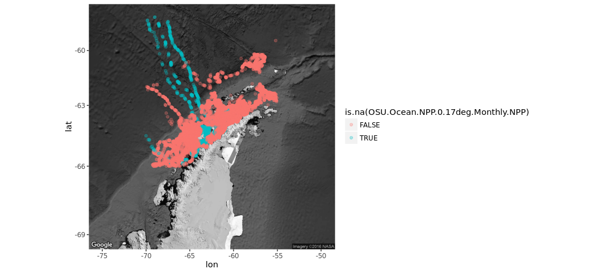<!-- -->

##Distance

<!-- -->

##Time 
<!-- -->

##Velocity
<!-- -->

##Angles

<!-- -->

#Correlated random walk

*Process Model*

$$ d_{t} \sim T*d_{t-1} + Normal(0,\Sigma)$$
$$ x_t = x_{t-1} + d_{t} $$

## Parameters

For each individual:

$$\theta = \text{Mean turning angle}$$
$$\gamma = \text{Move persistence} $$

For both behaviors process variance is:
$$ \sigma_{latitude} = 0.1$$
$$ \sigma_{longitude} = 0.1$$

##Behavioral States

$$ \text{For each individual i}$$
$$ Behavior_1 = \text{traveling}$$
$$ Behavior_2 = \text{foraging}$$

$$ \alpha_{i,1,1} = \text{Probability of remaining traveling when traveling}$$
$$\alpha_{i,2,1} = \text{Probability of switching from feeding to traveling}$$

$$\begin{matrix}
  \alpha_{i,1,1} & 1-\alpha_{i,1,1} \\
  \alpha_{i,2,1} & 1-\alpha_{i,2,1} \\
\end{matrix}
$$

##Environment

Behavioral states are a function of local environmental conditions. The first environmental condition is ocean depth. I then build a function for preferential foraging in shallow waters.

It generally follows the form, conditional on behavior at t -1:

$$Behavior_t \sim Multinomial([\phi_{traveling},\phi_{foraging}])$$
$$logit(\phi_{traveling}) = \alpha_{Behavior_{t-1}} + \beta_1 * Ocean_{y[t,]}$$
$$logit(\phi_{foraging}) = \alpha_{Behavior_{t-1}} + \beta_2 * Ocean_{y[t,]}$$


##Continious tracks

The transmitter will often go dark for 10 to 12 hours, due to weather, right in the middle of an otherwise good track. The model requires regular intervals to estimate the turning angles and temporal autocorrelation. As a track hits one of these walls, call it the end of a track, and begin a new track once the weather improves. We can remove any micro-tracks that are less than three days.
Specify a duration, calculate the number of tracks and the number of removed points. Iteratively.


How did the filter change the extent of tracks?

<!-- -->

<!-- -->

<!-- --><!-- -->


```
##       user     system    elapsed 
##     72.206      1.404 140164.128
```

##Chains
<!-- -->

<!-- -->

###Compare to priors

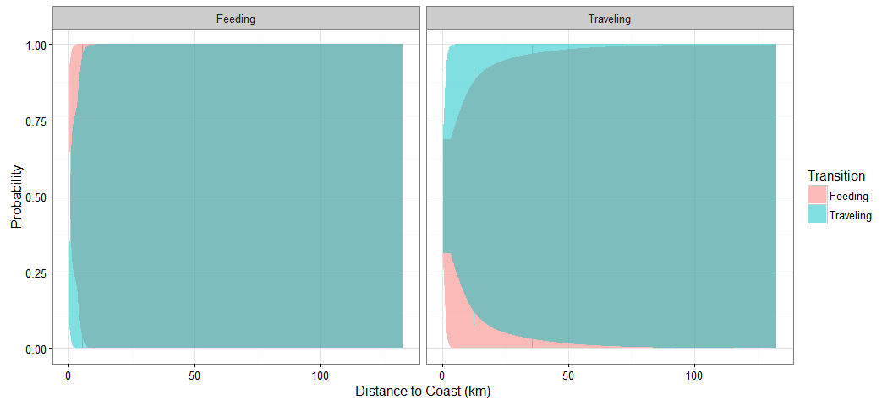<!-- -->

## Parameter Summary

```
## Source: local data frame [10 x 5]
## Groups: parameter [?]
## 
##    parameter         par        mean       lower     upper
##       (fctr)      (fctr)       (dbl)       (dbl)     (dbl)
## 1   alpha_mu alpha_mu[1]  3.56132392  1.40130189 4.8778091
## 2   alpha_mu alpha_mu[2]  1.32284059  0.16354829 2.4581401
## 3   beta2_mu beta2_mu[1] -0.14457126 -0.43928825 0.1739572
## 4   beta2_mu beta2_mu[2] -1.05899881 -3.73492066 1.6844570
## 5    beta_mu  beta_mu[1] -0.92768743 -2.44118518 0.8896919
## 6    beta_mu  beta_mu[2]  0.05006696 -0.16740745 0.5363841
## 7      gamma    gamma[1]  0.17950355  0.13326095 0.2276694
## 8      gamma    gamma[2]  0.85382415  0.81331822 0.8974981
## 9      theta    theta[1]  0.16239142  0.02469553 0.3071141
## 10     theta    theta[2]  6.18664371  6.15436767 6.2162254
```

<!-- -->

##Prediction - environmental function

### Ocean Depth
<!-- -->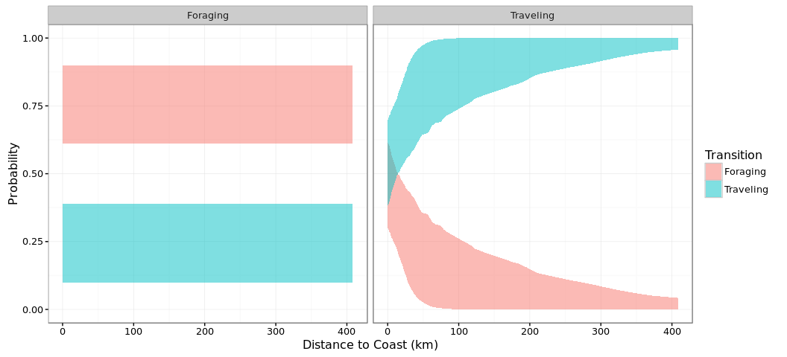<!-- -->

### Distance to Coast
<!-- -->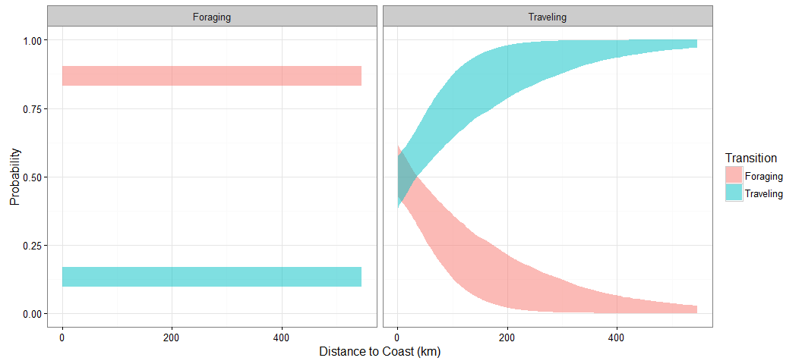<!-- -->

#Behavioral Prediction


##Spatial Prediction

### Per Animal

```
## $`5`
```

<!-- -->

```
## 
## $`6`
```

<!-- -->

```
## 
## $`7`
```

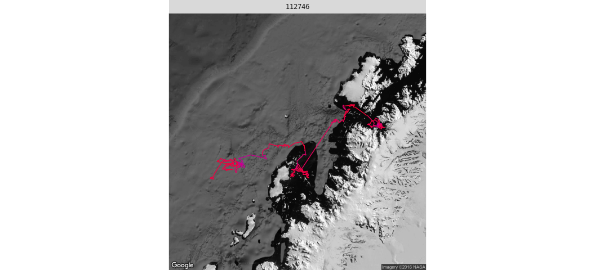<!-- -->

```
## 
## $`8`
```

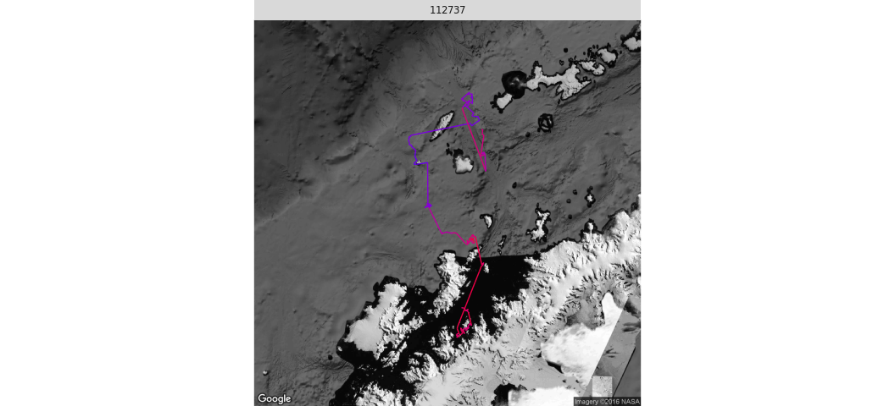<!-- -->

```
## 
## $`9`
```

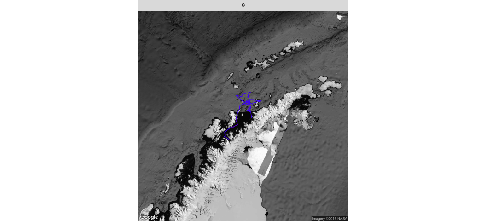<!-- -->

```
## 
## $`10`
```

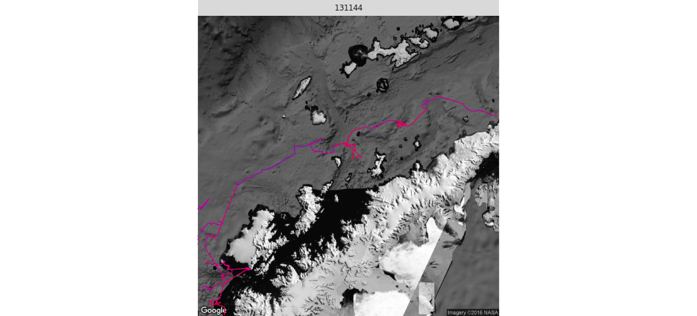<!-- -->

```
## 
## $`11`
```

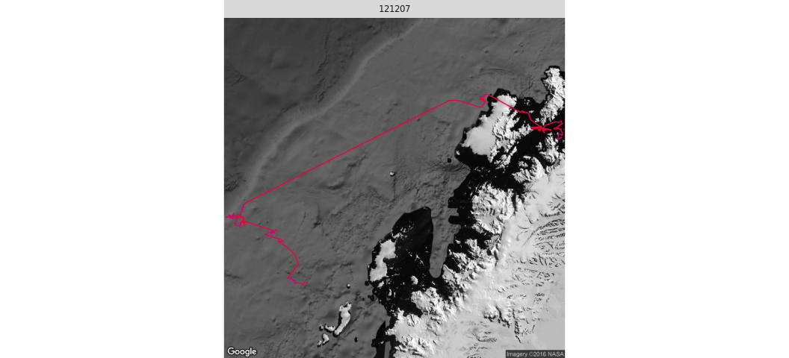<!-- -->

```
## 
## $`12`
```

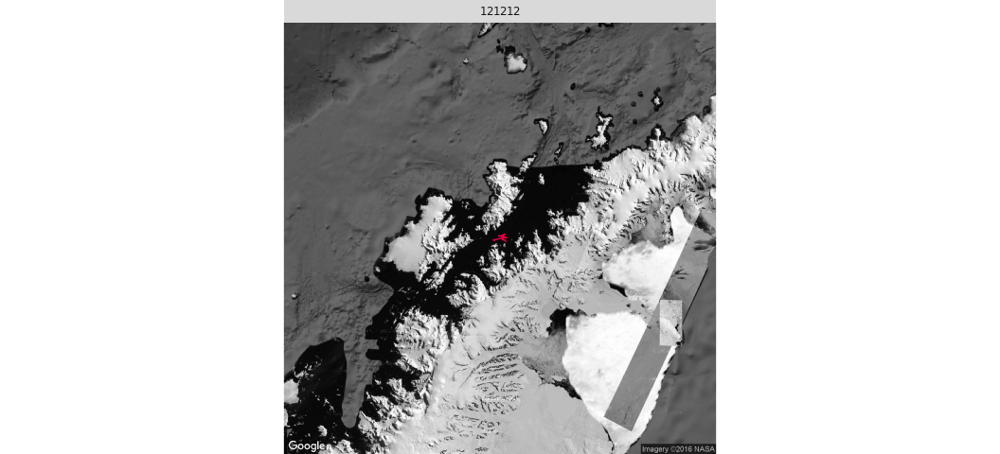<!-- -->

```
## 
## $`14`
```

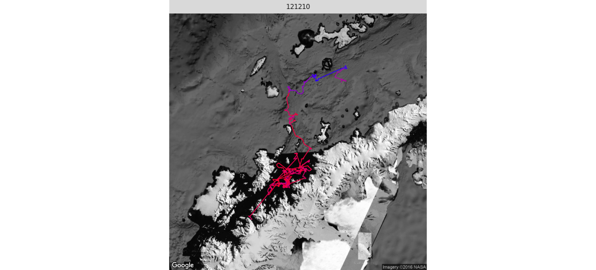<!-- -->

```
## 
## $`15`
```

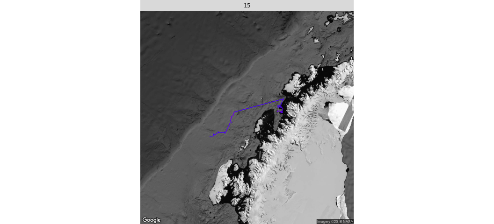<!-- -->

##Log Odds of Feeding

### Ocean Depth

<!-- -->

### Distance From Coast

<!-- -->

###Interaction

No estimate of uncertainty.
<!-- -->

##Autocorrelation in behavior

<!-- -->

##Behavioral description

## Predicted behavior duration


<!-- -->

##Location of Behavior

<!-- -->

#Environmental Prediction

<!-- -->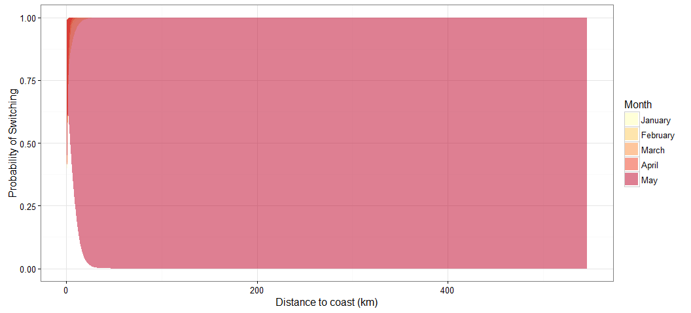<!-- -->


#Krill Fishery
<!-- -->


```
##             used   (Mb) gc trigger (Mb)  max used   (Mb)
## Ncells   1668289   89.1    6177917  330   7722397  412.5
## Vcells 195284740 1490.0  392287202 2993 390660067 2980.5
```
