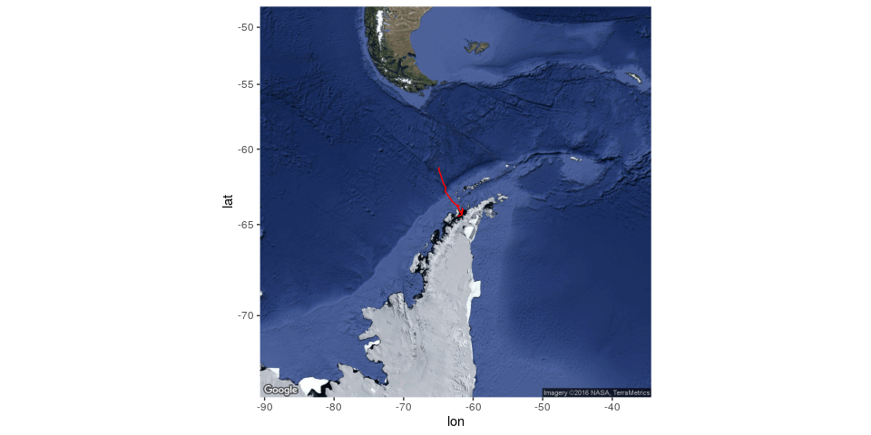
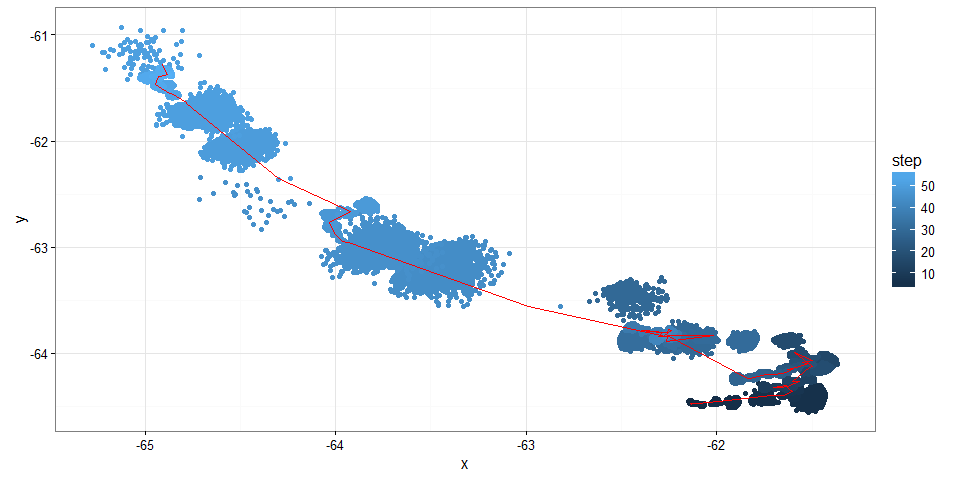
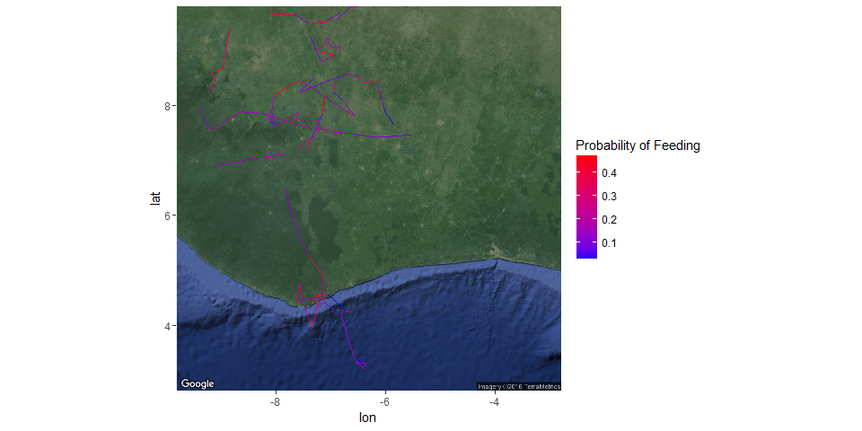
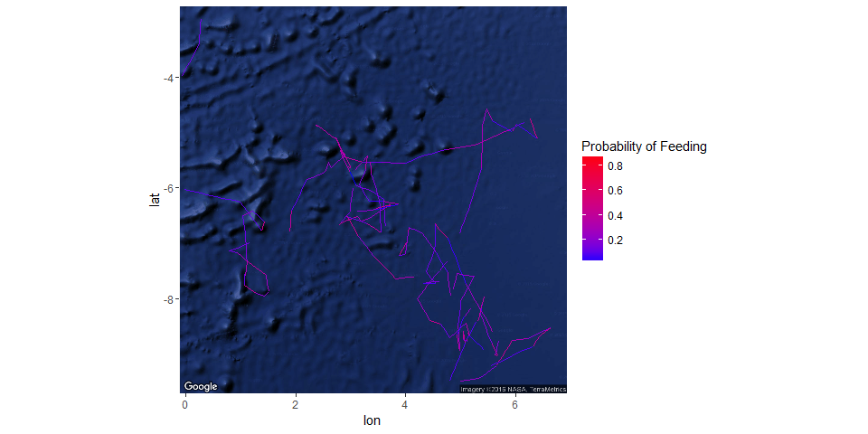
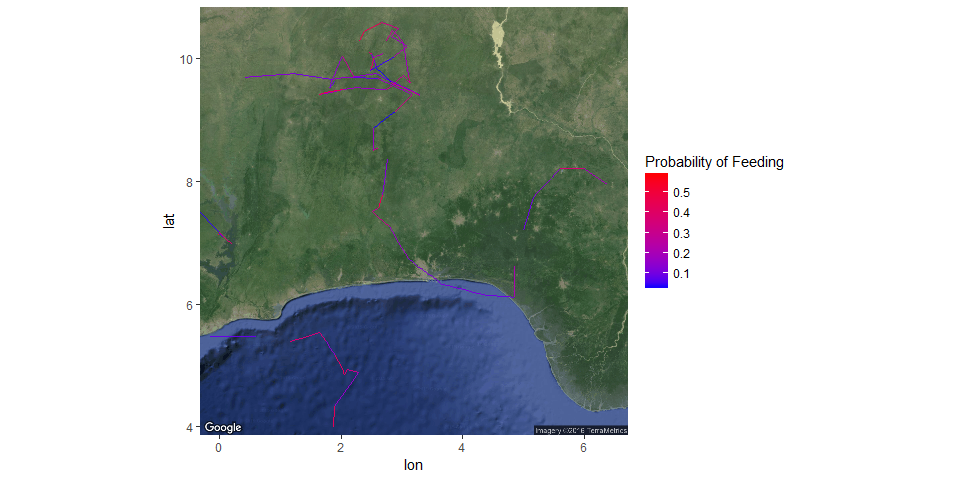
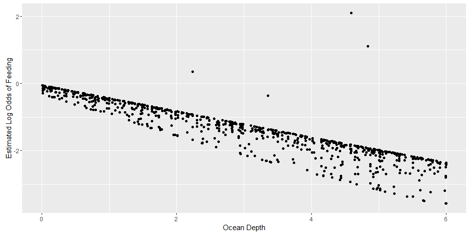
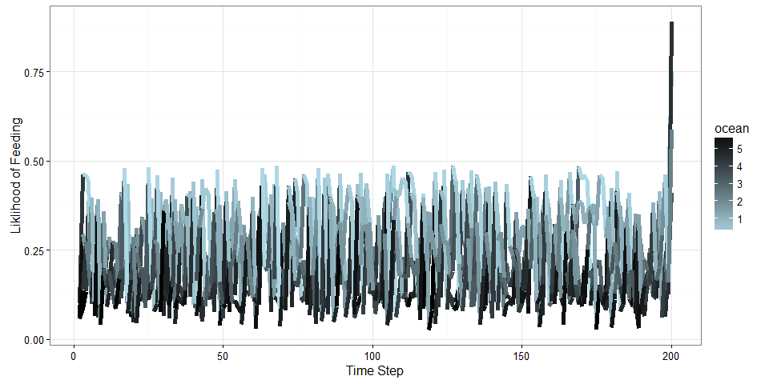

# Antarctic Whale Project: Single Species
Ben Weinstein  
May 5th, 2016  


```
## Compiling model graph
##    Resolving undeclared variables
##    Allocating nodes
## Graph information:
##    Observed stochastic nodes: 59
##    Unobserved stochastic nodes: 69
##    Total graph size: 4760
## 
## Initializing model
## 
## Adapting
```

#Abstract

We are currently ignoring any observation process or time regularization.

<!-- -->


```
## Compiling model graph
##    Resolving undeclared variables
##    Allocating nodes
## Graph information:
##    Observed stochastic nodes: 796
##    Unobserved stochastic nodes: 810
##    Total graph size: 176752
## 
## Initializing model
## 
## Adapting
```

#Abstract


#Movement model

Dynamic correlation random walk following Jonsen (2005) and Jonsen (2016).

*Process Model*

$$ d_{t} \sim T*d_{t-1} + Normal(0,\Sigma)$$
$$ x_t = x_{t-1} + d_{t} $$

## Parameters

$$\theta = \text{Mean turning angle}$$
$$\gamma = \text{Move persistence} $$

###Behavioral States

$$ Behavior_1 = \text{traveling}$$
$$ Behavior_2 = \text{foraging}$$

$$ \alpha_{1,1} = \text{Probability of remaining traveling when traveling}$$
$$\alpha_{2,1} = \text{Probability of switching from feeding to traveling}$$

$$\begin{matrix}
  \alpha_{1,1} & 1-\alpha_{1,1} \\
  \alpha_{2,1} & 1-\alpha_{2,1} \\
\end{matrix}
$$

###Environment

Behavioral states are a function of local environmental conditions. Here I use ocean depth as a first covariate.

It generally follows the form, conditional on behavior at t -1:

$$Behavior_t \sim Multinomial([\phi_{traveling},\phi_{foraging}])$$
$$logit(\phi_{traveling}) = \alpha_{Behavior_{t-1}} + \beta_1 * Ocean_{y[t,]}$$
$$logit(\phi_{foraging}) = \alpha_{Behavior_{t-1}} + \beta_2 * Ocean_{y[t,]}$$


#Model Fitting

The goal of the model is to capture the true parameter we simulated above. As we increase complexity, we will be able to monitor the validity of our approach.


```
##  [1] sink("Bayesian/Multi_RW.jags")                                                                  
##  [2] cat("                                                                                           
##  [3]     model{                                                                                      
##  [4]                                                                                                 
##  [5]     #Constants                                                                                  
##  [6]     pi <- 3.141592653589                                                                        
##  [7]                                                                                                 
##  [8]     for(i in 1:ind){                                                                            
##  [9]                                                                                                 
## [10]     ###First Step###                                                                            
## [11]     #First movement - random walk.                                                              
## [12]     y[i,2,1:2] ~ dmnorm(y[i,1,1:2],iSigma)                                                      
## [13]                                                                                                 
## [14]     ###First Behavioral State###                                                                
## [15]     state[i,1] ~ dcat(lambda[]) ## assign state for first obs                                   
## [16]                                                                                                 
## [17]     #Process Model for movement                                                                 
## [18]     for(t in 2:(steps-1)){                                                                      
## [19]                                                                                                 
## [20]     #Behavioral State at time T                                                                 
## [21]     logit(phi[i,t,1]) <- lalpha[state[i,t-1]] + lbeta[state[i,t-1]] * ocean[i,t]                
## [22]     phi[i,t,2] <- 1-phi[i,t,1]                                                                  
## [23]     state[i,t] ~ dcat(phi[i,t,])                                                                
## [24]                                                                                                 
## [25]     #Turning covariate                                                                          
## [26]     #Transition Matrix for turning angles                                                       
## [27]     T[i,t,1,1] <- cos(theta[state[i,t]])                                                        
## [28]     T[i,t,1,2] <- (-sin(theta[state[i,t]]))                                                     
## [29]     T[i,t,2,1] <- sin(theta[state[i,t]])                                                        
## [30]     T[i,t,2,2] <- cos(theta[state[i,t]])                                                        
## [31]                                                                                                 
## [32]     #Correlation in movement change                                                             
## [33]     d[i,t,1:2] <- y[i,t,] + gamma[state[i,t]] * T[i,t,,] %*% (y[i,t,1:2] - y[i,t-1,1:2])        
## [34]                                                                                                 
## [35]     #Gaussian Displacement                                                                      
## [36]     y[i,t+1,1:2] ~ dmnorm(d[i,t,1:2],iSigma)                                                    
## [37]     }                                                                                           
## [38]     #Final behavior state                                                                       
## [39]     logit(phi[i,steps,1]) <- lalpha[state[i,steps-1]] + lbeta[state[i,steps-1]] * ocean[i,steps]
## [40]     phi[i,steps,2] <- 1-phi[i,steps,1]                                                          
## [41]     state[i,steps] ~ dcat(phi[i,steps,])                                                        
## [42]     }                                                                                           
## [43]                                                                                                 
## [44]     #Priors                                                                                     
## [45]     #Process Variance                                                                           
## [46]     iSigma ~ dwish(R,2)                                                                         
## [47]     Sigma <- inverse(iSigma)                                                                    
## [48]                                                                                                 
## [49]     ##Mean Angle                                                                                
## [50]     tmp[1] ~ dbeta(10, 10)                                                                      
## [51]     tmp[2] ~ dbeta(10, 10)                                                                      
## [52]                                                                                                 
## [53]     # prior for theta in 'traveling state'                                                      
## [54]     theta[1] <- (2 * tmp[1] - 1) * pi                                                           
## [55]                                                                                                 
## [56]     # prior for theta in 'foraging state'                                                       
## [57]     theta[2] <- (tmp[2] * pi * 2)                                                               
## [58]                                                                                                 
## [59]     ##Move persistance                                                                          
## [60]     # prior for gamma (autocorrelation parameter) in state 1                                    
## [61]     gamma[1] ~ dbeta(5,2)                                                                       
## [62]                                                                                                 
## [63]     # prior for gamma in state 2                                                                
## [64]     gamma[2] ~ dbeta(2,5)                                                                       
## [65]                                                                                                 
## [66]     ##Behavioral States                                                                         
## [67]     # Following lunn 2012 p85                                                                   
## [68]                                                                                                 
## [69]     # prob of being in state 1 at t, given in state 1 at t-1                                    
## [70]     lalpha[1] ~ dnorm(0,0.386)                                                                  
## [71]     logit(alpha[1]) <- lalpha[1]                                                                
## [72]                                                                                                 
## [73]     lbeta[1] ~ dnorm(0,0.386)                                                                   
## [74]     logit(beta[1]) <- lbeta[1]                                                                  
## [75]                                                                                                 
## [76]     #Prob of transition to state 1 given state 2 at t-1                                         
## [77]     lalpha[2] ~ dnorm(0,0.386)                                                                  
## [78]     logit(alpha[2]) <- lalpha[2]                                                                
## [79]                                                                                                 
## [80]     lbeta[2] ~ dnorm(0,0.386)                                                                   
## [81]     logit(beta[2]) <- lbeta[2]                                                                  
## [82]                                                                                                 
## [83]     #Probability of behavior switching                                                          
## [84]     lambda[1] ~ dbeta(1,1)                                                                      
## [85]     lambda[2] <- 1 - lambda[1]                                                                  
## [86]                                                                                                 
## [87]     }"                                                                                          
## [88]     ,fill=TRUE)                                                                                 
## [89] sink()
```

```
##    user  system elapsed 
##  984.19    0.74 1012.54
```

```
## NOTE: Stopping adaptation
```

##Chains
<!-- -->

##Posteriors
<!-- --><!-- -->

###Compare to priors

<!-- -->

##Prediction - environmental function

<!-- -->

#Behavioral Prediction


```
## $`1`
```

<!-- -->

```
## 
## $`2`
```

<!-- -->

```
## 
## $`3`
```

<!-- -->

```
## 
## $`4`
```

<!-- -->
<!-- -->

##Autocorrelation in behavior

<!-- -->


