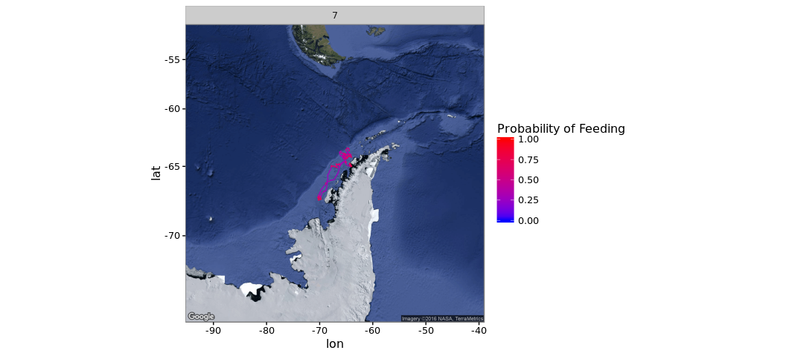
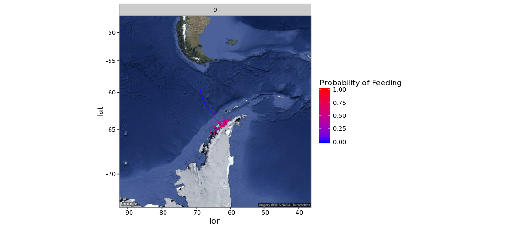

# Antarctic Whale Project: Single Species
Ben Weinstein  
`r Sys.time()`  


#Abstract


#Descriptive Statistics


<!-- -->

##Distance

<!-- -->

##Time 
<!-- -->

##Velocity
<!-- -->

##Angles

<!-- -->

#Correlated random walk

*Process Model*

$$ d_{t} \sim T*d_{t-1} + Normal(0,\Sigma)$$
$$ x_t = x_{t-1} + d_{t} $$

## Parameters

For each individual:

$$\theta = \text{Mean turning angle}$$
$$\gamma = \text{Move persistence} $$

For both behaviors process variance is:
$$ \sigma_{latitude} = 0.1$$
$$ \sigma_{longitude} = 0.1$$

##Behavioral States

$$ \text{For each individual i}$$
$$ Behavior_1 = \text{traveling}$$
$$ Behavior_2 = \text{foraging}$$

$$ \alpha_{i,1,1} = \text{Probability of remaining traveling when traveling}$$
$$\alpha_{i,2,1} = \text{Probability of switching from feeding to traveling}$$

$$\begin{matrix}
  \alpha_{i,1,1} & 1-\alpha_{i,1,1} \\
  \alpha_{i,2,1} & 1-\alpha_{i,2,1} \\
\end{matrix}
$$

##Environment

Behavioral states are a function of local environmental conditions. The first environmental condition is ocean depth. I then build a function for preferential foraging in shallow waters.

It generally follows the form, conditional on behavior at t -1:

$$Behavior_t \sim Multinomial([\phi_{traveling},\phi_{foraging}])$$
$$logit(\phi_{traveling}) = \alpha_{Behavior_{t-1}} + \beta_1 * Ocean_{y[t,]}$$
$$logit(\phi_{foraging}) = \alpha_{Behavior_{t-1}} + \beta_2 * Ocean_{y[t,]}$$


##Continious tracks

The transmitter will often go dark for 10 to 12 hours, due to weather, right in the middle of an otherwise good track. The model requires regular intervals to estimate the turning angles and temporal autocorrelation. As a track hits one of these walls, call it the end of a track, and begin a new track once the weather improves. We can remove any micro-tracks that are less than three days.
Specify a duration, calculate the number of tracks and the number of removed points. Iteratively.


How did the filter change the extent of tracks?

<!-- -->

<!-- --><!-- -->


```
##      user    system   elapsed 
##    15.889     0.826 10408.522
```

##Chains
<!-- -->

<!-- -->

###Compare to priors

<!-- -->

##Prediction - environmental function

<!-- -->

#Behavioral Prediction


##Spatial Prediction

### Per Animal

```
## $`1`
```

<!-- -->

```
## 
## $`2`
```

<!-- -->

```
## 
## $`3`
```

<!-- -->

```
## 
## $`4`
```

<!-- -->

```
## 
## $`5`
```

<!-- -->

```
## 
## $`6`
```

<!-- -->

```
## 
## $`7`
```

<!-- -->

```
## 
## $`8`
```

<!-- -->

```
## 
## $`9`
```

<!-- -->

##Log Odds of Feeding
<!-- -->

##Autocorrelation in behavior

<!-- -->

##Behavioral description

## Predicted behavior duration
<!-- -->

<!-- -->

##Location of Behavior


Global Plotting

<!-- -->

###Proportional Hazards

Survival analysis typically examines the relationship between time to death as a function of covariates. From this we can get the instantaneous rate of death at time t f(t), which is the cumulative distribution of the likelihood of death.

Let T represent survival time.

$$ P(t) = Pr(T<t)$$ 
with a pdf
$$p(t) = \frac{dP(t)}{dt}$$

The instantaneous risk of death at time t (h(t)), conditional on survival to that time:

$$ h(t) = \lim{\Delta_t\to 0} \frac{Pr[(t<T<t + \Delta_t)]|T>t}{\Delta t}$$

with covariates:
$$log (h_i(t)) = \alpha + \beta_i *x$$

The cox model has no intercept, making it semi-parametric
$$ log(h_i(t)) = h_0(t) + \beta_1 * x$$

<!-- -->


```
##             used  (Mb) gc trigger   (Mb)  max used   (Mb)
## Ncells   1842953  98.5   27854852 1487.7  43523207 2324.4
## Vcells 128192733 978.1  968765433 7391.1 901491842 6877.9
```
