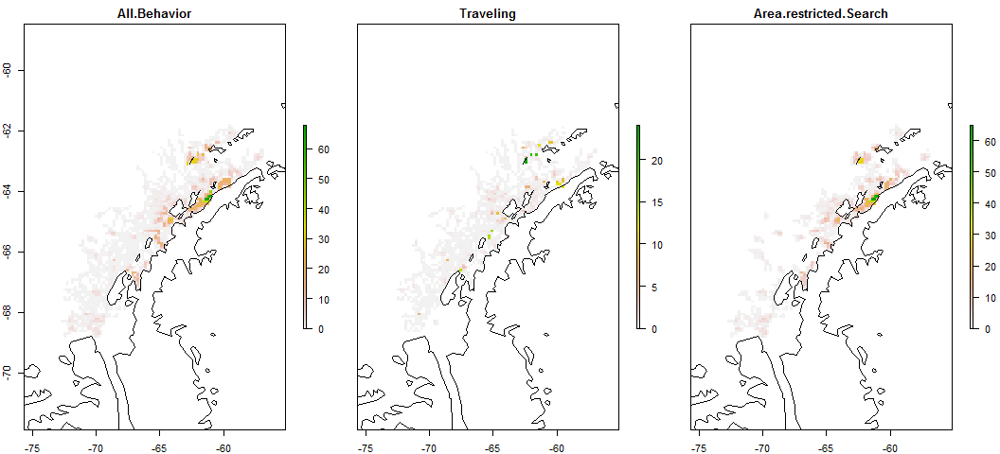
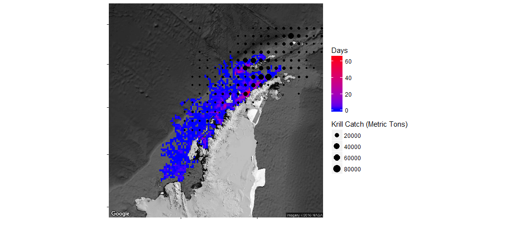
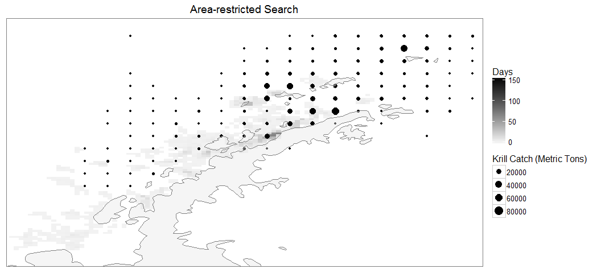

# Antarctic Whale Project: Single Species
Ben Weinstein  
`r Sys.time()`  


<!-- -->

##By Month

<!-- --><!-- -->

##CCAMLR Units

<!-- -->

<!-- --><!-- -->

##Distance


##Time 


##Velocity


##Angles


#Correlated random walk

*Process Model*

$$ d_{t} \sim T*d_{t-1} + Normal(0,\Sigma)$$
$$ x_t = x_{t-1} + d_{t} $$

## Parameters

For each individual:

$$\theta = \text{Mean turning angle}$$
$$\gamma = \text{Move persistence} $$

For both behaviors process variance is:
$$ \sigma_{latitude} = 0.1$$
$$ \sigma_{longitude} = 0.1$$

##Behavioral States

$$ \text{For each individual i}$$
$$ Behavior_1 = \text{traveling}$$
$$ Behavior_2 = \text{foraging}$$

$$ \alpha_{i,1,1} = \text{Probability of remaining traveling when traveling}$$
$$\alpha_{i,2,1} = \text{Probability of switching from Foraging to traveling}$$

$$\begin{matrix}
  \alpha_{i,1,1} & 1-\alpha_{i,1,1} \\
  \alpha_{i,2,1} & 1-\alpha_{i,2,1} \\
\end{matrix}$$


With the probability of switching states:

$$logit(\phi_{traveling}) = \alpha_{Behavior_{t-1}}$$

$$\phi_{foraging} = 1 - \phi_{traveling} $$

##Continious tracks

The transmitter will often go dark for 10 to 12 hours, due to weather, right in the middle of an otherwise good track. The model requires regular intervals to estimate the turning angles and temporal autocorrelation. As a track hits one of these walls, call it the end of a track, and begin a new track once the weather improves. We can remove any micro-tracks that are less than three days.
Specify a duration, calculate the number of tracks and the number of removed points. Iteratively.


How did the filter change the extent of tracks?

<!-- -->

<!-- -->

Look at the observations were defined into tracks.

<!-- -->

<!-- --><!-- -->


sink("Bayesian/Multi_RW.jags")
cat("
    model{
    
    #Constants
    pi <- 3.141592653589
    
    #for each if 6 argos class observation error
    
    for(x in 1:6){

      ##argos observation error##
      argos_prec[x,1:2,1:2] <- argos_cov[x,,]
      
      #Constructing the covariance matrix
      argos_cov[x,1,1] <- argos_sigma[x]
      argos_cov[x,1,2] <- 0
      argos_cov[x,2,1] <- 0
      argos_cov[x,2,2] <- argos_alpha[x]
    }
    
    for(i in 1:ind){
      for(g in 1:tracks[i]){
      
      ## Priors for first true location
      #for lat long
      y[i,g,1,1:2] ~ dmnorm(argos[i,g,1,1,1:2],argos_prec[1,1:2,1:2])
      
      #First movement - random walk.
      y[i,g,2,1:2] ~ dmnorm(y[i,g,1,1:2],iSigma)
      
      ###First Behavioral State###
      state[i,g,1] ~ dcat(lambda[]) ## assign state for first obs
      
      #Process Model for movement
      for(t in 2:(steps[i,g]-1)){
      
      #Behavioral State at time T
      phi[i,g,t,1] <- alpha_mu[state[i,g,t-1]] 
      phi[i,g,t,2] <- 1-phi[i,g,t,1]
      state[i,g,t] ~ dcat(phi[i,g,t,])
      
      #Turning covariate
      #Transition Matrix for turning angles
      T[i,g,t,1,1] <- cos(theta[state[i,g,t]])
      T[i,g,t,1,2] <- (-sin(theta[state[i,g,t]]))
      T[i,g,t,2,1] <- sin(theta[state[i,g,t]])
      T[i,g,t,2,2] <- cos(theta[state[i,g,t]])
      
      #Correlation in movement change
      d[i,g,t,1:2] <- y[i,g,t,] + gamma[state[i,g,t]] * T[i,g,t,,] %*% (y[i,g,t,1:2] - y[i,g,t-1,1:2])
      
      #Gaussian Displacement
      y[i,g,t+1,1:2] ~ dmnorm(d[i,g,t,1:2],iSigma)
      }
      
      #Final behavior state
      phi[i,g,steps[i,g],1] <- alpha_mu[state[i,g,steps[i,g]-1]] 
      phi[i,g,steps[i,g],2] <- 1-phi[i,g,steps[i,g],1]
      state[i,g,steps[i,g]] ~ dcat(phi[i,g,steps[i,g],])
      
      ##	Measurement equation - irregular observations
      # loops over regular time intervals (t)    
      
      for(t in 2:steps[i,g]){
      
      # loops over observed locations within interval t
      for(u in 1:idx[i,g,t]){ 
      zhat[i,g,t,u,1:2] <- (1-j[i,g,t,u]) * y[i,g,t-1,1:2] + j[i,g,t,u] * y[i,g,t,1:2]
      
      #for each lat and long
      #argos error
      #ag<-
      argos[i,g,t,u,1:2] ~ dmnorm(zhat[i,g,t,u,1:2],argos_prec[argos_class[i,g,t,u],1:2,1:2])
      }
      }
      }
    }
    ###Priors###
    
    #Process Variance
    iSigma ~ dwish(R,2)
    Sigma <- inverse(iSigma)
    
    ##Mean Angle
    tmp[1] ~ dbeta(10, 10)
    tmp[2] ~ dbeta(10, 10)
    
    # prior for theta in 'traveling state'
    theta[1] <- (2 * tmp[1] - 1) * pi
    
    # prior for theta in 'foraging state'    
    theta[2] <- (tmp[2] * pi * 2)
    
    ##Move persistance
    # prior for gamma (autocorrelation parameter)
    #from jonsen 2016

    ##Behavioral States
    
    gamma[1] ~ dbeta(3,2)		## gamma for state 1
    dev ~ dbeta(1,1)			## a random deviate to ensure that gamma[1] > gamma[2]
    gamma[2] <- gamma[1] * dev

    #Intercepts
    alpha_mu[1] ~ dbeta(1,1)
    alpha_mu[2] ~ dbeta(1,1)
    
    #Probability of behavior switching 
    lambda[1] ~ dbeta(1,1)
    lambda[2] <- 1 - lambda[1]
    
    ##Argos priors##
    #longitudinal argos precision, from Jonsen 2005, 2016, represented as precision not sd
    
    #by argos class
    argos_sigma[1] <- 11.9016
    argos_sigma[2] <- 10.2775
    argos_sigma[3] <- 1.228984
    argos_sigma[4] <- 2.162593
    argos_sigma[5] <- 3.885832
    argos_sigma[6] <- 0.0565539

    #latitidunal argos precision, from Jonsen 2005, 2016
    argos_alpha[1] <- 67.12537
    argos_alpha[2] <- 14.73474
    argos_alpha[3] <- 4.718973
    argos_alpha[4] <- 0.3872023
    argos_alpha[5] <- 3.836444
    argos_alpha[6] <- 0.1081156
    
    }"
    ,fill=TRUE)
sink()


##Chains


<!-- -->


<!-- -->

Look at the convergence of phi, just for an example

<!-- -->

Overall relationship between phi and state, nice test of convergence.

<!-- -->

###Compare to priors

<!-- -->

## Parameter Summary


```
##   parameter         par       mean        lower      upper
## 1  alpha_mu alpha_mu[1] 0.90536385  0.877351886 0.92848037
## 2  alpha_mu alpha_mu[2] 0.04673335  0.034270429 0.06224137
## 3     gamma    gamma[1] 0.85421528  0.825441581 0.88482701
## 4     gamma    gamma[2] 0.29897117  0.225189373 0.36825143
## 5     theta    theta[1] 0.01277826 -0.009047288 0.03507419
## 6     theta    theta[2] 3.15056776  2.957943727 3.37065860
```

<!-- -->

#Behavioral Prediction


Relationship between phi and state

<!-- -->

##Spatial Prediction

<!-- --><!-- --><!-- -->

## By individual

<!-- --><!-- -->

Overlay phi and state

<!-- -->

## Compared to CMLRR regions

<!-- -->

##Autocorrelation in behavior

<!-- -->

##Location of Behavior


# Overlap with Krill Fishery

```
## Source: local data frame [17 x 5]
## Groups: Unit, Areakm2 [8]
## 
##                      Unit   Areakm2      Year       Krill      Density
##                    <fctr>     <dbl>    <fctr>       <dbl>        <dbl>
## 1  Bransfield Strait East  28316.91 1980-2009  39365.1770 1.390165e+00
## 2  Bransfield Strait East  28316.91 2009-2016  66267.4220 2.340207e+00
## 3  Bransfield Strait West  22505.23 1980-2009  39109.4540 1.737794e+00
## 4  Bransfield Strait West  22505.23 2009-2016 334129.5481 1.484675e+01
## 5      Drake Passage East  16679.78 1980-2009 200773.1174 1.203692e+01
## 6      Drake Passage East  16679.78 2009-2016  29296.7391 1.756423e+00
## 7      Drake Passage West  16067.73 1980-2009 515394.5366 3.207638e+01
## 8      Drake Passage West  16067.73 2009-2016  60794.8695 3.783663e+00
## 9      Drake Passage West  16067.73        NA     52.0590 3.239973e-03
## 10                AP East  57248.36 1980-2009   4551.0500 7.949660e-02
## 11        Elephant Island  36693.83 1980-2009 316615.9470 8.628589e+00
## 12        Elephant Island  36693.83 2009-2016   3721.3692 1.014168e-01
## 13        AP Pelagic Area 441721.50 1980-2009  60383.9770 1.367015e-01
## 14        AP Pelagic Area 441721.50 2009-2016    848.3244 1.920496e-03
## 15        AP Pelagic Area 441721.50        NA     16.7160 3.784285e-05
## 16                AP West  37218.83 1980-2009   9645.8810 2.591667e-01
## 17                AP West  37218.83 2009-2016  56013.8708 1.504987e+00
```

<!-- -->

#Time spent in grid cell


<!-- -->


## ARS


<!-- --><!-- --><!-- -->

### Time by management unit


<!-- -->

<!-- -->

<!-- --><!-- --><!-- -->

<!-- --><!-- --><!-- -->

#Randomization tests.

## Randomization I: Do whales use SSMUs non-randomly?

<!-- -->

True time per unit

<!-- -->

## Randomization II: Do whales behave non-randomly within management units?

Given the number of observations in each unit, which are being disproportionately used for foraging?

Steps
* Randomize labels of foraging and traveling at each observation
* Calculate the total time foraging and traveling in each unit
* Compare this null distribution to the observed value

<!-- -->

Observed values

<!-- -->


```
##                   Type      Size     PrettySize     Rows Columns
## pc              tbl_df 598231464 [1] "570.5 Mb" 11490000      10
## a               tbl_df 157774144 [1] "150.5 Mb"  3944000       7
## data              list  80981360  [1] "77.2 Mb"       10      NA
## argos            array  39720952  [1] "37.9 Mb"       33      20
## obs              array  39720952  [1] "37.9 Mb"       33      20
## argos_class      array  19867968  [1] "18.9 Mb"       33      20
## j                array  19867968  [1] "18.9 Mb"       33      20
## obs_class        array  19867968  [1] "18.9 Mb"       33      20
## mdat        data.frame  16339200  [1] "15.6 Mb"    49859      47
## temp             ggmap  13116528  [1] "12.5 Mb"     1280    1280
```

```
##             used   (Mb) gc trigger   (Mb)  max used   (Mb)
## Ncells   1693469   90.5    3886542  207.6   3886542  207.6
## Vcells 136618826 1042.4  298864534 2280.2 298863716 2280.2
```
