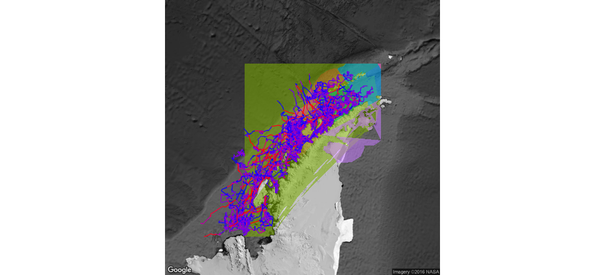

# Antarctic Whale Project: Single Species
Ben Weinstein  
`r Sys.time()`  


```
##              Type Size     PrettySize Rows Columns
## lsos     function 5184   [1] "5.1 Kb"   NA      NA
## newModel  logical   48 [1] "48 bytes"    1      NA
```


#Descriptive Statistics


<!-- -->

##By Month

<!-- -->

##Distance

<!-- -->

##Time 
<!-- -->

##Velocity
<!-- -->

##Angles

<!-- -->

#Correlated random walk

*Process Model*

$$ d_{t} \sim T*d_{t-1} + Normal(0,\Sigma)$$
$$ x_t = x_{t-1} + d_{t} $$

## Parameters

For each individual:

$$\theta = \text{Mean turning angle}$$
$$\gamma = \text{Move persistence} $$

For both behaviors process variance is:
$$ \sigma_{latitude} = 0.1$$
$$ \sigma_{longitude} = 0.1$$

##Behavioral States

$$ \text{For each individual i}$$
$$ Behavior_1 = \text{traveling}$$
$$ Behavior_2 = \text{foraging}$$

$$ \alpha_{i,1,1} = \text{Probability of remaining traveling when traveling}$$
$$\alpha_{i,2,1} = \text{Probability of switching from Foraging to traveling}$$

$$\begin{matrix}
  \alpha_{i,1,1} & 1-\alpha_{i,1,1} \\
  \alpha_{i,2,1} & 1-\alpha_{i,2,1} \\
\end{matrix}
$$

##Environment

Behavioral states are a function of local environmental conditions. The first environmental condition is ocean depth. I then build a function for preferential foraging in shallow waters.

It generally follows the form, conditional on behavior at t -1:

$$Behavior_t \sim Multinomial([\phi_{traveling},\phi_{foraging}])$$

With the probability of switching states:

$$logit(\phi_{traveling}) = \alpha_{Behavior_{t-1}} + \beta_{Month,1} * Ocean_{y[t,]} + \beta_{Month,2} * Coast_{y[t,]}$$

$$logit(\phi_{foraging}) = \alpha_{Behavior_{t-1}} $$

Following Bestley in preferring to describe the switch into feeding, but no estimating the resumption of traveling.

The effect of the environment is temporally variable such that

$$ \beta_{Month,2} \sim ~ Normal(\beta_{\mu},\beta_\tau)$$


##Continious tracks

The transmitter will often go dark for 10 to 12 hours, due to weather, right in the middle of an otherwise good track. The model requires regular intervals to estimate the turning angles and temporal autocorrelation. As a track hits one of these walls, call it the end of a track, and begin a new track once the weather improves. We can remove any micro-tracks that are less than three days.
Specify a duration, calculate the number of tracks and the number of removed points. Iteratively.


How did the filter change the extent of tracks?

<!-- -->

<!-- -->

<!-- --><!-- -->


sink("Bayesian/Multi_RW.jags")
cat("
    model{
    
    #Constants
    pi <- 3.141592653589
    
    ##argos observation error##
    argos_prec[1:2,1:2] <- inverse(argos_sigma*argos_cov[,])
    
    #Constructing the covariance matrix
    argos_cov[1,1] <- 1
    argos_cov[1,2] <- sqrt(argos_alpha) * rho
    argos_cov[2,1] <- sqrt(argos_alpha) * rho
    argos_cov[2,2] <- argos_alpha
    
    for(i in 1:ind){
    for(g in 1:tracks[i]){
    
    ## Priors for first true location
    #for lat long
    y[i,g,1,1:2] ~ dmnorm(argos[i,g,1,1,1:2],argos_prec)
    
    #First movement - random walk.
    y[i,g,2,1:2] ~ dmnorm(y[i,g,1,1:2],iSigma)
    
    ###First Behavioral State###
    state[i,g,1] ~ dcat(lambda[]) ## assign state for first obs
    
    #Process Model for movement
    for(t in 2:(steps[i,g]-1)){
    
    #Behavioral State at time T
    logit(phi[i,g,t,1]) <- alpha_mu[state[i,g,t-1]] + beta[Month[i,g,t-1],state[i,g,t-1]] * ocean[i,g,t] + beta2[Month[i,g,t-1],state[i,g,t-1]] * coast[i,g,t]
    phi[i,g,t,2] <- 1-phi[i,g,t,1]
    state[i,g,t] ~ dcat(phi[i,g,t,])
    
    #Turning covariate
    #Transition Matrix for turning angles
    T[i,g,t,1,1] <- cos(theta[state[i,g,t]])
    T[i,g,t,1,2] <- (-sin(theta[state[i,g,t]]))
    T[i,g,t,2,1] <- sin(theta[state[i,g,t]])
    T[i,g,t,2,2] <- cos(theta[state[i,g,t]])
    
    #Correlation in movement change
    d[i,g,t,1:2] <- y[i,g,t,] + gamma[state[i,g,t]] * T[i,g,t,,] %*% (y[i,g,t,1:2] - y[i,g,t-1,1:2])
    
    #Gaussian Displacement
    y[i,g,t+1,1:2] ~ dmnorm(d[i,g,t,1:2],iSigma)
    }
    
    #Final behavior state
    logit(phi[i,g,steps[i,g],1]) <- alpha_mu[state[i,g,steps[i,g]-1]] + beta[Month[i,g,steps[i,g]-1],state[i,g,steps[i,g]-1]] * ocean[i,g,steps[i,g]] + beta2[Month[i,g,steps[i,g]-1],state[i,g,steps[i,g]-1]] * coast[i,g,steps[i,g]]
    phi[i,g,steps[i,g],2] <- 1-phi[i,g,steps[i,g],1]
    state[i,g,steps[i,g]] ~ dcat(phi[i,g,steps[i,g],])
    
    ##	Measurement equation - irregular observations
    # loops over regular time intervals (t)    
    
    for(t in 2:steps[i,g]){
    
    # loops over observed locations within interval t
    for(u in 1:idx[i,g,t]){ 
    zhat[i,g,t,u,1:2] <- (1-j[i,g,t,u]) * y[i,g,t-1,1:2] + j[i,g,t,u] * y[i,g,t,1:2]
    
    #for each lat and long
    #argos error
    argos[i,g,t,u,1:2] ~ dmnorm(zhat[i,g,t,u,1:2],argos_prec)
    }
    }
    }
    }
    ###Priors###
    
    #Process Variance
    iSigma ~ dwish(R,2)
    Sigma <- inverse(iSigma)
    
    ##Mean Angle
    tmp[1] ~ dbeta(10, 10)
    tmp[2] ~ dbeta(10, 10)
    
    # prior for theta in 'traveling state'
    theta[1] <- (2 * tmp[1] - 1) * pi
    
    # prior for theta in 'foraging state'    
    theta[2] <- (tmp[2] * pi * 2)
    
    ##Move persistance
    # prior for gamma (autocorrelation parameter) in state 1
    gamma[2] ~ dbeta(1.5, 5)		## gamma for state 2
    dev ~ dbeta(1,1)			## a random deviate to ensure that gamma[1] > gamma[2]
    gamma[1] <- gamma[2] + dev 		## gamma for state 1
    
    
    #Monthly Covaraites
    for(x in 1:Months){
    beta[x,1]~dnorm(beta_mu[1],beta_tau[1])
    beta[x,2]<-0
    beta2[x,1]~dnorm(beta2_mu[1],beta2_tau[1])
    beta2[x,2]<-0
    }
    
    ##Behavioral States
    
    #Hierarchical structure across motnhs
    #Intercepts
    alpha_mu[1] ~ dnorm(0,0.386)
    alpha_mu[2] ~ dnorm(0,0.386)
    
    #Variance
    alpha_tau[1] ~ dt(0,1,1)I(0,)
    alpha_tau[2] ~ dt(0,1,1)I(0,)
    
    #Slopes
    ## Ocean Depth
    beta_mu[1] ~ dnorm(0,0.386)
    beta_mu[2] = 0
    
    # Distance coast
    beta2_mu[1] ~ dnorm(0,0.386)
    beta2_mu[2] = 0
    
    #Monthly Variance
    #Ocean
    beta_tau[1] ~ dt(0,1,1)I(0,)
    beta_tau[2] = 0
    
    #Coast
    beta2_tau[1] ~ dt(0,1,1)I(0,)
    beta2_tau[2]  = 0
    
    
    #Probability of behavior switching 
    lambda[1] ~ dbeta(1,1)
    lambda[2] <- 1 - lambda[1]
    
    ##Argos priors##
    #longitudinal argos error
    argos_sigma ~ dunif(0,10)
    
    #latitidunal argos error
    argos_alpha~dunif(0,10)
    
    #correlation in argos error
    rho ~ dunif(-1, 1)
    
    
    }"
    ,fill=TRUE)
sink()


```
##     user   system  elapsed 
##  492.931    1.857 2283.980
```


##Chains

```
##                         Type      Size     PrettySize  Rows Columns
## jagM          rjags.parallel 473960744   [1] "452 Mb"     6      NA
## ice              RasterLayer 144011608 [1] "137.3 Mb"  3000    6000
## data                    list  68284944  [1] "65.1 Mb"    11      NA
## argos                  array  42969704    [1] "41 Mb"    34      21
## obs                    array  42969704    [1] "41 Mb"    34      21
## d     SpatialPointsDataFrame  26388136  [1] "25.2 Mb" 52492      60
## mdat              data.frame  26066656  [1] "24.9 Mb" 57230      57
## oxy               data.frame  21585864  [1] "20.6 Mb" 49938      64
## j                      array  21492400  [1] "20.5 Mb"    34      21
## moved              MoveStack  20413880  [1] "19.5 Mb" 49938      54
```

```
##            used  (Mb) gc trigger   (Mb)  max used   (Mb)
## Ncells  1517576  81.1    3205452  171.2   3205452  171.2
## Vcells 47164675 359.9  187700905 1432.1 234625905 1790.1
```

<!-- -->


<!-- -->

###Compare to priors

<!-- -->

## Parameter Summary

```
##    parameter         par        mean       lower       upper
## 1   alpha_mu alpha_mu[1] -1.47436244 -3.79904105 -0.09925083
## 2   alpha_mu alpha_mu[2] -1.70260919 -1.95561670 -1.37162709
## 3       beta   beta[1,1] -0.74892843 -3.16326261  1.13157745
## 4       beta   beta[2,1] -1.02252400 -3.04885313  0.80695037
## 5       beta   beta[3,1] -0.23647847 -2.27068598  1.65930299
## 6       beta   beta[4,1]  0.04877074 -0.88078715  0.98928146
## 7       beta   beta[5,1] -0.55859554 -2.63992839  1.34575749
## 8       beta   beta[6,1] -0.44206366 -2.46222585  1.51614611
## 9       beta   beta[1,2]  0.00000000  0.00000000  0.00000000
## 10      beta   beta[2,2]  0.00000000  0.00000000  0.00000000
## 11      beta   beta[3,2]  0.00000000  0.00000000  0.00000000
## 12      beta   beta[4,2]  0.00000000  0.00000000  0.00000000
## 13      beta   beta[5,2]  0.00000000  0.00000000  0.00000000
## 14      beta   beta[6,2]  0.00000000  0.00000000  0.00000000
## 15     beta2  beta2[1,1] -0.50675211 -1.74999368  0.04058361
## 16     beta2  beta2[2,1] -0.61463152 -1.92114437  0.02971938
## 17     beta2  beta2[3,1] -0.61175123 -2.32023438  0.03087522
## 18     beta2  beta2[4,1]  0.02178906  0.01008166  0.03593939
## 19     beta2  beta2[5,1] -0.44411203 -1.80089022  0.21468365
## 20     beta2  beta2[6,1] -0.42955888 -2.16435304  0.22553022
## 21     beta2  beta2[1,2]  0.00000000  0.00000000  0.00000000
## 22     beta2  beta2[2,2]  0.00000000  0.00000000  0.00000000
## 23     beta2  beta2[3,2]  0.00000000  0.00000000  0.00000000
## 24     beta2  beta2[4,2]  0.00000000  0.00000000  0.00000000
## 25     beta2  beta2[5,2]  0.00000000  0.00000000  0.00000000
## 26     beta2  beta2[6,2]  0.00000000  0.00000000  0.00000000
## 27  beta2_mu beta2_mu[1] -0.39762275 -1.36525446  0.11505955
## 28  beta2_mu beta2_mu[2]  0.00000000  0.00000000  0.00000000
## 29   beta_mu  beta_mu[1] -0.44910273 -1.66196289  0.44156361
## 30   beta_mu  beta_mu[2]  0.00000000  0.00000000  0.00000000
## 31     gamma    gamma[1]  1.16088308  0.90533524  1.42583702
## 32     gamma    gamma[2]  0.29772712  0.13050172  0.43777810
## 33     theta    theta[1] -0.01068402 -0.04667164  0.01850577
## 34     theta    theta[2]  6.18712700  6.09807415  6.24955245
```

<!-- -->

#Behavior and environment

##Hierarchical 

### Ocean Depth
<!-- --><!-- -->

### Distance to Coast
<!-- --><!-- -->

###Interaction

<!-- -->

## By Month

### Depth

<!-- --><!-- -->

Just the probability of feeding when traveling.

<!-- -->

Just mean estimate.

<!-- --><!-- -->

### Coast

<!-- --><!-- -->

Zooming in on the top right plot.
<!-- --><!-- --><!-- -->

Just mean estimate.

<!-- --><!-- -->

#Behavioral Prediction


##Spatial Prediction

<!-- -->

### Per Animal

```
## $`1`
```

<!-- -->

```
## 
## $`2`
```

<!-- -->

```
## 
## $`3`
```

<!-- -->

```
## 
## $`4`
```

<!-- -->

```
## 
## $`5`
```

<!-- -->

```
## 
## $`6`
```

<!-- -->

```
## 
## $`7`
```

<!-- -->

```
## 
## $`8`
```

<!-- -->

```
## 
## $`9`
```

<!-- -->

```
## 
## $`10`
```

<!-- -->

```
## 
## $`11`
```

<!-- -->

```
## 
## $`12`
```

<!-- -->

```
## 
## $`13`
```

<!-- -->

```
## 
## $`14`
```

<!-- -->

```
## 
## $`15`
```

<!-- -->

```
## 
## $`16`
```

<!-- -->

```
## 
## $`17`
```

<!-- -->

```
## 
## $`18`
```

<!-- -->

```
## 
## $`19`
```

<!-- -->

```
## 
## $`20`
```

<!-- -->

```
## 
## $`21`
```

<!-- -->

```
## 
## $`22`
```

<!-- -->

```
## 
## $`23`
```

<!-- -->

```
## 
## $`24`
```

<!-- -->

```
## 
## $`25`
```

<!-- -->

```
## 
## $`26`
```

<!-- -->

```
## 
## $`27`
```

<!-- -->

```
## 
## $`28`
```

<!-- -->

```
## 
## $`29`
```

<!-- -->

```
## 
## $`30`
```

<!-- -->

```
## 
## $`31`
```

<!-- -->

```
## 
## $`32`
```

<!-- -->

```
## 
## $`33`
```

<!-- -->

```
## 
## $`34`
```

<!-- -->

##Log Odds of Foraging

### Ocean Depth

<!-- -->

### Distance From Coast

<!-- -->

##Autocorrelation in behavior

<!-- -->

##Behavioral description

##Location of Behavior

<!-- -->

#Environmental Prediction - Probability of Foraging across time


## Bathymetry

<!-- -->

## Distance to coast

<!-- -->

##All variables

<!-- -->

# Overlap with Krill Fishery
<!-- -->

<!-- -->

## By Month


## Change in foraging areas

Jan verus May

Red = Better Foraging in Jan
Blue = Better Foraging in May

<!-- -->

### Variance in monthly suitability

<!-- -->

### Mean suitability

<!-- -->

## Monthly Overlap with Krill Fishery

<!-- -->


```
##                         Type      Size     PrettySize    Rows Columns
## ice              RasterLayer 144011608 [1] "137.3 Mb"    3000    6000
## pc                    tbl_df  90943168  [1] "86.7 Mb" 1614400      12
## data                    list  68284944  [1] "65.1 Mb"      11      NA
## argos                  array  42969704    [1] "41 Mb"      34      21
## obs                    array  42969704    [1] "41 Mb"      34      21
## d     SpatialPointsDataFrame  26388136  [1] "25.2 Mb"   52492      60
## mdat              data.frame  26066656  [1] "24.9 Mb"   57230      57
## oxy               data.frame  21585864  [1] "20.6 Mb"   49938      64
## j                      array  21492400  [1] "20.5 Mb"      34      21
## moved              MoveStack  20413880  [1] "19.5 Mb"   49938      54
```

```
##             used  (Mb) gc trigger   (Mb)  max used   (Mb)
## Ncells   1660289  88.7    5695528  304.2  14442815  771.4
## Vcells 118417998 903.5  376882324 2875.4 443504726 3383.7
```
