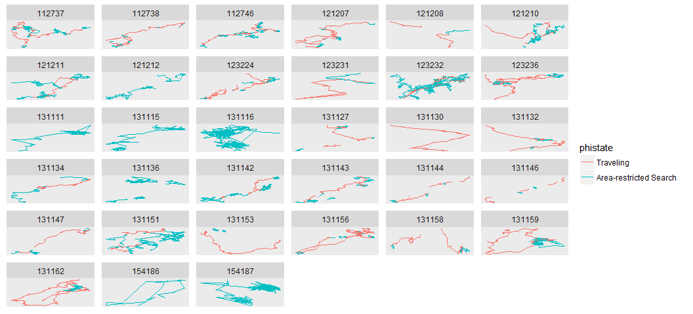
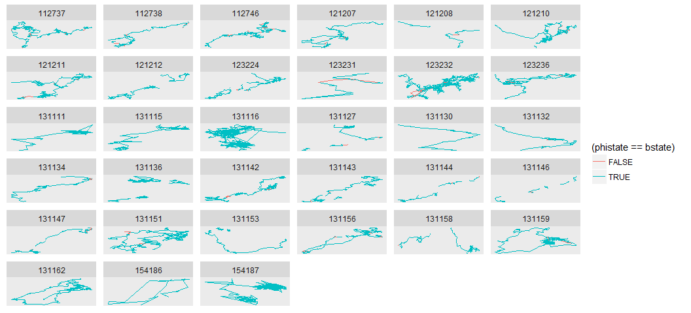
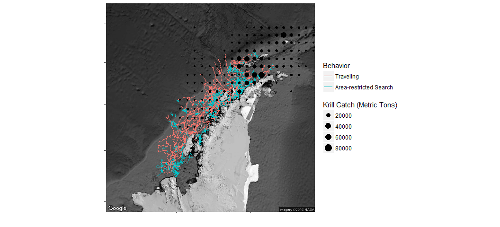
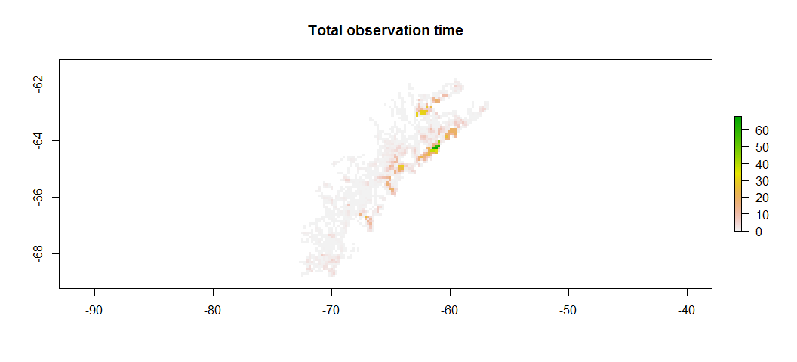

# Antarctic Whale Project: Single Species
Ben Weinstein  
`r Sys.time()`  


#Descriptive Statistics


<!-- -->

##By Month

<!-- -->

##Distance

<!-- -->

##Time 
<!-- -->

##Velocity
<!-- -->

##Angles

<!-- -->

#Correlated random walk

*Process Model*

$$ d_{t} \sim T*d_{t-1} + Normal(0,\Sigma)$$
$$ x_t = x_{t-1} + d_{t} $$

## Parameters

For each individual:

$$\theta = \text{Mean turning angle}$$
$$\gamma = \text{Move persistence} $$

For both behaviors process variance is:
$$ \sigma_{latitude} = 0.1$$
$$ \sigma_{longitude} = 0.1$$

##Behavioral States

$$ \text{For each individual i}$$
$$ Behavior_1 = \text{traveling}$$
$$ Behavior_2 = \text{foraging}$$

$$ \alpha_{i,1,1} = \text{Probability of remaining traveling when traveling}$$
$$\alpha_{i,2,1} = \text{Probability of switching from Foraging to traveling}$$

$$\begin{matrix}
  \alpha_{i,1,1} & 1-\alpha_{i,1,1} \\
  \alpha_{i,2,1} & 1-\alpha_{i,2,1} \\
\end{matrix}
$$

##Environment

Behavioral states are a function of local environmental conditions. The first environmental condition is ocean depth. I then build a function for preferential foraging in shallow waters.

It generally follows the form, conditional on behavior at t -1:

$$Behavior_t \sim Multinomial([\phi_{traveling},\phi_{foraging}])$$

With the probability of switching states:

$$logit(\phi_{traveling}) = \alpha_{Behavior_{t-1}} + \beta_{Month,1} * Ocean_{y[t,]} + \beta_{Month,2} * Coast_{y[t,]}$$

$$logit(\phi_{foraging}) = \alpha_{Behavior_{t-1}} $$

Following Bestley in preferring to describe the switch into feeding, but no estimating the resumption of traveling.

The effect of the environment is temporally variable such that

$$ \beta_{Month,2} \sim ~ Normal(\beta_{\mu},\beta_\tau)$$


##Continious tracks

The transmitter will often go dark for 10 to 12 hours, due to weather, right in the middle of an otherwise good track. The model requires regular intervals to estimate the turning angles and temporal autocorrelation. As a track hits one of these walls, call it the end of a track, and begin a new track once the weather improves. We can remove any micro-tracks that are less than three days.
Specify a duration, calculate the number of tracks and the number of removed points. Iteratively.


How did the filter change the extent of tracks?

<!-- -->

<!-- -->

<!-- --><!-- -->


```
##    user  system elapsed 
##    1.22    0.10  136.00
```


##Chains

```
##                         Type     Size    PrettySize  Rows Columns
## mdat              data.frame 26066656 [1] "24.9 Mb" 57230      57
## m                      ggmap 13116432 [1] "12.5 Mb"  1280    1280
## d     SpatialPointsDataFrame  3573656  [1] "3.4 Mb"  7942      64
## oxy               data.frame  3443496  [1] "3.3 Mb"  7942      64
## sxy                     list  1994704  [1] "1.9 Mb"    21      NA
## mxy               grouped_df  1871176  [1] "1.8 Mb"  3803      69
## jagM          rjags.parallel  1620728  [1] "1.5 Mb"     6      NA
## data                    list  1128208  [1] "1.1 Mb"    11      NA
## argos                  array   691176  [1] "675 Kb"     2      12
## obs                    array   691176  [1] "675 Kb"     2      12
```

```
##           used (Mb) gc trigger  (Mb) max used  (Mb)
## Ncells 1495874 79.9    2637877 140.9  2637877 140.9
## Vcells 8565407 65.4   31156538 237.8 56241480 429.1
```

```
##           used (Mb) gc trigger  (Mb) max used  (Mb)
## Ncells 1490951 79.7    2637877 140.9  2637877 140.9
## Vcells 7888456 60.2   24925230 190.2 56241480 429.1
```

<!-- -->


<!-- -->

###Compare to priors

<!-- -->

## Parameter Summary

```
##    parameter         par         mean       lower       upper
## 1   alpha_mu alpha_mu[1] -1.036173707 -3.93239634  1.23350593
## 2   alpha_mu alpha_mu[2]  0.186877428 -1.17175757  1.55959984
## 3       beta   beta[1,1] -0.141005123 -1.89336242  1.80426171
## 4       beta   beta[2,1]  0.004119516 -1.81008562  1.56683487
## 5       beta   beta[3,1]  0.044204506 -1.52644449  1.15773055
## 6       beta   beta[4,1]  0.311075762 -0.95704603  1.35641796
## 7       beta   beta[5,1] -0.309386466 -1.99324723  0.69232750
## 8       beta   beta[1,2]  0.000000000  0.00000000  0.00000000
## 9       beta   beta[2,2]  0.000000000  0.00000000  0.00000000
## 10      beta   beta[3,2]  0.000000000  0.00000000  0.00000000
## 11      beta   beta[4,2]  0.000000000  0.00000000  0.00000000
## 12      beta   beta[5,2]  0.000000000  0.00000000  0.00000000
## 13   beta_mu  beta_mu[1] -0.080347235 -0.98733467  0.77901393
## 14   beta_mu  beta_mu[2]  0.000000000  0.00000000  0.00000000
## 15     beta2  beta2[1,1] -1.243037350 -2.72164551 -0.31415846
## 16     beta2  beta2[2,1] -0.696848162 -1.36825899 -0.19523779
## 17     beta2  beta2[3,1] -0.926160004 -1.39334617 -0.46883858
## 18     beta2  beta2[4,1] -1.059332768 -1.39327606 -0.60393622
## 19     beta2  beta2[5,1] -0.363180879 -1.18710453  0.22022130
## 20     beta2  beta2[1,2]  0.000000000  0.00000000  0.00000000
## 21     beta2  beta2[2,2]  0.000000000  0.00000000  0.00000000
## 22     beta2  beta2[3,2]  0.000000000  0.00000000  0.00000000
## 23     beta2  beta2[4,2]  0.000000000  0.00000000  0.00000000
## 24     beta2  beta2[5,2]  0.000000000  0.00000000  0.00000000
## 25  beta2_mu beta2_mu[1] -0.913852677 -1.24859160 -0.41778463
## 26  beta2_mu beta2_mu[2]  0.000000000  0.00000000  0.00000000
## 27     gamma    gamma[1]  1.057178600  0.83573582  1.27414471
## 28     gamma    gamma[2]  0.329435027  0.15846767  0.47074921
## 29     theta    theta[1]  0.010065471 -0.02709249  0.06264831
## 30     theta    theta[2]  3.343830664  0.47751855  6.16522796
```

<!-- -->

#Behavior and environment

##Hierarchical 

### Ocean Depth
<!-- --><!-- -->

### Distance to Coast
<!-- --><!-- -->

###Interaction

<!-- -->

## By Month

### Depth

<!-- --><!-- -->

Just the probability of feeding when traveling.

<!-- -->

Just mean estimate.

<!-- --><!-- -->

### Coast

<!-- --><!-- -->

Zooming in on the top right plot.
<!-- --><!-- --><!-- -->

Just mean estimate.

<!-- --><!-- -->

#Behavioral Prediction


##Spatial Prediction

<!-- -->

### Per Animal

```
## $`1`
```

<!-- -->

```
## 
## $`2`
```

<!-- -->

##Log Odds of Foraging

### Ocean Depth

<!-- -->

### Distance From Coast

<!-- -->

##Autocorrelation in behavior

<!-- -->

##Behavioral description

##Location of Behavior

<!-- -->

#Environmental Prediction - Probability of Foraging across time


## Bathymetry

<!-- -->

## Distance to coast

<!-- -->

##All variables

<!-- -->

# Overlap with Krill Fishery
<!-- -->

<!-- -->

## By Month


## Change in foraging areas

Jan verus May

Red = Better Foraging in Jan
Blue = Better Foraging in May

<!-- -->

### Variance in monthly suitability

<!-- -->

### Mean suitability

<!-- -->

## Monthly Overlap with Krill Fishery

<!-- -->


```
##                            Type     Size      PrettySize  Rows Columns
## mdat                 data.frame 26066656   [1] "24.9 Mb" 57230      57
## temp                      ggmap 13116048   [1] "12.5 Mb"  1280    1280
## d        SpatialPointsDataFrame  3573656    [1] "3.4 Mb"  7942      64
## oxy                  data.frame  3443496    [1] "3.3 Mb"  7942      64
## sxy                        list  1693456    [1] "1.6 Mb"     2      NA
## mxy                  data.frame  1669496    [1] "1.6 Mb"  3526      70
## pc                       tbl_df  1077904      [1] "1 Mb" 18000      12
## allplot              grouped_df  1031880 [1] "1007.7 Kb" 19780       7
## monthras                   list   858576  [1] "838.5 Kb"     5      NA
## mdf                  data.frame   650704  [1] "635.5 Kb"  9515      11
```

```
##            used (Mb) gc trigger  (Mb) max used  (Mb)
## Ncells  1622120 86.7    4547696 242.9  5684620 303.6
## Vcells 11890867 90.8   36068331 275.2 56241480 429.1
```
