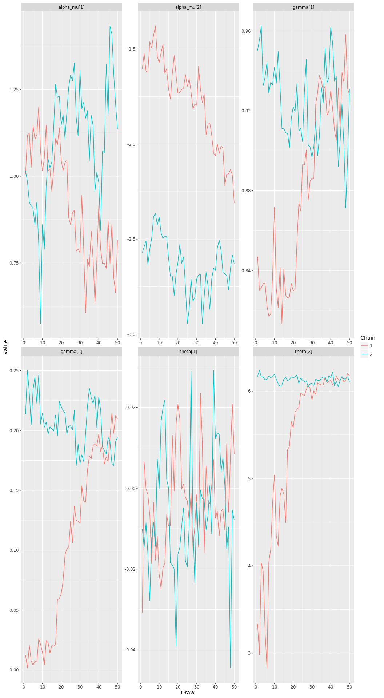
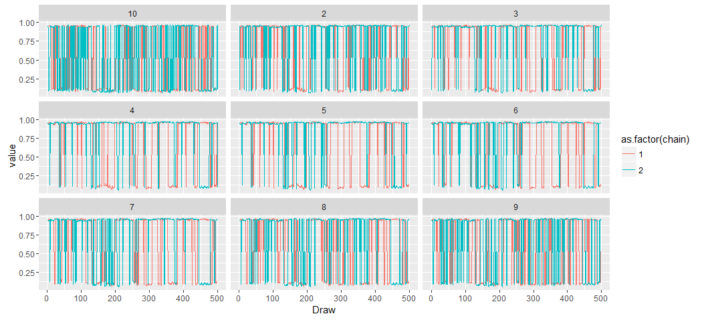
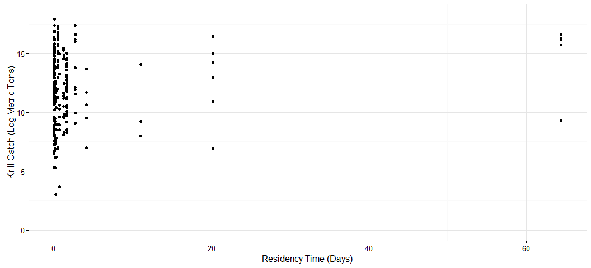
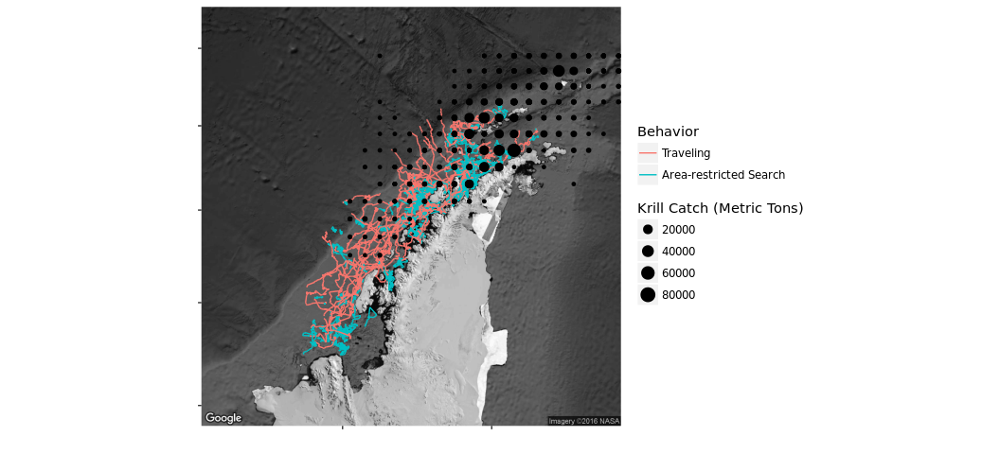

# Antarctic Whale Project: Single Species
Ben Weinstein  
`r Sys.time()`  


#Descriptive Statistics


<!-- -->

##By Month

<!-- -->

##Distance

<!-- -->

##Time 
<!-- -->

##Velocity
<!-- -->

##Angles

<!-- -->

#Correlated random walk

*Process Model*

$$ d_{t} \sim T*d_{t-1} + Normal(0,\Sigma)$$
$$ x_t = x_{t-1} + d_{t} $$

## Parameters

For each individual:

$$\theta = \text{Mean turning angle}$$
$$\gamma = \text{Move persistence} $$

For both behaviors process variance is:
$$ \sigma_{latitude} = 0.1$$
$$ \sigma_{longitude} = 0.1$$

##Behavioral States

$$ \text{For each individual i}$$
$$ Behavior_1 = \text{traveling}$$
$$ Behavior_2 = \text{foraging}$$

$$ \alpha_{i,1,1} = \text{Probability of remaining traveling when traveling}$$
$$\alpha_{i,2,1} = \text{Probability of switching from Foraging to traveling}$$

$$\begin{matrix}
  \alpha_{i,1,1} & 1-\alpha_{i,1,1} \\
  \alpha_{i,2,1} & 1-\alpha_{i,2,1} \\
\end{matrix}
$$

##Environment

Behavioral states are a function of local environmental conditions. The first environmental condition is ocean depth. I then build a function for preferential foraging in shallow waters.

It generally follows the form, conditional on behavior at t -1:

$$Behavior_t \sim Multinomial([\phi_{traveling},\phi_{foraging}])$$

With the probability of switching states:

$$logit(\phi_{traveling}) = \alpha_{Behavior_{t-1}} + \beta_{Month,1} * Ocean_{y[t,]} + \beta_{Month,2} * Coast_{y[t,]}$$

$$logit(\phi_{foraging}) = \alpha_{Behavior_{t-1}} $$

Following Bestley in preferring to describe the switch into feeding, but no estimating the resumption of traveling.

The effect of the environment is temporally variable such that

$$ \beta_{Month,2} \sim ~ Normal(\beta_{\mu},\beta_\tau)$$


##Continious tracks

The transmitter will often go dark for 10 to 12 hours, due to weather, right in the middle of an otherwise good track. The model requires regular intervals to estimate the turning angles and temporal autocorrelation. As a track hits one of these walls, call it the end of a track, and begin a new track once the weather improves. We can remove any micro-tracks that are less than three days.
Specify a duration, calculate the number of tracks and the number of removed points. Iteratively.


How did the filter change the extent of tracks?

<!-- -->

<!-- -->

<!-- --><!-- -->


sink("Bayesian/Multi_RW.jags")
cat("
    model{
    
    #Constants
    pi <- 3.141592653589
    
    ##argos observation error##
    argos_prec[1:2,1:2] <- inverse(argos_sigma*argos_cov[,])
    
    #Constructing the covariance matrix
    argos_cov[1,1] <- 1
    argos_cov[1,2] <- sqrt(argos_alpha) * rho
    argos_cov[2,1] <- sqrt(argos_alpha) * rho
    argos_cov[2,2] <- argos_alpha
    
    for(i in 1:ind){
    for(g in 1:tracks[i]){
    
    ## Priors for first true location
    #for lat long
    y[i,g,1,1:2] ~ dmnorm(argos[i,g,1,1,1:2],argos_prec)
    
    #First movement - random walk.
    y[i,g,2,1:2] ~ dmnorm(y[i,g,1,1:2],iSigma)
    
    ###First Behavioral State###
    state[i,g,1] ~ dcat(lambda[]) ## assign state for first obs
    
    #Process Model for movement
    for(t in 2:(steps[i,g]-1)){
    
    #Behavioral State at time T
    logit(phi[i,g,t,1]) <- alpha_mu[state[i,g,t-1]] + beta[Month[i,g,t-1],state[i,g,t-1]] * ocean[i,g,t] + beta2[Month[i,g,t-1],state[i,g,t-1]] * coast[i,g,t]
    phi[i,g,t,2] <- 1-phi[i,g,t,1]
    state[i,g,t] ~ dcat(phi[i,g,t,])
    
    #Turning covariate
    #Transition Matrix for turning angles
    T[i,g,t,1,1] <- cos(theta[state[i,g,t]])
    T[i,g,t,1,2] <- (-sin(theta[state[i,g,t]]))
    T[i,g,t,2,1] <- sin(theta[state[i,g,t]])
    T[i,g,t,2,2] <- cos(theta[state[i,g,t]])
    
    #Correlation in movement change
    d[i,g,t,1:2] <- y[i,g,t,] + gamma[state[i,g,t]] * T[i,g,t,,] %*% (y[i,g,t,1:2] - y[i,g,t-1,1:2])
    
    #Gaussian Displacement
    y[i,g,t+1,1:2] ~ dmnorm(d[i,g,t,1:2],iSigma)
    }
    
    #Final behavior state
    logit(phi[i,g,steps[i,g],1]) <- alpha_mu[state[i,g,steps[i,g]-1]] + beta[Month[i,g,steps[i,g]-1],state[i,g,steps[i,g]-1]] * ocean[i,g,steps[i,g]] + beta2[Month[i,g,steps[i,g]-1],state[i,g,steps[i,g]-1]] * coast[i,g,steps[i,g]]
    phi[i,g,steps[i,g],2] <- 1-phi[i,g,steps[i,g],1]
    state[i,g,steps[i,g]] ~ dcat(phi[i,g,steps[i,g],])
    
    ##	Measurement equation - irregular observations
    # loops over regular time intervals (t)    
    
    for(t in 2:steps[i,g]){
    
    # loops over observed locations within interval t
    for(u in 1:idx[i,g,t]){ 
    zhat[i,g,t,u,1:2] <- (1-j[i,g,t,u]) * y[i,g,t-1,1:2] + j[i,g,t,u] * y[i,g,t,1:2]
    
    #for each lat and long
    #argos error
    argos[i,g,t,u,1:2] ~ dmnorm(zhat[i,g,t,u,1:2],argos_prec)
    }
    }
    }
    }
    ###Priors###
    
    #Process Variance
    iSigma ~ dwish(R,2)
    Sigma <- inverse(iSigma)
    
    ##Mean Angle
    tmp[1] ~ dbeta(10, 10)
    tmp[2] ~ dbeta(10, 10)
    
    # prior for theta in 'traveling state'
    theta[1] <- (2 * tmp[1] - 1) * pi
    
    # prior for theta in 'foraging state'    
    theta[2] <- (tmp[2] * pi * 2)
    
    ##Move persistance
    # prior for gamma (autocorrelation parameter) in state 1
    gamma[2] ~ dbeta(1.5, 5)		## gamma for state 2
    dev ~ dbeta(1,1)			## a random deviate to ensure that gamma[1] > gamma[2]
    gamma[1] <- gamma[2] + dev 		## gamma for state 1
    
    
    #Monthly Covaraites
    for(x in 1:Months){
    beta[x,1]~dnorm(beta_mu[1],beta_tau[1])
    beta[x,2]<-0
    beta2[x,1]~dnorm(beta2_mu[1],beta2_tau[1])
    beta2[x,2]<-0
    }
    
    ##Behavioral States
    
    #Hierarchical structure across motnhs
    #Intercepts
    alpha_mu[1] ~ dnorm(0,0.386)
    alpha_mu[2] ~ dnorm(0,0.386)
    
    #Variance
    alpha_tau[1] ~ dt(0,1,1)I(0,)
    alpha_tau[2] ~ dt(0,1,1)I(0,)
    
    #Slopes
    ## Ocean Depth
    beta_mu[1] ~ dnorm(0,0.386)
    beta_mu[2] = 0
    
    # Distance coast
    beta2_mu[1] ~ dnorm(0,0.386)
    beta2_mu[2] = 0
    
    #Monthly Variance
    #Ocean
    beta_tau[1] ~ dt(0,1,1)I(0,)
    beta_tau[2] = 0
    
    #Coast
    beta2_tau[1] ~ dt(0,1,1)I(0,)
    beta2_tau[2]  = 0
    
    
    #Probability of behavior switching 
    lambda[1] ~ dbeta(1,1)
    lambda[2] <- 1 - lambda[1]
    
    ##Argos priors##
    #longitudinal argos error
    argos_sigma ~ dunif(0,10)
    
    #latitidunal argos error
    argos_alpha~dunif(0,10)
    
    #correlation in argos error
    rho ~ dunif(-1, 1)
    
    
    }"
    ,fill=TRUE)
sink()


```
##      user    system   elapsed 
##  1316.639     5.971 51781.527
```

##Chains


<!-- -->


<!-- -->

###Compare to priors

<!-- -->

## Parameter Summary

```
##    parameter         par         mean        lower        upper
## 1   alpha_mu alpha_mu[1] -0.330913693 -0.757802643  0.134441605
## 2   alpha_mu alpha_mu[2] -1.572260492 -1.938777644 -1.236364489
## 3       beta   beta[1,1]  0.183101984 -0.887965295  1.185169355
## 4       beta   beta[2,1] -0.079967958 -0.948066739  0.643506774
## 5       beta   beta[3,1]  0.328869960 -0.532875606  1.084758203
## 6       beta   beta[4,1]  0.335265064 -0.369042495  1.198041733
## 7       beta   beta[5,1]  0.381040128 -0.251754125  1.158015520
## 8       beta   beta[6,1]  0.239405198 -1.097063440  1.434378908
## 9       beta   beta[1,2]  0.000000000  0.000000000  0.000000000
## 10      beta   beta[2,2]  0.000000000  0.000000000  0.000000000
## 11      beta   beta[3,2]  0.000000000  0.000000000  0.000000000
## 12      beta   beta[4,2]  0.000000000  0.000000000  0.000000000
## 13      beta   beta[5,2]  0.000000000  0.000000000  0.000000000
## 14      beta   beta[6,2]  0.000000000  0.000000000  0.000000000
## 15     beta2  beta2[1,1]  0.016258938  0.005064731  0.029429938
## 16     beta2  beta2[2,1]  0.013035526  0.002326475  0.023688673
## 17     beta2  beta2[3,1]  0.005435094 -0.005730867  0.017288005
## 18     beta2  beta2[4,1]  0.013647757  0.001427641  0.026489118
## 19     beta2  beta2[5,1]  0.012178045  0.002193089  0.024885245
## 20     beta2  beta2[6,1] -0.070494561 -0.811685293  0.037708229
## 21     beta2  beta2[1,2]  0.000000000  0.000000000  0.000000000
## 22     beta2  beta2[2,2]  0.000000000  0.000000000  0.000000000
## 23     beta2  beta2[3,2]  0.000000000  0.000000000  0.000000000
## 24     beta2  beta2[4,2]  0.000000000  0.000000000  0.000000000
## 25     beta2  beta2[5,2]  0.000000000  0.000000000  0.000000000
## 26     beta2  beta2[6,2]  0.000000000  0.000000000  0.000000000
## 27  beta2_mu beta2_mu[1]  0.004109571 -0.041173294  0.030472383
## 28  beta2_mu beta2_mu[2]  0.000000000  0.000000000  0.000000000
## 29   beta_mu  beta_mu[1]  0.230151051 -0.492964014  0.930077754
## 30   beta_mu  beta_mu[2]  0.000000000  0.000000000  0.000000000
## 31     gamma    gamma[1]  0.922303645  0.886692503  0.960524381
## 32     gamma    gamma[2]  0.116737139  0.058375666  0.160058830
## 33     theta    theta[1] -0.018426172 -0.041299535  0.003720885
## 34     theta    theta[2]  0.468393813  0.248035895  0.799421242
```

<!-- -->

#Behavior and environment

##Hierarchical 

### Ocean Depth
<!-- --><!-- -->

### Distance to Coast
<!-- --><!-- -->

###Interaction

<!-- -->

## By Month

### Depth

<!-- --><!-- -->

Just the probability of feeding when traveling.

<!-- -->

Just mean estimate.

<!-- --><!-- -->

### Coast

<!-- --><!-- -->

Zooming in on the top right plot.
<!-- --><!-- -->

Just mean estimate.

<!-- --><!-- -->

#Behavioral Prediction


###Correlation in posterior switching and state


##Spatial Prediction

<!-- -->

### Per Animal

```
## $`1`
```

<!-- -->

```
## 
## $`2`
```

<!-- -->

```
## 
## $`3`
```

<!-- -->

```
## 
## $`4`
```

<!-- -->

```
## 
## $`5`
```

<!-- -->

```
## 
## $`6`
```

<!-- -->

```
## 
## $`7`
```

<!-- -->

```
## 
## $`8`
```

<!-- -->

```
## 
## $`9`
```

<!-- -->

```
## 
## $`10`
```

<!-- -->

```
## 
## $`11`
```

<!-- -->

```
## 
## $`12`
```

<!-- -->

```
## 
## $`13`
```

<!-- -->

```
## 
## $`14`
```

<!-- -->

```
## 
## $`15`
```

<!-- -->

```
## 
## $`16`
```

<!-- -->

```
## 
## $`17`
```

<!-- -->

```
## 
## $`18`
```

<!-- -->

```
## 
## $`19`
```

<!-- -->

```
## 
## $`20`
```

<!-- -->

```
## 
## $`21`
```

<!-- -->

```
## 
## $`22`
```

<!-- -->

```
## 
## $`23`
```

<!-- -->

```
## 
## $`24`
```

<!-- -->

```
## 
## $`25`
```

<!-- -->

```
## 
## $`26`
```

<!-- -->

```
## 
## $`27`
```

<!-- -->

```
## 
## $`28`
```

<!-- -->

```
## 
## $`29`
```

<!-- -->

```
## 
## $`30`
```

<!-- -->

```
## 
## $`31`
```

<!-- -->

```
## 
## $`32`
```

<!-- -->

```
## 
## $`33`
```

<!-- -->

```
## 
## $`34`
```

<!-- -->

```
## 
## $`35`
```

<!-- -->

```
## 
## $`36`
```

<!-- -->

```
## 
## $`37`
```

<!-- -->

```
## 
## $`38`
```

<!-- -->

```
## 
## $`39`
```

<!-- -->

##Log Odds of Foraging

### Ocean Depth

<!-- -->

### Distance From Coast

<!-- -->

##Autocorrelation in behavior

<!-- -->

##Behavioral description

## Predicted behavior duration


<!-- -->

##Location of Behavior

<!-- -->

#Environmental Prediction - Probability of Foraging across time


## Bathymetry

<!-- -->

## Distance to coast

<!-- -->

##All variables

<!-- -->

# Overlap with Krill Fishery
<!-- -->

<!-- -->

## By Month


## Change in foraging areas

Jan verus May

Red = Better Foraging in Jan
Blue = Better Foraging in May

<!-- -->

### Variance in monthly suitability

<!-- -->

### Mean suitability

<!-- -->

## Monthly Overlap with Krill Fishery

<!-- -->


```
##             used   (Mb) gc trigger    (Mb)   max used    (Mb)
## Ncells   1996784  106.7   20802690  1111.0   40630256  2169.9
## Vcells 553959284 4226.4 1551192449 11834.7 1933856902 14754.2
```
