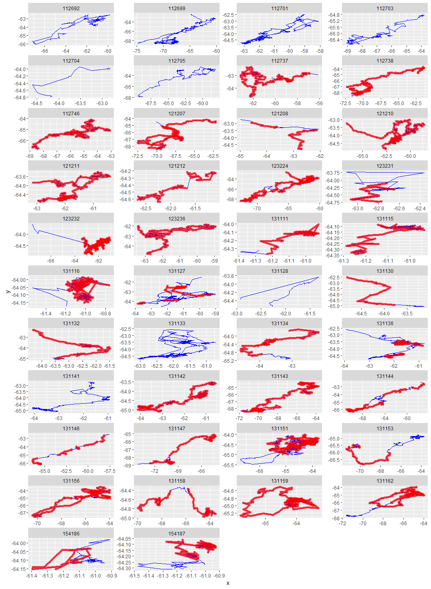
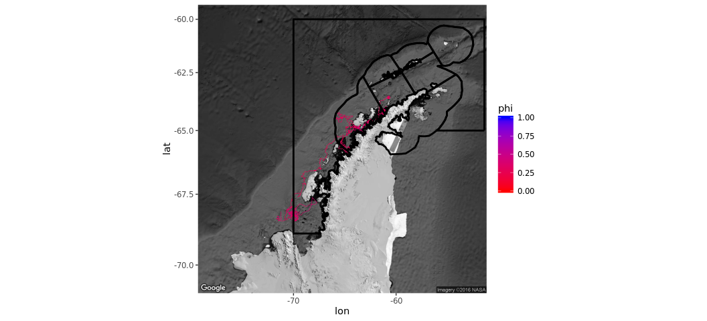

# Antarctic Whale Project: Single Species
Ben Weinstein  
`r Sys.time()`  

six hours


<!-- -->

##By Month

<!-- -->

##CCAMLR Units
<!-- -->

##Distance


##Time 


##Velocity


##Angles


#Correlated random walk

*Process Model*

$$ d_{t} \sim T*d_{t-1} + Normal(0,\Sigma)$$
$$ x_t = x_{t-1} + d_{t} $$

## Parameters

For each individual:

$$\theta = \text{Mean turning angle}$$
$$\gamma = \text{Move persistence} $$

For both behaviors process variance is:
$$ \sigma_{latitude} = 0.1$$
$$ \sigma_{longitude} = 0.1$$

##Behavioral States

$$ \text{For each individual i}$$
$$ Behavior_1 = \text{traveling}$$
$$ Behavior_2 = \text{foraging}$$

$$ \alpha_{i,1,1} = \text{Probability of remaining traveling when traveling}$$
$$\alpha_{i,2,1} = \text{Probability of switching from Foraging to traveling}$$

$$\begin{matrix}
  \alpha_{i,1,1} & 1-\alpha_{i,1,1} \\
  \alpha_{i,2,1} & 1-\alpha_{i,2,1} \\
\end{matrix}$$


With the probability of switching states:

$$logit(\phi_{traveling}) = \alpha_{Behavior_{t-1}}$$

$$\phi_{foraging} = 1 - \phi_{traveling} $$

##Continious tracks

The transmitter will often go dark for 10 to 12 hours, due to weather, right in the middle of an otherwise good track. The model requires regular intervals to estimate the turning angles and temporal autocorrelation. As a track hits one of these walls, call it the end of a track, and begin a new track once the weather improves. We can remove any micro-tracks that are less than three days.
Specify a duration, calculate the number of tracks and the number of removed points. Iteratively.


How did the filter change the extent of tracks?

<!-- -->

<!-- -->

<!-- --><!-- -->


sink("Bayesian/Multi_RW.jags")
cat("
    model{
    
    #Constants
    pi <- 3.141592653589
    
    ##argos observation error##
    argos_prec[1:2,1:2] <- inverse(argos_sigma*argos_cov[,])
    
    #Constructing the covariance matrix
    argos_cov[1,1] <- 1
    argos_cov[1,2] <- sqrt(argos_alpha) * rho
    argos_cov[2,1] <- sqrt(argos_alpha) * rho
    argos_cov[2,2] <- argos_alpha
    
    for(i in 1:ind){
    for(g in 1:tracks[i]){
    
    ## Priors for first true location
    #for lat long
    y[i,g,1,1:2] ~ dmnorm(argos[i,g,1,1,1:2],argos_prec)
    
    #First movement - random walk.
    y[i,g,2,1:2] ~ dmnorm(y[i,g,1,1:2],iSigma)
    
    ###First Behavioral State###
    state[i,g,1] ~ dcat(lambda[]) ## assign state for first obs
    
    #Process Model for movement
    for(t in 2:(steps[i,g]-1)){
    
    #Behavioral State at time T
    logit(phi[i,g,t,1]) <- alpha_mu[state[i,g,t-1]] 
    phi[i,g,t,2] <- 1-phi[i,g,t,1]
    state[i,g,t] ~ dcat(phi[i,g,t,])
    
    #Turning covariate
    #Transition Matrix for turning angles
    T[i,g,t,1,1] <- cos(theta[state[i,g,t]])
    T[i,g,t,1,2] <- (-sin(theta[state[i,g,t]]))
    T[i,g,t,2,1] <- sin(theta[state[i,g,t]])
    T[i,g,t,2,2] <- cos(theta[state[i,g,t]])
    
    #Correlation in movement change
    d[i,g,t,1:2] <- y[i,g,t,] + gamma[state[i,g,t]] * T[i,g,t,,] %*% (y[i,g,t,1:2] - y[i,g,t-1,1:2])
    
    #Gaussian Displacement
    y[i,g,t+1,1:2] ~ dmnorm(d[i,g,t,1:2],iSigma)
    }
    
    #Final behavior state
    logit(phi[i,g,steps[i,g],1]) <- alpha_mu[state[i,g,steps[i,g]-1]] 
    phi[i,g,steps[i,g],2] <- 1-phi[i,g,steps[i,g],1]
    state[i,g,steps[i,g]] ~ dcat(phi[i,g,steps[i,g],])
    
    ##	Measurement equation - irregular observations
    # loops over regular time intervals (t)    
    
    for(t in 2:steps[i,g]){
    
    # loops over observed locations within interval t
    for(u in 1:idx[i,g,t]){ 
    zhat[i,g,t,u,1:2] <- (1-j[i,g,t,u]) * y[i,g,t-1,1:2] + j[i,g,t,u] * y[i,g,t,1:2]
    
    #for each lat and long
    #argos error
    argos[i,g,t,u,1:2] ~ dmnorm(zhat[i,g,t,u,1:2],argos_prec)
    }
    }
    }
    }
    ###Priors###
    
    #Process Variance
    iSigma ~ dwish(R,2)
    Sigma <- inverse(iSigma)
    
    ##Mean Angle
    tmp[1] ~ dbeta(20, 20)
    tmp[2] ~ dbeta(10, 10)
    
    # prior for theta in 'traveling state'
    theta[1] <- (2 * tmp[1] - 1) * pi
    
    # prior for theta in 'foraging state'    
    theta[2] <- (tmp[2] * pi * 2)
    
    ##Move persistance
    # prior for gamma (autocorrelation parameter)
    #from jonsen 2016
    gamma[2] ~ dbeta(1.5, 2)		## gamma for state 2
    dev ~ dbeta(1,1)			## a random deviate to ensure that gamma[1] > gamma[2]
    gamma[1] <-  gamma[2] + dev
    
    ##Behavioral States
    
    #Hierarchical structure across motnhs
    #Intercepts
    alpha_mu[1] ~ dnorm(0,0.386)
    alpha_mu[2] ~ dnorm(0,0.386)
    
    #Variance
    alpha_tau[1] ~ dt(0,1,1)I(0,)
    alpha_tau[2] ~ dt(0,1,1)I(0,)
    
    #Probability of behavior switching 
    lambda[1] ~ dbeta(1,1)
    lambda[2] <- 1 - lambda[1]
    
    ##Argos priors##
    #longitudinal argos error
    argos_sigma ~ dunif(0,10)
    
    #latitidunal argos error
    argos_alpha~dunif(0,10)
    
    #correlation in argos error
    rho ~ dunif(-1, 1)
    
    
    }"
    ,fill=TRUE)
sink()


```
##    user  system elapsed 
##   0.461   0.006 552.923
```


##Chains

```
##                           Type     Size     PrettySize  Rows Columns
## mdat                data.frame 16339200  [1] "15.6 Mb" 49859      47
## m                        ggmap 13116768  [1] "12.5 Mb"  1280    1280
## jagM            rjags.parallel  7041248   [1] "6.7 Mb"     6      NA
## b       SpatialPointsDataFrame  4875992   [1] "4.7 Mb"  3354      47
## fccamlr             data.frame  1649608   [1] "1.6 Mb" 41160       7
## mxy                 grouped_df  1052984     [1] "1 Mb"  3351      52
## sxy                       list   998200 [1] "974.8 Kb"     6      NA
## d       SpatialPointsDataFrame   939008   [1] "917 Kb"  3354      47
## oxy                 data.frame   882256 [1] "861.6 Kb"  3354      47
## data                      list   763904   [1] "746 Kb"     9      NA
```

```
##           used (Mb) gc trigger  (Mb) max used  (Mb)
## Ncells 1541013 82.3    2637877 140.9  2637877 140.9
## Vcells 7058392 53.9   21787340 166.3 33439945 255.2
```

<!-- -->


<!-- -->

###Compare to priors

<!-- -->

## Parameter Summary

```
##   parameter         par      mean       lower     upper
## 1  alpha_mu alpha_mu[1] 1.4397461  0.48649463 2.2798116
## 2  alpha_mu alpha_mu[2] 0.7999115 -0.92041167 2.9630465
## 3     gamma    gamma[1] 0.4224409  0.30516789 0.5448894
## 4     gamma    gamma[2] 0.2960219  0.14531697 0.4228653
## 5     theta    theta[1] 0.1240580 -0.04942822 0.3302026
## 6     theta    theta[2] 3.0856457  2.48220867 3.6767675
```

<!-- -->

#Behavioral Prediction


Relationship between phi and state

<!-- -->

##Spatial Prediction

<!-- -->

## Confidence
<!-- -->

## By individual

<!-- --><!-- -->

## Compared to CMLRR regions

<!-- -->

##Autocorrelation in behavior

<!-- -->

##Location of Behavior


# Overlap with Krill Fishery


#Time spent in grid cell

<!-- --><!-- -->

<!-- -->


##Traveling

<!-- --><!-- -->


<!-- -->

<!-- -->

<!-- --><!-- -->


<!-- -->

<!-- -->

<!-- -->

<!-- -->


```
##                             Type     Size     PrettySize   Rows Columns
## mdat                  data.frame 16339200  [1] "15.6 Mb"  49859      47
## temp                       ggmap 13116816  [1] "12.5 Mb"   1280    1280
## pc                        tbl_df  6821088   [1] "6.5 Mb" 130200      10
## b         SpatialPointsDataFrame  4875992   [1] "4.7 Mb"   3354      47
## fccamlr               data.frame  1649608   [1] "1.6 Mb"  41160       7
## mxy                   data.frame  1098264     [1] "1 Mb"   3252      58
## traveling             data.frame  1054832     [1] "1 Mb"   3121      58
## d         SpatialPointsDataFrame   939008   [1] "917 Kb"   3354      47
## oxy                   data.frame   882256 [1] "861.6 Kb"   3354      47
## mdf                   data.frame   785592 [1] "767.2 Kb"   5709      23
```

```
##           used (Mb) gc trigger  (Mb) max used  (Mb)
## Ncells 1611803 86.1    2637877 140.9  2637877 140.9
## Vcells 7012886 53.6   20979846 160.1 33439945 255.2
```
