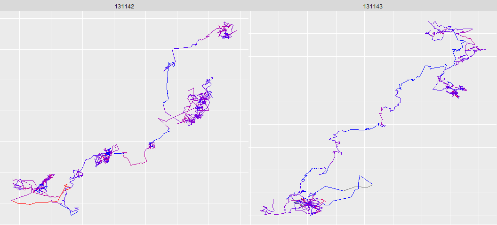
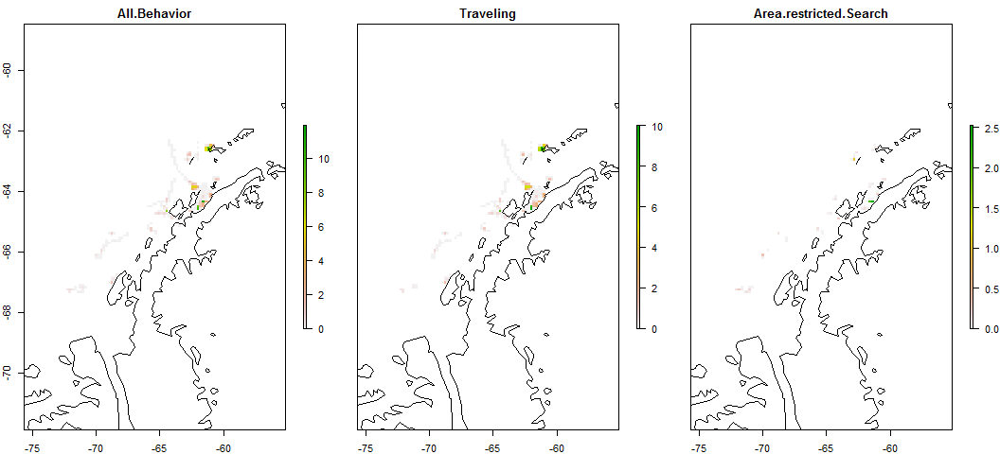

# Antarctic Whale Project: Single Species
Ben Weinstein  
`r Sys.time()`  


#Descriptive Statistics


<!-- -->

##By Month

<!-- -->

##Distance

<!-- -->

##Time 
<!-- -->

##Velocity
<!-- -->

##Angles

<!-- -->

#Correlated random walk

*Process Model*

$$ d_{t} \sim T*d_{t-1} + Normal(0,\Sigma)$$
$$ x_t = x_{t-1} + d_{t} $$

## Parameters

For each individual:

$$\theta = \text{Mean turning angle}$$
$$\gamma = \text{Move persistence} $$

For both behaviors process variance is:
$$ \sigma_{latitude} = 0.1$$
$$ \sigma_{longitude} = 0.1$$

##Behavioral States

$$ \text{For each individual i}$$
$$ Behavior_1 = \text{traveling}$$
$$ Behavior_2 = \text{foraging}$$

$$ \alpha_{i,1,1} = \text{Probability of remaining traveling when traveling}$$
$$\alpha_{i,2,1} = \text{Probability of switching from Foraging to traveling}$$

$$\begin{matrix}
  \alpha_{i,1,1} & 1-\alpha_{i,1,1} \\
  \alpha_{i,2,1} & 1-\alpha_{i,2,1} \\
\end{matrix}
$$

##Environment

Behavioral states are a function of local environmental conditions. The first environmental condition is ocean depth. I then build a function for preferential foraging in shallow waters.

It generally follows the form, conditional on behavior at t -1:

$$Behavior_t \sim Multinomial([\phi_{traveling},\phi_{foraging}])$$

With the probability of switching states:

$$logit(\phi_{traveling}) = \alpha_{Behavior_{t-1}} + \beta_{Month,1} * Ocean_{y[t,]} + \beta_{Month,2} * Coast_{y[t,]}$$

$$logit(\phi_{foraging}) = \alpha_{Behavior_{t-1}} $$

Following Bestley in preferring to describe the switch into feeding, but no estimating the resumption of traveling.

The effect of the environment is temporally variable such that

$$ \beta_{Month,2} \sim ~ Normal(\beta_{\mu},\beta_\tau)$$


##Continious tracks

The transmitter will often go dark for 10 to 12 hours, due to weather, right in the middle of an otherwise good track. The model requires regular intervals to estimate the turning angles and temporal autocorrelation. As a track hits one of these walls, call it the end of a track, and begin a new track once the weather improves. We can remove any micro-tracks that are less than three days.
Specify a duration, calculate the number of tracks and the number of removed points. Iteratively.


How did the filter change the extent of tracks?

<!-- -->

<!-- -->

<!-- --><!-- -->


```
##     user   system  elapsed 
##  206.707    1.415 3686.449
```

##Chains
<!-- -->


<!-- -->

###Compare to priors

<!-- -->

## Parameter Summary

```
##    parameter         par        mean        lower        upper
## 1   alpha_mu alpha_mu[1] -0.16093811 -0.711253454  0.318516695
## 2   alpha_mu alpha_mu[2] -1.34545909 -1.703602408 -0.960502964
## 3       beta   beta[1,1] -0.08868493 -1.949495925  2.010350191
## 4       beta   beta[2,1] -1.00588840 -2.211595847  0.251083443
## 5       beta   beta[3,1] -1.32430196 -2.867262749  0.007678424
## 6       beta   beta[4,1] -0.80035834 -2.349682113  0.684147471
## 7       beta   beta[5,1] -0.68421402 -2.615535672  1.341597950
## 8       beta   beta[1,2]  0.00000000  0.000000000  0.000000000
## 9       beta   beta[2,2]  0.00000000  0.000000000  0.000000000
## 10      beta   beta[3,2]  0.00000000  0.000000000  0.000000000
## 11      beta   beta[4,2]  0.00000000  0.000000000  0.000000000
## 12      beta   beta[5,2]  0.00000000  0.000000000  0.000000000
## 13     beta2  beta2[1,1]  0.02781336  0.007216153  0.055823476
## 14     beta2  beta2[2,1]  0.02348769  0.007447670  0.045778399
## 15     beta2  beta2[3,1]  0.01148409 -0.004312604  0.030340620
## 16     beta2  beta2[4,1]  0.01340922 -0.008018526  0.036752287
## 17     beta2  beta2[5,1]  0.16302000  0.061444247  0.339623889
## 18     beta2  beta2[1,2]  0.00000000  0.000000000  0.000000000
## 19     beta2  beta2[2,2]  0.00000000  0.000000000  0.000000000
## 20     beta2  beta2[3,2]  0.00000000  0.000000000  0.000000000
## 21     beta2  beta2[4,2]  0.00000000  0.000000000  0.000000000
## 22     beta2  beta2[5,2]  0.00000000  0.000000000  0.000000000
## 23  beta2_mu beta2_mu[1]  0.05098848 -0.033014925  0.170165521
## 24  beta2_mu beta2_mu[2]  0.00000000  0.000000000  0.000000000
## 25   beta_mu  beta_mu[1] -0.71782608 -2.072195597  0.573453559
## 26   beta_mu  beta_mu[2]  0.00000000  0.000000000  0.000000000
## 27     gamma    gamma[1]  0.89222522  0.860225392  0.922093365
## 28     gamma    gamma[2]  0.01379875  0.001860104  0.033636478
## 29     theta    theta[1] -0.02220363 -0.047839687  0.001400099
## 30     theta    theta[2]  3.07305837  1.621681487  4.547176022
```

<!-- -->

#Behavior and environment

##Hierarchical 

### Ocean Depth
<!-- --><!-- -->

### Distance to Coast
<!-- --><!-- -->

###Interaction

<!-- -->

## By Month

### Depth

<!-- --><!-- -->

Just the probability of feeding when traveling.

<!-- -->

### Coast

<!-- --><!-- -->

Zooming in on the top right plot.
<!-- --><!-- -->

#Behavioral Prediction


###Correlation in posterior switching and state


##Spatial Prediction

<!-- -->


### Per Animal

```
## $`1`
```

<!-- -->

```
## 
## $`2`
```

<!-- -->

```
## 
## $`3`
```

<!-- -->

```
## 
## $`4`
```

<!-- -->

```
## 
## $`5`
```

<!-- -->

```
## 
## $`6`
```

<!-- -->

```
## 
## $`7`
```

<!-- -->

```
## 
## $`8`
```

<!-- -->

```
## 
## $`9`
```

<!-- -->

```
## 
## $`10`
```

<!-- -->

```
## 
## $`11`
```

<!-- -->

```
## 
## $`12`
```

<!-- -->

```
## 
## $`13`
```

<!-- -->

```
## 
## $`14`
```

<!-- -->

```
## 
## $`15`
```

<!-- -->

```
## 
## $`16`
```

<!-- -->

##Log Odds of Foraging

### Ocean Depth

<!-- -->

### Distance From Coast

<!-- -->

##Autocorrelation in behavior

<!-- -->

##Behavioral description

## Predicted behavior duration


<!-- -->

##Location of Behavior

<!-- -->

#Environmental Prediction - Probability of Foraging across time


## Bathymetry

<!-- -->

## Distance to coast

<!-- -->

##All variables

<!-- -->

# Overlap with Krill Fishery
<!-- -->

<!-- -->

## By Month


## Change in foraging areas

January verus May

Red = Better Foraging in Jan
Blue = Better Foraging in May

<!-- -->

## Monthly Overlap with Krill Fishery

<!-- -->


```
##             used   (Mb) gc trigger   (Mb)  max used   (Mb)
## Ncells   1754130   93.7    5915776  316.0  14442815  771.4
## Vcells 198187770 1512.1  607190379 4632.5 603213253 4602.2
```
