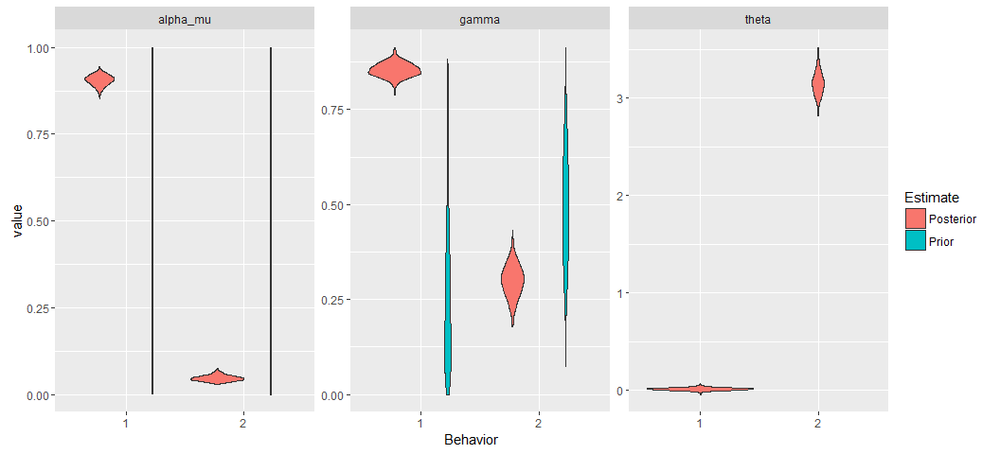

# Antarctic Whale Project: Single Species
Ben Weinstein  
`r Sys.time()`  


<!-- -->

##By Month

<!-- -->

##Distance


##Time 


##Velocity


##Angles


#Correlated random walk

*Process Model*

$$ d_{t} \sim T*d_{t-1} + Normal(0,\Sigma)$$
$$ x_t = x_{t-1} + d_{t} $$

## Parameters

For each individual:

$$\theta = \text{Mean turning angle}$$
$$\gamma = \text{Move persistence} $$

For both behaviors process variance is:
$$ \sigma_{latitude} = 0.1$$
$$ \sigma_{longitude} = 0.1$$

##Behavioral States

$$ \text{For each individual i}$$
$$ Behavior_1 = \text{traveling}$$
$$ Behavior_2 = \text{foraging}$$

$$ \alpha_{i,1,1} = \text{Probability of remaining traveling when traveling}$$
$$\alpha_{i,2,1} = \text{Probability of switching from Foraging to traveling}$$

$$\begin{matrix}
  \alpha_{i,1,1} & 1-\alpha_{i,1,1} \\
  \alpha_{i,2,1} & 1-\alpha_{i,2,1} \\
\end{matrix}
$$


With the probability of switching states:

$$logit(\phi_{traveling}) = \alpha_{Behavior_{t-1}}$$

$$\phi_{foraging} = 1 - \phi_{traveling} $$

##Continious tracks

The transmitter will often go dark for 10 to 12 hours, due to weather, right in the middle of an otherwise good track. The model requires regular intervals to estimate the turning angles and temporal autocorrelation. As a track hits one of these walls, call it the end of a track, and begin a new track once the weather improves. We can remove any micro-tracks that are less than three days.
Specify a duration, calculate the number of tracks and the number of removed points. Iteratively.


How did the filter change the extent of tracks?

<!-- -->

<!-- -->

<!-- --><!-- -->


sink("Bayesian/Multi_RW.jags")
cat("
    model{
    
    #Constants
    pi <- 3.141592653589
    
    ##argos observation error##
    argos_prec[1:2,1:2] <- inverse(argos_sigma*argos_cov[,])
    
    #Constructing the covariance matrix
    argos_cov[1,1] <- 1
    argos_cov[1,2] <- sqrt(argos_alpha) * rho
    argos_cov[2,1] <- sqrt(argos_alpha) * rho
    argos_cov[2,2] <- argos_alpha
    
    for(i in 1:ind){
    for(g in 1:tracks[i]){
    
    ## Priors for first true location
    #for lat long
    y[i,g,1,1:2] ~ dmnorm(argos[i,g,1,1,1:2],argos_prec)
    
    #First movement - random walk.
    y[i,g,2,1:2] ~ dmnorm(y[i,g,1,1:2],iSigma)
    
    ###First Behavioral State###
    state[i,g,1] ~ dcat(lambda[]) ## assign state for first obs
    
    #Process Model for movement
    for(t in 2:(steps[i,g]-1)){
    
    #Behavioral State at time T
    logit(phi[i,g,t,1]) <- alpha_mu[state[i,g,t-1]] 
    phi[i,g,t,2] <- 1-phi[i,g,t,1]
    state[i,g,t] ~ dcat(phi[i,g,t,])
    
    #Turning covariate
    #Transition Matrix for turning angles
    T[i,g,t,1,1] <- cos(theta[state[i,g,t]])
    T[i,g,t,1,2] <- (-sin(theta[state[i,g,t]]))
    T[i,g,t,2,1] <- sin(theta[state[i,g,t]])
    T[i,g,t,2,2] <- cos(theta[state[i,g,t]])
    
    #Correlation in movement change
    d[i,g,t,1:2] <- y[i,g,t,] + gamma[state[i,g,t]] * T[i,g,t,,] %*% (y[i,g,t,1:2] - y[i,g,t-1,1:2])
    
    #Gaussian Displacement
    y[i,g,t+1,1:2] ~ dmnorm(d[i,g,t,1:2],iSigma)
    }
    
    #Final behavior state
    logit(phi[i,g,steps[i,g],1]) <- alpha_mu[state[i,g,steps[i,g]-1]] 
    phi[i,g,steps[i,g],2] <- 1-phi[i,g,steps[i,g],1]
    state[i,g,steps[i,g]] ~ dcat(phi[i,g,steps[i,g],])
    
    ##	Measurement equation - irregular observations
    # loops over regular time intervals (t)    
    
    for(t in 2:steps[i,g]){
    
    # loops over observed locations within interval t
    for(u in 1:idx[i,g,t]){ 
    zhat[i,g,t,u,1:2] <- (1-j[i,g,t,u]) * y[i,g,t-1,1:2] + j[i,g,t,u] * y[i,g,t,1:2]
    
    #for each lat and long
    #argos error
    argos[i,g,t,u,1:2] ~ dmnorm(zhat[i,g,t,u,1:2],argos_prec)
    }
    }
    }
    }
    ###Priors###
    
    #Process Variance
    iSigma ~ dwish(R,2)
    Sigma <- inverse(iSigma)
    
    ##Mean Angle
    tmp[1] ~ dbeta(10, 10)
    tmp[2] ~ dbeta(10, 10)
    
    # prior for theta in 'traveling state'
    theta[1] <- (2 * tmp[1] - 1) * pi
    
    # prior for theta in 'foraging state'    
    theta[2] <- (tmp[2] * pi * 2)
    
    ##Move persistance
    # prior for gamma (autocorrelation parameter) in state 1
    gamma[2] ~ dbeta(1.5, 5)		## gamma for state 2
    dev ~ dbeta(1,1)			## a random deviate to ensure that gamma[1] > gamma[2]
    gamma[1] <- gamma[2] + dev 		## gamma for state 1
    
    
    ##Behavioral States
    
    #Hierarchical structure across motnhs
    #Intercepts
    alpha_mu[1] ~ dnorm(0,0.386)
    alpha_mu[2] ~ dnorm(0,0.386)
    
    #Variance
    alpha_tau[1] ~ dt(0,1,1)I(0,)
    alpha_tau[2] ~ dt(0,1,1)I(0,)
    
    #Probability of behavior switching 
    lambda[1] ~ dbeta(1,1)
    lambda[2] <- 1 - lambda[1]
    
    ##Argos priors##
    #longitudinal argos error
    argos_sigma ~ dunif(0,10)
    
    #latitidunal argos error
    argos_alpha~dunif(0,10)
    
    #correlation in argos error
    rho ~ dunif(-1, 1)
    
    
    }"
    ,fill=TRUE)
sink()


```
##    user  system elapsed 
##    2.67    0.09  144.86
```


##Chains

```
##                         Type     Size    PrettySize  Rows Columns
## mdat              data.frame 24692824 [1] "23.5 Mb" 57230      54
## m                      ggmap 13116672 [1] "12.5 Mb"  1280    1280
## d     SpatialPointsDataFrame  3459904  [1] "3.3 Mb"  8124      61
## oxy               data.frame  3326832  [1] "3.2 Mb"  8124      61
## jagM          rjags.parallel  2373272  [1] "2.3 Mb"     6      NA
## sxy                     list  1904000  [1] "1.8 Mb"    21      NA
## mxy               grouped_df  1787056  [1] "1.7 Mb"  3820      66
## data                    list  1081312    [1] "1 Mb"     9      NA
## argos                  array   691176  [1] "675 Kb"     2      12
## obs                    array   691176  [1] "675 Kb"     2      12
```

```
##           used (Mb) gc trigger  (Mb) max used  (Mb)
## Ncells 1460639 78.1    3886542 207.6  3886542 207.6
## Vcells 8502722 64.9   24806718 189.3 60480683 461.5
```

<!-- -->


<!-- -->

###Compare to priors

<!-- -->

## Parameter Summary

```
##   parameter         par        mean        lower      upper
## 1  alpha_mu alpha_mu[1]  2.42370753  2.196926797  2.7081927
## 2  alpha_mu alpha_mu[2] -2.27771811 -2.900654004 -1.6469218
## 3     gamma    gamma[1]  0.80230224  0.741749236  0.8593515
## 4     gamma    gamma[2]  0.11076147  0.009213097  0.2013641
## 5     theta    theta[1]  0.03936701 -0.014165665  0.1280827
## 6     theta    theta[2]  3.81522576  2.217518225  5.2836334
```

<!-- -->

#Behavioral Prediction


##Spatial Prediction

<!-- -->

### Per Animal


##Autocorrelation in behavior

<!-- -->

##Behavioral description

##Location of Behavior


# Overlap with Krill Fishery


#Time spent in grid cell

<!-- --><!-- -->

<!-- -->


##Traveling

<!-- --><!-- -->


<!-- -->

<!-- -->

<!-- -->


<!-- -->

<!-- -->

<!-- -->

<!-- -->


```
##                            Type     Size     PrettySize  Rows Columns
## mdat                 data.frame 24692824  [1] "23.5 Mb" 57230      54
## temp                      ggmap 13116192  [1] "12.5 Mb"  1280    1280
## d        SpatialPointsDataFrame  3459904   [1] "3.3 Mb"  8124      61
## oxy                  data.frame  3326832   [1] "3.2 Mb"  8124      61
## jagM             rjags.parallel  2373272   [1] "2.3 Mb"     6      NA
## mxy                  data.frame  1635416   [1] "1.6 Mb"  3543      69
## pc                       tbl_df  1479728   [1] "1.4 Mb" 26640      10
## data                       list  1081312     [1] "1 Mb"     9      NA
## sxy                        list   871192 [1] "850.8 Kb"     2      NA
## foraging             data.frame   840856 [1] "821.1 Kb"  1818      68
```

```
##           used (Mb) gc trigger  (Mb) max used  (Mb)
## Ncells 1513442 80.9    3886542 207.6  3886542 207.6
## Vcells 8976384 68.5   24806718 189.3 60480683 461.5
```
