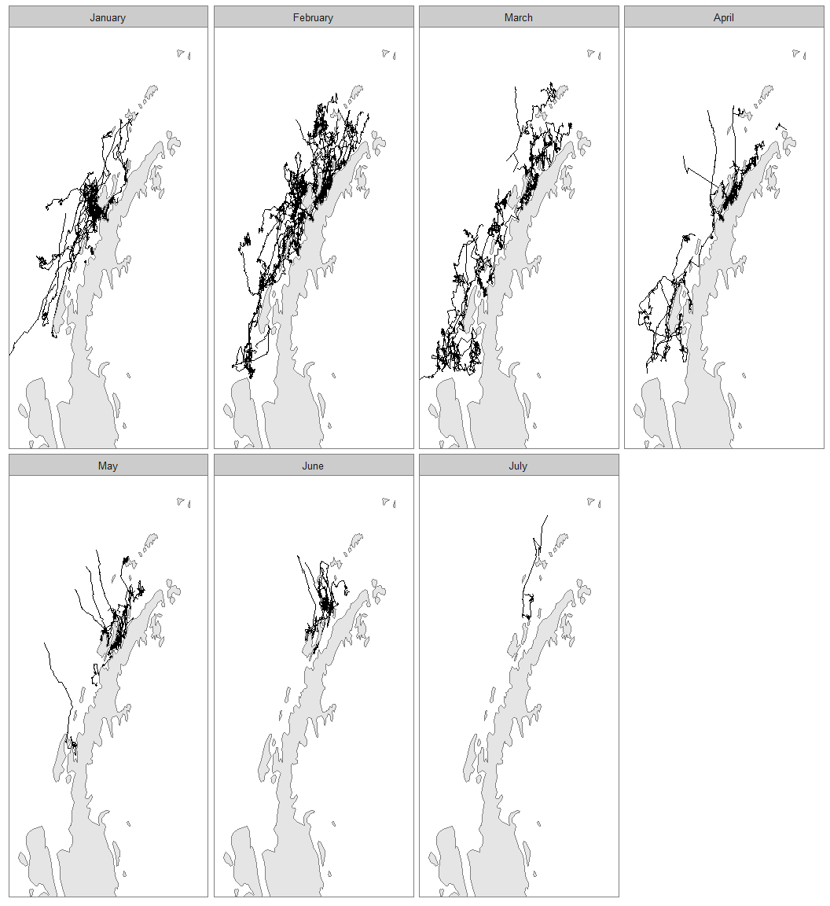
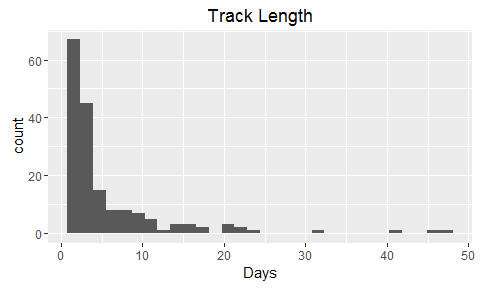
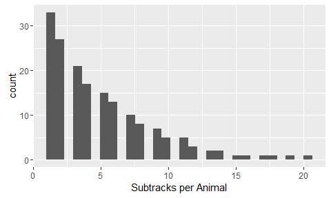
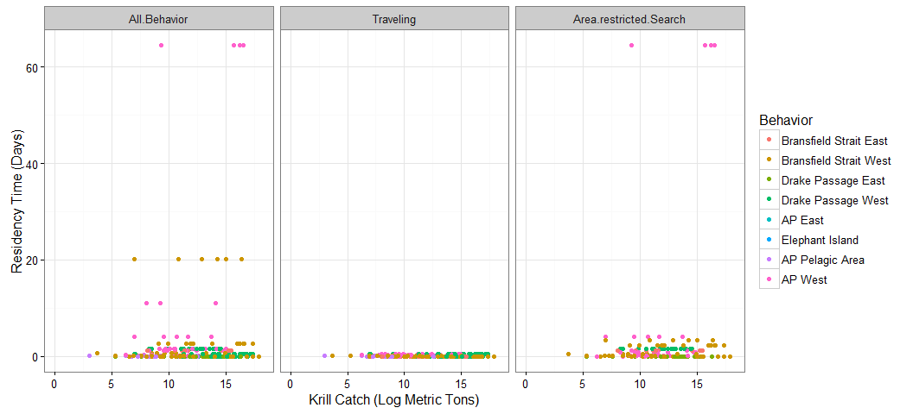
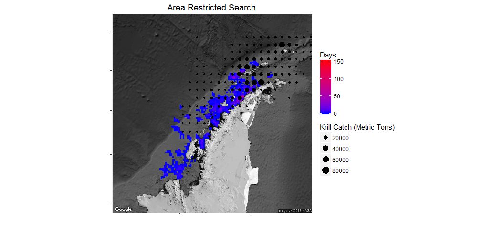
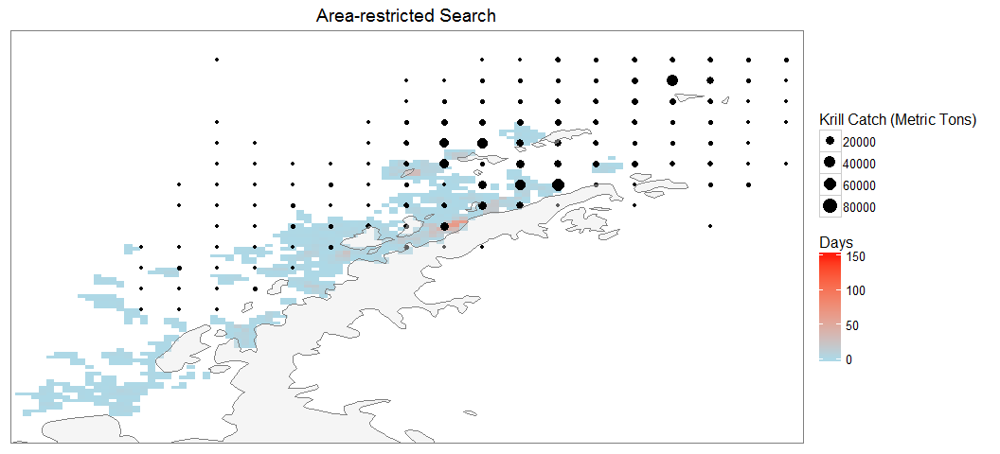

# Antarctic Whale Project: Single Species
Ben Weinstein  
`r Sys.time()`  


<!-- -->

##By Month

<!-- --><!-- -->

##CCAMLR Units

<!-- -->

<!-- --><!-- -->

##Distance


##Time 


##Velocity


##Angles


#Correlated random walk

*Process Model*

$$ d_{t} \sim T*d_{t-1} + Normal(0,\Sigma)$$
$$ x_t = x_{t-1} + d_{t} $$

## Parameters

For each individual:

$$\theta = \text{Mean turning angle}$$
$$\gamma = \text{Move persistence} $$

For both behaviors process variance is:
$$ \sigma_{latitude} = 0.1$$
$$ \sigma_{longitude} = 0.1$$

##Behavioral States

$$ \text{For each individual i}$$
$$ Behavior_1 = \text{traveling}$$
$$ Behavior_2 = \text{foraging}$$

$$ \alpha_{i,1,1} = \text{Probability of remaining traveling when traveling}$$
$$\alpha_{i,2,1} = \text{Probability of switching from Foraging to traveling}$$

$$\begin{matrix}
  \alpha_{i,1,1} & 1-\alpha_{i,1,1} \\
  \alpha_{i,2,1} & 1-\alpha_{i,2,1} \\
\end{matrix}$$


With the probability of switching states:

$$logit(\phi_{traveling}) = \alpha_{Behavior_{t-1}}$$

$$\phi_{foraging} = 1 - \phi_{traveling} $$

##Continious tracks

The transmitter will often go dark for 10 to 12 hours, due to weather, right in the middle of an otherwise good track. The model requires regular intervals to estimate the turning angles and temporal autocorrelation. As a track hits one of these walls, call it the end of a track, and begin a new track once the weather improves. We can remove any micro-tracks that are less than three days.
Specify a duration, calculate the number of tracks and the number of removed points. Iteratively.


How did the filter change the extent of tracks?

<!-- -->

<!-- -->

Look at the observations were defined into tracks.

<!-- -->

<!-- --><!-- -->


sink("Bayesian/Multi_RW.jags")
cat("
    model{
    
    #Constants
    pi <- 3.141592653589
    
    ##argos observation error##
    argos_prec[1:2,1:2] <- argos_cov[,]
    
    #Constructing the covariance matrix
    argos_cov[1,1] <- argos_sigma
    argos_cov[1,2] <- 0
    argos_cov[2,1] <- 0
    argos_cov[2,2] <- argos_alpha
    
    for(i in 1:ind){
    for(g in 1:tracks[i]){
    
    ## Priors for first true location
    #for lat long
    y[i,g,1,1:2] ~ dmnorm(argos[i,g,1,1,1:2],argos_prec)
    
    #First movement - random walk.
    y[i,g,2,1:2] ~ dmnorm(y[i,g,1,1:2],iSigma)
    
    ###First Behavioral State###
    state[i,g,1] ~ dcat(lambda[]) ## assign state for first obs
    
    #Process Model for movement
    for(t in 2:(steps[i,g]-1)){
    
    #Behavioral State at time T
    phi[i,g,t,1] <- alpha_mu[state[i,g,t-1]] 
    phi[i,g,t,2] <- 1-phi[i,g,t,1]
    state[i,g,t] ~ dcat(phi[i,g,t,])
    
    #Turning covariate
    #Transition Matrix for turning angles
    T[i,g,t,1,1] <- cos(theta[state[i,g,t]])
    T[i,g,t,1,2] <- (-sin(theta[state[i,g,t]]))
    T[i,g,t,2,1] <- sin(theta[state[i,g,t]])
    T[i,g,t,2,2] <- cos(theta[state[i,g,t]])
    
    #Correlation in movement change
    d[i,g,t,1:2] <- y[i,g,t,] + gamma[state[i,g,t]] * T[i,g,t,,] %*% (y[i,g,t,1:2] - y[i,g,t-1,1:2])
    
    #Gaussian Displacement
    y[i,g,t+1,1:2] ~ dmnorm(d[i,g,t,1:2],iSigma)
    }
    
    #Final behavior state
    phi[i,g,steps[i,g],1] <- alpha_mu[state[i,g,steps[i,g]-1]] 
    phi[i,g,steps[i,g],2] <- 1-phi[i,g,steps[i,g],1]
    state[i,g,steps[i,g]] ~ dcat(phi[i,g,steps[i,g],])
    
    ##	Measurement equation - irregular observations
    # loops over regular time intervals (t)    
    
    for(t in 2:steps[i,g]){
    
    # loops over observed locations within interval t
    for(u in 1:idx[i,g,t]){ 
    zhat[i,g,t,u,1:2] <- (1-j[i,g,t,u]) * y[i,g,t-1,1:2] + j[i,g,t,u] * y[i,g,t,1:2]
    
    #for each lat and long
    #argos error
    argos[i,g,t,u,1:2] ~ dmnorm(zhat[i,g,t,u,1:2],argos_prec)
    }
    }
    }
    }
    ###Priors###
    
    #Process Variance
    iSigma ~ dwish(R,2)
    Sigma <- inverse(iSigma)
    
    ##Mean Angle
    tmp[1] ~ dbeta(10, 10)
    tmp[2] ~ dbeta(10, 10)
    
    # prior for theta in 'traveling state'
    theta[1] <- (2 * tmp[1] - 1) * pi
    
    # prior for theta in 'foraging state'    
    theta[2] <- (tmp[2] * pi * 2)
    
    ##Move persistance
    # prior for gamma (autocorrelation parameter)
    #from jonsen 2016

    ##Behavioral States
    
    gamma[1] ~ dbeta(3,2)		## gamma for state 1
    dev ~ dbeta(1,1)			## a random deviate to ensure that gamma[1] > gamma[2]
    gamma[2] <- gamma[1] * dev

    #Intercepts
    alpha_mu[1] ~ dbeta(1,1)
    alpha_mu[2] ~ dbeta(1,1)
    
    #Probability of behavior switching 
    lambda[1] ~ dbeta(1,1)
    lambda[2] <- 1 - lambda[1]
    
    ##Argos priors##
    #longitudinal argos precision
    argos_sigma <- 5
    
    #latitidunal argos precision
    argos_alpha <- 5
    
    
    }"
    ,fill=TRUE)
sink()


```
##      user    system   elapsed 
##   501.391     3.893 27397.507
```


##Chains

```
##                         Type       Size    PrettySize  Rows Columns
## jagM          rjags.parallel 3180217112    [1] "3 Gb"     6      NA
## data                    list   61113336 [1] "58.3 Mb"     9      NA
## argos                  array   39720952 [1] "37.9 Mb"    33      20
## obs                    array   39720952 [1] "37.9 Mb"    33      20
## j                      array   19867968 [1] "18.9 Mb"    33      20
## b     SpatialPointsDataFrame   16418080 [1] "15.7 Mb" 46421      47
## mdat              data.frame   16339200 [1] "15.6 Mb" 49859      47
## m                      ggmap   13116240 [1] "12.5 Mb"  1280    1280
## d     SpatialPointsDataFrame   12825928 [1] "12.2 Mb" 46421      47
## oxy               data.frame   12080104 [1] "11.5 Mb" 46421      47
```

```
##             used   (Mb) gc trigger   (Mb)  max used   (Mb)
## Ncells   1790130   95.7    3886542  207.6   3886542  207.6
## Vcells 446407878 3405.9 1017786417 7765.1 878522978 6702.6
```

<!-- -->


<!-- -->

Look at the convergence of phi, just for an example

<!-- -->

Overall relationship between phi and state, nice test of convergence.

<!-- -->

###Compare to priors

<!-- -->

## Parameter Summary

```
##   parameter         par       mean        lower      upper
## 1  alpha_mu alpha_mu[1] 0.91073361  0.885179024 0.93531258
## 2  alpha_mu alpha_mu[2] 0.04558698  0.033074171 0.05958549
## 3     gamma    gamma[1] 0.85174917  0.821631872 0.88228115
## 4     gamma    gamma[2] 0.31339704  0.236373730 0.39744742
## 5     theta    theta[1] 0.01481494 -0.007603755 0.03756657
## 6     theta    theta[2] 3.14837447  2.931923821 3.37828681
```

<!-- -->

#Behavioral Prediction


Relationship between phi and state

<!-- -->

##Spatial Prediction

<!-- --><!-- --><!-- -->

## By individual

<!-- --><!-- -->

Overlay phi and state

<!-- -->

## Compared to CMLRR regions

<!-- -->

##Autocorrelation in behavior

<!-- -->

##Location of Behavior


# Overlap with Krill Fishery


#Time spent in grid cell


<!-- -->


## ARS


<!-- --><!-- --><!-- -->

### Time by management unit


<!-- -->

<!-- -->

<!-- --><!-- --><!-- -->

<!-- --><!-- --><!-- -->


```
##             Type      Size     PrettySize     Rows Columns
## pc        tbl_df 598231464 [1] "570.5 Mb" 11490000      10
## a         tbl_df 157774144 [1] "150.5 Mb"  3944000       7
## data        list  61113336  [1] "58.3 Mb"        9      NA
## argos      array  39720952  [1] "37.9 Mb"       33      20
## obs        array  39720952  [1] "37.9 Mb"       33      20
## j          array  19867968  [1] "18.9 Mb"       33      20
## mdat  data.frame  16339200  [1] "15.6 Mb"    49859      47
## temp       ggmap  13116528  [1] "12.5 Mb"     1280    1280
## mxy   data.frame  12825688  [1] "12.2 Mb"    29346      68
## oxy   data.frame  12080104  [1] "11.5 Mb"    46421      47
```

```
##             used  (Mb) gc trigger   (Mb)   max used   (Mb)
## Ncells   1678464  89.7    5103933  272.6    9968622  532.4
## Vcells 118670061 905.4  333508252 2544.5 1010500452 7709.6
```
