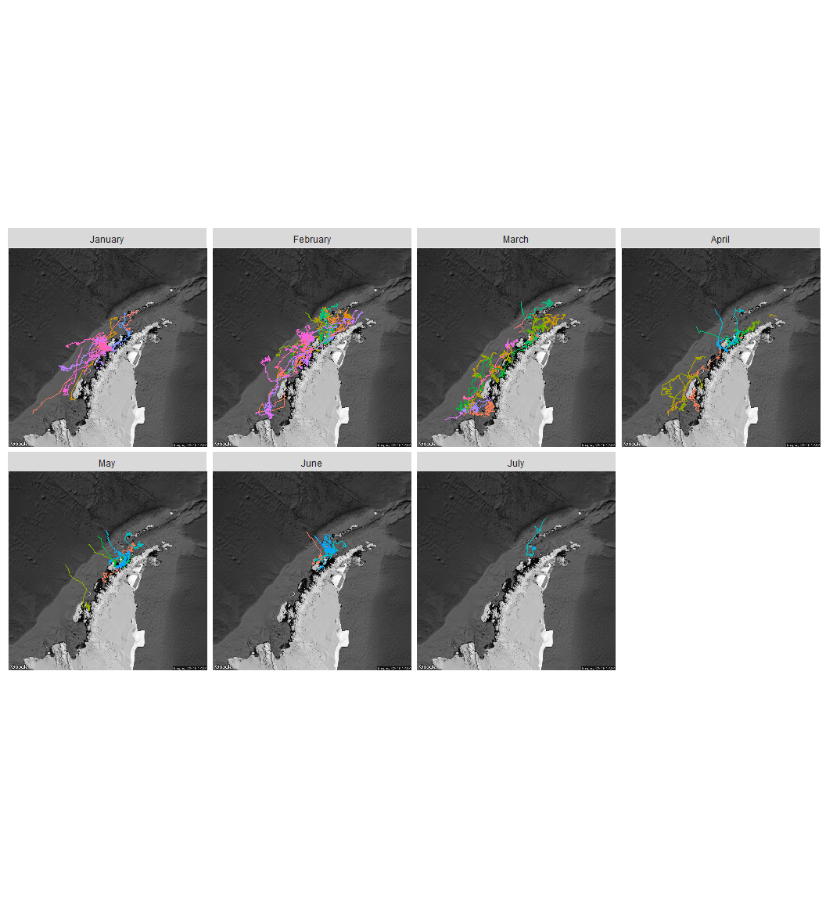
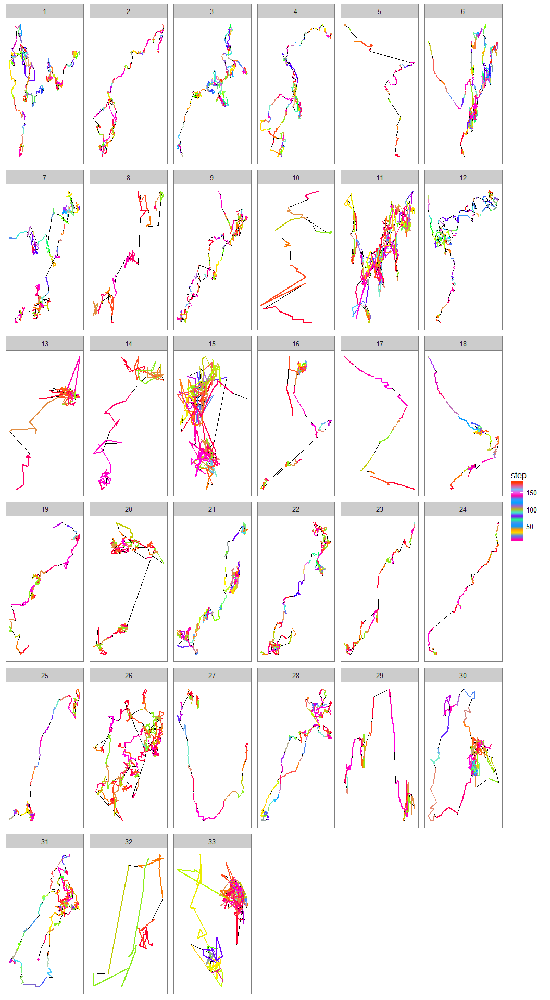

# Antarctic Whale Project: Single Species
Ben Weinstein  
`r Sys.time()`  


#Abstract


#Descriptive Statistics


<!-- -->

##Distance

<!-- -->

##Time 
<!-- -->

##Velocity
<!-- -->

##Angles

<!-- -->

#Correlated random walk

*Process Model*

$$ d_{t} \sim T*d_{t-1} + Normal(0,\Sigma)$$
$$ x_t = x_{t-1} + d_{t} $$

## Parameters

For each individual:

$$\theta = \text{Mean turning angle}$$
$$\gamma = \text{Move persistence} $$

For both behaviors process variance is:
$$ \sigma_{latitude} = 0.1$$
$$ \sigma_{longitude} = 0.1$$

##Behavioral States

$$ \text{For each individual i}$$
$$ Behavior_1 = \text{traveling}$$
$$ Behavior_2 = \text{foraging}$$

$$ \alpha_{i,1,1} = \text{Probability of remaining traveling when traveling}$$
$$\alpha_{i,2,1} = \text{Probability of switching from feeding to traveling}$$

$$\begin{matrix}
  \alpha_{i,1,1} & 1-\alpha_{i,1,1} \\
  \alpha_{i,2,1} & 1-\alpha_{i,2,1} \\
\end{matrix}
$$

##Environment

Behavioral states are a function of local environmental conditions. The first environmental condition is ocean depth. I then build a function for preferential foraging in shallow waters.

It generally follows the form, conditional on behavior at t -1:

$$Behavior_t \sim Multinomial([\phi_{traveling},\phi_{foraging}])$$
$$logit(\phi_{traveling}) = \alpha_{Behavior_{t-1}} + \beta_1 * Ocean_{y[t,]}$$
$$logit(\phi_{foraging}) = \alpha_{Behavior_{t-1}} + \beta_2 * Ocean_{y[t,]}$$


##Continious tracks

The transmitter will often go dark for 10 to 12 hours, due to weather, right in the middle of an otherwise good track. The model requires regular intervals to estimate the turning angles and temporal autocorrelation. As a track hits one of these walls, call it the end of a track, and begin a new track once the weather improves. We can remove any micro-tracks that are less than three days.
Specify a duration, calculate the number of tracks and the number of removed points. Iteratively.


How did the filter change the extent of tracks?

<!-- -->

<!-- --><!-- -->


```
  [1] sink("Bayesian/Multi_RW.jags")                                                                                                  
  [2] cat("                                                                                                                           
  [3]     model{                                                                                                                      
  [4]                                                                                                                                 
  [5]     #Constants                                                                                                                  
  [6]     pi <- 3.141592653589                                                                                                        
  [7]                                                                                                                                 
  [8]     ##argos observation error##                                                                                                 
  [9]     argos_prec[1:2,1:2] <- inverse(argos_sigma*argos_cov[,])                                                                    
 [10]                                                                                                                                 
 [11]     #Constructing the covariance matrix                                                                                         
 [12]     argos_cov[1,1] <- 1                                                                                                         
 [13]     argos_cov[1,2] <- sqrt(argos_alpha) * rho                                                                                   
 [14]     argos_cov[2,1] <- sqrt(argos_alpha) * rho                                                                                   
 [15]     argos_cov[2,2] <- argos_alpha                                                                                               
 [16]                                                                                                                                 
 [17]     for(i in 1:ind){                                                                                                            
 [18]       for(g in 1:tracks[i]){                                                                                                    
 [19]                                                                                                                                 
 [20]         ###First Step###                                                                                                        
 [21]         ## Priors for first true location                                                                                       
 [22]         #for lat long                                                                                                           
 [23]         y[i,g,1,1:2] ~ dmnorm(argos[i,g,1,1,1:2],argos_prec)                                                                    
 [24]                                                                                                                                 
 [25]         #First movement - random walk.                                                                                          
 [26]         y[i,g,2,1:2] ~ dmnorm(y[i,g,1,1:2],iSigma)                                                                              
 [27]                                                                                                                                 
 [28]         ###First Behavioral State###                                                                                            
 [29]         state[i,g,1] ~ dcat(lambda[]) ## assign state for first obs                                                             
 [30]                                                                                                                                 
 [31]         #Process Model for movement                                                                                             
 [32]         for(t in 2:(steps[i,g]-1)){                                                                                             
 [33]                                                                                                                                 
 [34]         #Behavioral State at time T                                                                                             
 [35]         logit(phi[i,g,t,1]) <- lalpha[i,state[i,g,t-1]] + lbeta[i,state[i,g,t-1]] * ocean[i,g,t]                                
 [36]         phi[i,g,t,2] <- 1-phi[i,g,t,1]                                                                                          
 [37]         state[i,g,t] ~ dcat(phi[i,g,t,])                                                                                        
 [38]                                                                                                                                 
 [39]         #Turning covariate                                                                                                      
 [40]         #Transition Matrix for turning angles                                                                                   
 [41]         T[i,g,t,1,1] <- cos(theta[state[i,g,t]])                                                                                
 [42]         T[i,g,t,1,2] <- (-sin(theta[state[i,g,t]]))                                                                             
 [43]         T[i,g,t,2,1] <- sin(theta[state[i,g,t]])                                                                                
 [44]         T[i,g,t,2,2] <- cos(theta[state[i,g,t]])                                                                                
 [45]                                                                                                                                 
 [46]         #Correlation in movement change                                                                                         
 [47]         d[i,g,t,1:2] <- y[i,g,t,] + gamma[state[i,g,t]] * T[i,g,t,,] %*% (y[i,g,t,1:2] - y[i,g,t-1,1:2])                        
 [48]                                                                                                                                 
 [49]         #Gaussian Displacement                                                                                                  
 [50]         y[i,g,t+1,1:2] ~ dmnorm(d[i,g,t,1:2],iSigma)                                                                            
 [51]       }                                                                                                                         
 [52]                                                                                                                                 
 [53]     #Final behavior state                                                                                                       
 [54]     logit(phi[i,g,steps[i,g],1]) <- lalpha[i,state[i,g,steps[i,g]-1]] + lbeta[i,state[i,g,steps[i,g]-1]] * ocean[i,g,steps[i,g]]
 [55]     phi[i,g,steps[i,g],2] <- 1-phi[i,g,steps[i,g],1]                                                                            
 [56]     state[i,g,steps[i,g]] ~ dcat(phi[i,g,steps[i,g],])                                                                          
 [57]                                                                                                                                 
 [58]     ##\tMeasurement equation - irregular observations                                                                           
 [59]     # loops over regular time intervals (t)                                                                                     
 [60]                                                                                                                                 
 [61]     for(t in 2:steps[i,g]){                                                                                                     
 [62]                                                                                                                                 
 [63]     # loops over observed locations within interval t                                                                           
 [64]     for(u in 1:idx[i,g,t]){                                                                                                     
 [65]       zhat[i,g,t,u,1:2] <- (1-j[i,g,t,u]) * y[i,g,t-1,1:2] + j[i,g,t,u] * y[i,g,t,1:2]                                          
 [66]                                                                                                                                 
 [67]         #for each lat and long                                                                                                  
 [68]           #argos error                                                                                                          
 [69]           argos[i,g,t,u,1:2] ~ dmnorm(zhat[i,g,t,u,1:2],argos_prec)                                                             
 [70]           }                                                                                                                     
 [71]         }                                                                                                                       
 [72]       }                                                                                                                         
 [73]     }                                                                                                                           
 [74]     ###Priors###                                                                                                                
 [75]                                                                                                                                 
 [76]     #Process Variance                                                                                                           
 [77]     iSigma ~ dwish(R,2)                                                                                                         
 [78]     Sigma <- inverse(iSigma)                                                                                                    
 [79]                                                                                                                                 
 [80]     ##Mean Angle                                                                                                                
 [81]     tmp[1] ~ dbeta(10, 10)                                                                                                      
 [82]     tmp[2] ~ dbeta(10, 10)                                                                                                      
 [83]                                                                                                                                 
 [84]     # prior for theta in 'traveling state'                                                                                      
 [85]     theta[1] <- (2 * tmp[1] - 1) * pi                                                                                           
 [86]                                                                                                                                 
 [87]     # prior for theta in 'foraging state'                                                                                       
 [88]     theta[2] <- (tmp[2] * pi * 2)                                                                                               
 [89]                                                                                                                                 
 [90]     ##Move persistance                                                                                                          
 [91]     # prior for gamma (autocorrelation parameter) in state 1                                                                    
 [92]     gamma[1] ~ dbeta(5,2)                                                                                                       
 [93]                                                                                                                                 
 [94]     # prior for gamma in state 2                                                                                                
 [95]     gamma[2] ~ dbeta(2,5)                                                                                                       
 [96]                                                                                                                                 
 [97]     ##Behavioral States                                                                                                         
 [98]     # Following lunn 2012 p85                                                                                                   
 [99]                                                                                                                                 
[100]     #Hierarchical structure                                                                                                     
[101]     #Intercepts                                                                                                                 
[102]     lalpha_mu[1] ~ dnorm(0,0.386)                                                                                               
[103]     lalpha_mu[2] ~ dnorm(0,0.386)                                                                                               
[104]                                                                                                                                 
[105]     #Variance                                                                                                                   
[106]     lalpha_tau[1] ~ dt(0,1,1)I(0,)                                                                                              
[107]     lalpha_tau[2] ~ dt(0,1,1)I(0,)                                                                                              
[108]                                                                                                                                 
[109]     #Slopes                                                                                                                     
[110]     lbeta_mu[1] ~ dnorm(0,0.386)                                                                                                
[111]     lbeta_mu[2] ~ dnorm(0,0.386)                                                                                                
[112]                                                                                                                                 
[113]     #Variance                                                                                                                   
[114]     lbeta_tau[1] ~ dt(0,1,1)I(0,)                                                                                               
[115]     lbeta_tau[2] ~ dt(0,1,1)I(0,)                                                                                               
[116]                                                                                                                                 
[117]     #For each individual                                                                                                        
[118]     for(i in 1:ind){                                                                                                            
[119]       # prob of being in state 1 at t, given in state 1 at t-1                                                                  
[120]       #Individual Intercept                                                                                                     
[121]       lalpha[i,1] ~ dnorm(lalpha_mu[1],lalpha_tau[1])                                                                           
[122]       logit(alpha[i,1]) <- lalpha[i,1]                                                                                          
[123]                                                                                                                                 
[124]       #effect of ocean on traveling -> traveling                                                                                
[125]       lbeta[i,1] ~ dnorm(lbeta_mu[1],lbeta_tau[1])                                                                              
[126]       logit(beta[i,1]) <- lbeta[i,1]                                                                                            
[127]                                                                                                                                 
[128]       #Prob of transition to state 1 given state 2 at t-1                                                                       
[129]       lalpha[i,2] ~ dnorm(lalpha_mu[2],lalpha_tau[2])                                                                           
[130]       logit(alpha[i,2]) <- lalpha[i,2]                                                                                          
[131]                                                                                                                                 
[132]       #effect of ocean on feeding -> traveling                                                                                  
[133]       lbeta[i,2] ~ dnorm(lbeta_mu[2],lbeta_tau[2])                                                                              
[134]       logit(beta[i,2]) <- lbeta[i,2]                                                                                            
[135]                                                                                                                                 
[136]     }                                                                                                                           
[137]                                                                                                                                 
[138]     #Probability of behavior switching                                                                                          
[139]     lambda[1] ~ dbeta(1,1)                                                                                                      
[140]     lambda[2] <- 1 - lambda[1]                                                                                                  
[141]                                                                                                                                 
[142]     ##Argos priors##                                                                                                            
[143]     #longitudinal argos error                                                                                                   
[144]     argos_sigma ~ dunif(0,10)                                                                                                   
[145]                                                                                                                                 
[146]     #latitidunal argos error                                                                                                    
[147]     argos_alpha~dunif(0,10)                                                                                                     
[148]                                                                                                                                 
[149]     #correlation in argos error                                                                                                 
[150]     rho ~ dunif(-1, 1)                                                                                                          
[151]                                                                                                                                 
[152]                                                                                                                                 
[153]     }"                                                                                                                          
[154]     ,fill=TRUE)                                                                                                                 
[155] sink()                                                                                                                          
```


```
##     user   system  elapsed 
##   14.777    0.593 1707.768
```

##Chains
<!-- -->

<!-- -->

###Compare to priors

<!-- -->

##Prediction - environmental function

<!-- -->

#Behavioral Prediction


##Spatial Prediction

### Per Animal

```
## $`1`
```

<!-- -->

```
## 
## $`2`
```

<!-- -->

```
## 
## $`3`
```

<!-- -->

```
## 
## $`4`
```

<!-- -->

```
## 
## $`5`
```

<!-- -->

```
## 
## $`6`
```

<!-- -->

```
## 
## $`7`
```

<!-- -->

```
## 
## $`8`
```

<!-- -->

```
## 
## $`9`
```

<!-- -->

##Log Odds of Feeding
<!-- -->

##Autocorrelation in behavior

<!-- -->

##Behavioral description

## Predicted behavior duration
<!-- -->

<!-- -->

##Location of Behavior


Global Plotting

<!-- -->

###Proportional Hazards

TODO: NEEDS TO ACCOUNT FOR CENSORED DATA! 

Survival analysis typically examines the relationship between time to death as a function of covariates. From this we can get the instantaneous rate of death at time t f(t), which is the cumulative distribution of the likelihood of death.

Let T represent survival time.

$$ P(t) = Pr(T<t)$$ 
with a pdf
$$p(t) = \frac{dP(t)}{dt}$$

The instantaneous risk of death at time t (h(t)), conditional on survival to that time:

$$ h(t) = \lim{\Delta_t\to 0} \frac{Pr[(t<T<t + \Delta_t)]|T>t}{\Delta t}$$

with covariates:
$$log (h_i(t)) = \alpha + \beta_i *x$$

The cox model has no intercept, making it semi-parametric
$$ log(h_i(t)) = h_0(t) + \beta_1 * x$$


```
## Call:
## coxph(formula = Surv(time = feedr$hours, event = feedr$status, 
##     type = "right") ~ feedr$Animal)
## 
##   n= 272680, number of events= 266688 
## 
##                    coef exp(coef)  se(coef)      z Pr(>|z|)    
## feedr$Animal2 -0.222194  0.800760  0.005716 -38.87   <2e-16 ***
## feedr$Animal3 -0.402842  0.668417  0.007910 -50.93   <2e-16 ***
## feedr$Animal4 -0.471656  0.623968  0.005604 -84.17   <2e-16 ***
## feedr$Animal5 -0.596450  0.550763  0.021337 -27.95   <2e-16 ***
## feedr$Animal6 -0.745654  0.474424  0.023698 -31.46   <2e-16 ***
## feedr$Animal7  0.102635  1.108087  0.007328  14.01   <2e-16 ***
## feedr$Animal8 -0.644162  0.525102  0.010143 -63.51   <2e-16 ***
## feedr$Animal9 -1.086958  0.337241  0.017574 -61.85   <2e-16 ***
## ---
## Signif. codes:  0 '***' 0.001 '**' 0.01 '*' 0.05 '.' 0.1 ' ' 1
## 
##               exp(coef) exp(-coef) lower .95 upper .95
## feedr$Animal2    0.8008     1.2488    0.7918    0.8098
## feedr$Animal3    0.6684     1.4961    0.6581    0.6789
## feedr$Animal4    0.6240     1.6026    0.6172    0.6309
## feedr$Animal5    0.5508     1.8157    0.5282    0.5743
## feedr$Animal6    0.4744     2.1078    0.4529    0.4970
## feedr$Animal7    1.1081     0.9025    1.0923    1.1241
## feedr$Animal8    0.5251     1.9044    0.5148    0.5356
## feedr$Animal9    0.3372     2.9652    0.3258    0.3491
## 
## Concordance= 0.595  (se = 0.001 )
## Rsquare= 0.057   (max possible= 1 )
## Likelihood ratio test= 16036  on 8 df,   p=0
## Wald test            = 15590  on 8 df,   p=0
## Score (logrank) test = 16023  on 8 df,   p=0
```

<!-- -->


```
##             used  (Mb) gc trigger   (Mb)  max used   (Mb)
## Ncells   1858084  99.3    4703850  251.3   4703850  251.3
## Vcells 114469818 873.4  203408056 1551.9 203407856 1551.9
```
