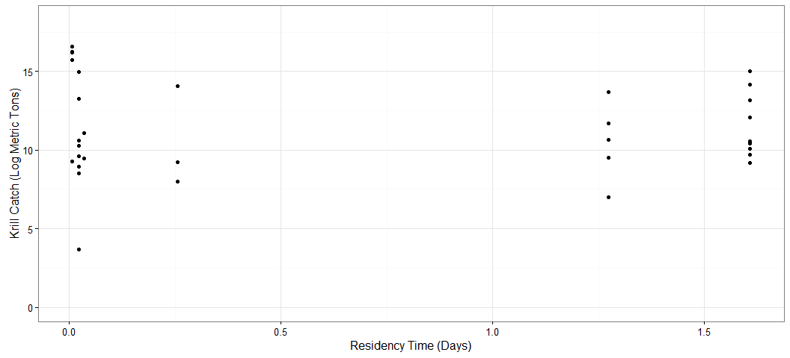

# Antarctic Whale Project: Single Species
Ben Weinstein  
`r Sys.time()`  


#Descriptive Statistics


<!-- -->

##By Month

<!-- -->

##Distance

<!-- -->

##Time 
<!-- -->

##Velocity
<!-- -->

##Angles

<!-- -->

#Correlated random walk

*Process Model*

$$ d_{t} \sim T*d_{t-1} + Normal(0,\Sigma)$$
$$ x_t = x_{t-1} + d_{t} $$

## Parameters

For each individual:

$$\theta = \text{Mean turning angle}$$
$$\gamma = \text{Move persistence} $$

For both behaviors process variance is:
$$ \sigma_{latitude} = 0.1$$
$$ \sigma_{longitude} = 0.1$$

##Behavioral States

$$ \text{For each individual i}$$
$$ Behavior_1 = \text{traveling}$$
$$ Behavior_2 = \text{foraging}$$

$$ \alpha_{i,1,1} = \text{Probability of remaining traveling when traveling}$$
$$\alpha_{i,2,1} = \text{Probability of switching from Foraging to traveling}$$

$$\begin{matrix}
  \alpha_{i,1,1} & 1-\alpha_{i,1,1} \\
  \alpha_{i,2,1} & 1-\alpha_{i,2,1} \\
\end{matrix}
$$

##Environment

Behavioral states are a function of local environmental conditions. The first environmental condition is ocean depth. I then build a function for preferential foraging in shallow waters.

It generally follows the form, conditional on behavior at t -1:

$$Behavior_t \sim Multinomial([\phi_{traveling},\phi_{foraging}])$$

With the probability of switching states:

$$logit(\phi_{traveling}) = \alpha_{Behavior_{t-1}} + \beta_{Month,1} * Ocean_{y[t,]} + \beta_{Month,2} * Coast_{y[t,]}$$

$$logit(\phi_{foraging}) = \alpha_{Behavior_{t-1}} $$

Following Bestley in preferring to describe the switch into feeding, but no estimating the resumption of traveling.

The effect of the environment is temporally variable such that

$$ \beta_{Month,2} \sim ~ Normal(\beta_{\mu},\beta_\tau)$$


##Continious tracks

The transmitter will often go dark for 10 to 12 hours, due to weather, right in the middle of an otherwise good track. The model requires regular intervals to estimate the turning angles and temporal autocorrelation. As a track hits one of these walls, call it the end of a track, and begin a new track once the weather improves. We can remove any micro-tracks that are less than three days.
Specify a duration, calculate the number of tracks and the number of removed points. Iteratively.


How did the filter change the extent of tracks?

<!-- -->

<!-- -->

<!-- --><!-- -->


```
##      user    system   elapsed 
##   198.285     1.609 10921.344
```

##Chains
<!-- -->


<!-- -->

###Compare to priors

<!-- -->

## Parameter Summary

```
## Source: local data frame [38 x 5]
## Groups: parameter [?]
## 
##    parameter         par        mean      lower      upper
##       (fctr)      (fctr)       (dbl)      (dbl)      (dbl)
## 1   alpha_mu alpha_mu[1]  0.01804063 -0.6497932  0.6681658
## 2   alpha_mu alpha_mu[2] -1.64435281 -2.2552399 -1.0862936
## 3       beta   beta[1,1] -0.17076594 -1.8039178  1.9217257
## 4       beta   beta[2,1] -1.52161389 -3.9871033 -0.1261102
## 5       beta   beta[3,1] -1.52250167 -3.7409450  0.2167110
## 6       beta   beta[4,1] -1.00901508 -2.5238436  0.5069955
## 7       beta   beta[5,1] -0.56553751 -2.5615299  1.6717656
## 8       beta   beta[9,1] -0.34906997 -1.8973933  2.0421645
## 9       beta  beta[10,1] -1.23708135 -3.5817598  1.1308879
## 10      beta   beta[1,2]  0.00000000  0.0000000  0.0000000
## ..       ...         ...         ...        ...        ...
```

<!-- -->

#Behavior and environment

##Hierarchical 

### Ocean Depth
<!-- --><!-- -->

### Distance to Coast
<!-- --><!-- -->

## By Month

<!-- --><!-- -->

### Mean Estimates Only
<!-- --><!-- -->

### As facets
<!-- --><!-- -->

###Interaction

No estimate of uncertainty.
<!-- -->


#Behavioral Prediction


###Correlation in posterior switching and state


##Spatial Prediction

<!-- -->


### Per Animal

```
## $`1`
```

<!-- -->

```
## 
## $`2`
```

<!-- -->

```
## 
## $`3`
```

<!-- -->

```
## 
## $`4`
```

<!-- -->

```
## 
## $`5`
```

<!-- -->

```
## 
## $`6`
```

<!-- -->

```
## 
## $`7`
```

<!-- -->

```
## 
## $`8`
```

<!-- -->

```
## 
## $`9`
```

<!-- -->

```
## 
## $`10`
```

<!-- -->

```
## 
## $`11`
```

<!-- -->

```
## 
## $`12`
```

<!-- -->

```
## 
## $`13`
```

<!-- -->

```
## 
## $`14`
```

<!-- -->

```
## 
## $`15`
```

<!-- -->

```
## 
## $`16`
```

<!-- -->

##Log Odds of Foraging

### Ocean Depth

<!-- -->

### Distance From Coast

<!-- -->


##Autocorrelation in behavior

<!-- -->

##Behavioral description

## Predicted behavior duration

Needs to be indexed by month.


<!-- -->

##Location of Behavior

<!-- -->

#Environmental Prediction - Probability of Foraging


## Bathymetry

<!-- -->

## Distance to coast

<!-- -->

##All variables


```
## [[1]]
```

<!-- -->

```
## 
## [[2]]
```

<!-- -->


#Krill Fishery
<!-- -->

<!-- -->


```
##             used   (Mb) gc trigger   (Mb)   max used    (Mb)
## Ncells   1773940   94.8   20145734 1075.9   39347138  2101.4
## Vcells 311452879 2376.2 1083541430 8266.8 1383093853 10552.2
```
