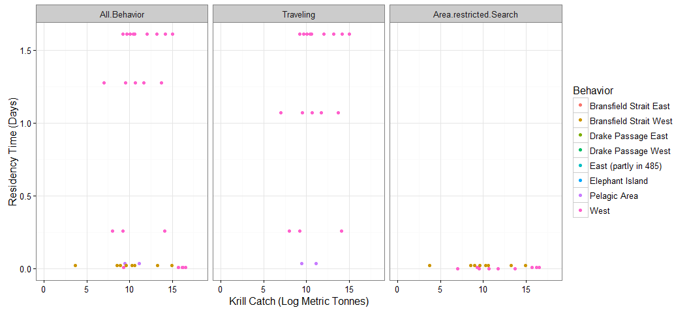
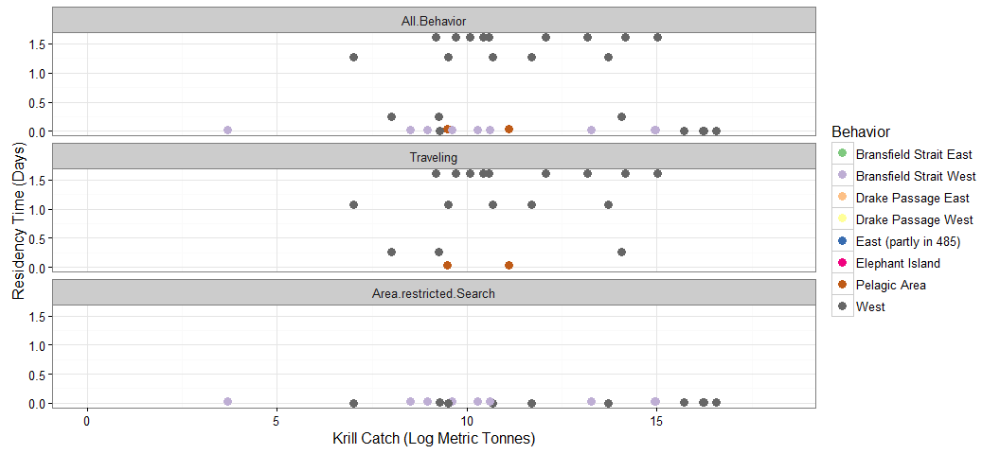

# Antarctic Whale Project: Single Species
Ben Weinstein  
`r Sys.time()`  


<!-- -->

##By Month

<!-- -->

##CCAMLR Units
<!-- -->

##Distance


##Time 


##Velocity


##Angles


#Correlated random walk

*Process Model*

$$ d_{t} \sim T*d_{t-1} + Normal(0,\Sigma)$$
$$ x_t = x_{t-1} + d_{t} $$

## Parameters

For each individual:

$$\theta = \text{Mean turning angle}$$
$$\gamma = \text{Move persistence} $$

For both behaviors process variance is:
$$ \sigma_{latitude} = 0.1$$
$$ \sigma_{longitude} = 0.1$$

##Behavioral States

$$ \text{For each individual i}$$
$$ Behavior_1 = \text{traveling}$$
$$ Behavior_2 = \text{foraging}$$

$$ \alpha_{i,1,1} = \text{Probability of remaining traveling when traveling}$$
$$\alpha_{i,2,1} = \text{Probability of switching from Foraging to traveling}$$

$$\begin{matrix}
  \alpha_{i,1,1} & 1-\alpha_{i,1,1} \\
  \alpha_{i,2,1} & 1-\alpha_{i,2,1} \\
\end{matrix}$$


With the probability of switching states:

$$logit(\phi_{traveling}) = \alpha_{Behavior_{t-1}}$$

$$\phi_{foraging} = 1 - \phi_{traveling} $$

##Continious tracks

The transmitter will often go dark for 10 to 12 hours, due to weather, right in the middle of an otherwise good track. The model requires regular intervals to estimate the turning angles and temporal autocorrelation. As a track hits one of these walls, call it the end of a track, and begin a new track once the weather improves. We can remove any micro-tracks that are less than three days.
Specify a duration, calculate the number of tracks and the number of removed points. Iteratively.


How did the filter change the extent of tracks?

<!-- -->

<!-- -->

Look at the observations were defined into tracks.

<!-- -->

<!-- --><!-- -->


sink("Bayesian/Multi_RW.jags")
cat("
    model{
    
    #Constants
    pi <- 3.141592653589
    
    ##argos observation error##
    argos_prec[1:2,1:2] <- inverse(argos_sigma*argos_cov[,])
    
    #Constructing the covariance matrix
    argos_cov[1,1] <- 1
    argos_cov[1,2] <- sqrt(argos_alpha) * rho
    argos_cov[2,1] <- sqrt(argos_alpha) * rho
    argos_cov[2,2] <- argos_alpha
    
    for(i in 1:ind){
    for(g in 1:tracks[i]){
    
    ## Priors for first true location
    #for lat long
    y[i,g,1,1:2] ~ dmnorm(argos[i,g,1,1,1:2],argos_prec)
    
    #First movement - random walk.
    y[i,g,2,1:2] ~ dmnorm(y[i,g,1,1:2],iSigma)
    
    ###First Behavioral State###
    state[i,g,1] ~ dcat(lambda[]) ## assign state for first obs
    
    #Process Model for movement
    for(t in 2:(steps[i,g]-1)){
    
    #Behavioral State at time T
    phi[i,g,t,1] <- alpha_mu[state[i,g,t-1]] 
    phi[i,g,t,2] <- 1-phi[i,g,t,1]
    state[i,g,t] ~ dcat(phi[i,g,t,])
    
    #Turning covariate
    #Transition Matrix for turning angles
    T[i,g,t,1,1] <- cos(theta[state[i,g,t]])
    T[i,g,t,1,2] <- (-sin(theta[state[i,g,t]]))
    T[i,g,t,2,1] <- sin(theta[state[i,g,t]])
    T[i,g,t,2,2] <- cos(theta[state[i,g,t]])
    
    #Correlation in movement change
    d[i,g,t,1:2] <- y[i,g,t,] + gamma[state[i,g,t]] * T[i,g,t,,] %*% (y[i,g,t,1:2] - y[i,g,t-1,1:2])
    
    #Gaussian Displacement
    y[i,g,t+1,1:2] ~ dmnorm(d[i,g,t,1:2],iSigma)
    }
    
    #Final behavior state
    phi[i,g,steps[i,g],1] <- alpha_mu[state[i,g,steps[i,g]-1]] 
    phi[i,g,steps[i,g],2] <- 1-phi[i,g,steps[i,g],1]
    state[i,g,steps[i,g]] ~ dcat(phi[i,g,steps[i,g],])
    
    ##	Measurement equation - irregular observations
    # loops over regular time intervals (t)    
    
    for(t in 2:steps[i,g]){
    
    # loops over observed locations within interval t
    for(u in 1:idx[i,g,t]){ 
    zhat[i,g,t,u,1:2] <- (1-j[i,g,t,u]) * y[i,g,t-1,1:2] + j[i,g,t,u] * y[i,g,t,1:2]
    
    #for each lat and long
    #argos error
    argos[i,g,t,u,1:2] ~ dmnorm(zhat[i,g,t,u,1:2],argos_prec)
    }
    }
    }
    }
    ###Priors###
    
    #Process Variance
    iSigma ~ dwish(R,2)
    Sigma <- inverse(iSigma)
    
    ##Mean Angle
    tmp[1] ~ dbeta(10, 10)
    tmp[2] ~ dbeta(10, 10)
    
    # prior for theta in 'traveling state'
    theta[1] <- (2 * tmp[1] - 1) * pi
    
    # prior for theta in 'foraging state'    
    theta[2] <- (tmp[2] * pi * 2)
    
    ##Move persistance
    # prior for gamma (autocorrelation parameter)
    #from jonsen 2016

    ##Behavioral States
    
    gamma[1] ~ dbeta(3,2)		## gamma for state 1
    dev ~ dbeta(1,1)			## a random deviate to ensure that gamma[1] > gamma[2]
    gamma[2] <- gamma[1] * dev

    #Intercepts
    alpha_mu[1] ~ dbeta(1,1)
    alpha_mu[2] ~ dbeta(1,1)
    
    #Probability of behavior switching 
    lambda[1] ~ dbeta(1,1)
    lambda[2] <- 1 - lambda[1]
    
    ##Argos priors##
    #longitudinal argos error
    argos_sigma ~ dunif(0,10)
    
    #latitidunal argos error
    argos_alpha~dunif(0,10)
    
    #correlation in argos error
    rho ~ dunif(-1, 1)
    
    
    }"
    ,fill=TRUE)
sink()


##Chains


<!-- -->


<!-- -->

Look at the convergence of phi, just for an example

<!-- -->

Overall relationship between phi and state, nice test of convergence.

<!-- -->

###Compare to priors

<!-- -->

## Parameter Summary

```
##   parameter         par         mean        lower      upper
## 1  alpha_mu alpha_mu[1]  0.691784472  0.542486233 0.81114649
## 2  alpha_mu alpha_mu[2]  0.415731285  0.299324803 0.55386080
## 3     gamma  gamma[1,1]  0.609425466  0.525158842 0.72703889
## 4     gamma  gamma[2,1]  0.105290542  0.038834660 0.18342178
## 5     gamma  gamma[1,2]  0.650936503  0.574041611 0.72449164
## 6     gamma  gamma[2,2]  0.059591969  0.008450074 0.13682887
## 7     theta    theta[1] -0.007926251 -0.070318245 0.04229884
## 8     theta    theta[2]  2.001343390  1.053388828 3.02916701
```

<!-- -->

#Behavioral Prediction


Relationship between phi and state

<!-- -->

##Spatial Prediction

<!-- --><!-- -->

## By individual

<!-- --><!-- -->

Overlay phi and state

<!-- -->

## Compared to CMLRR regions

<!-- -->

##Autocorrelation in behavior

<!-- -->

##Location of Behavior


# Overlap with Krill Fishery


#Time spent in grid cell


<!-- -->


## ARS


<!-- --><!-- --><!-- -->

<!-- -->

<!-- -->

<!-- -->

<!-- -->


```
##                         Type     Size    PrettySize   Rows Columns
## pc                    tbl_df 39877016   [1] "38 Mb" 619800      12
## b     SpatialPointsDataFrame 16418080 [1] "15.7 Mb"  46421      47
## mdat              data.frame 16339200 [1] "15.6 Mb"  49859      47
## temp                   ggmap 13116528 [1] "12.5 Mb"   1280    1280
## d     SpatialPointsDataFrame 12825928 [1] "12.2 Mb"  46421      47
## oxy               data.frame 12080104 [1] "11.5 Mb"  46421      47
## a                     tbl_df  8432712    [1] "8 Mb" 210600       7
## data                    list  6648128  [1] "6.3 Mb"      9      NA
## argos                  array  5729072  [1] "5.5 Mb"     12       7
## obs                    array  4252248  [1] "4.1 Mb"     25       8
```

```
##            used  (Mb) gc trigger  (Mb) max used  (Mb)
## Ncells  1624013  86.8    3205452 171.2  3205452 171.2
## Vcells 16901757 129.0   47757828 364.4 93213757 711.2
```
