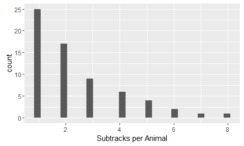
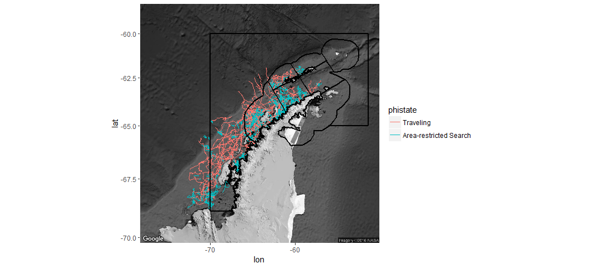
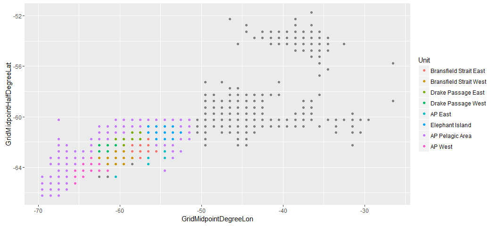
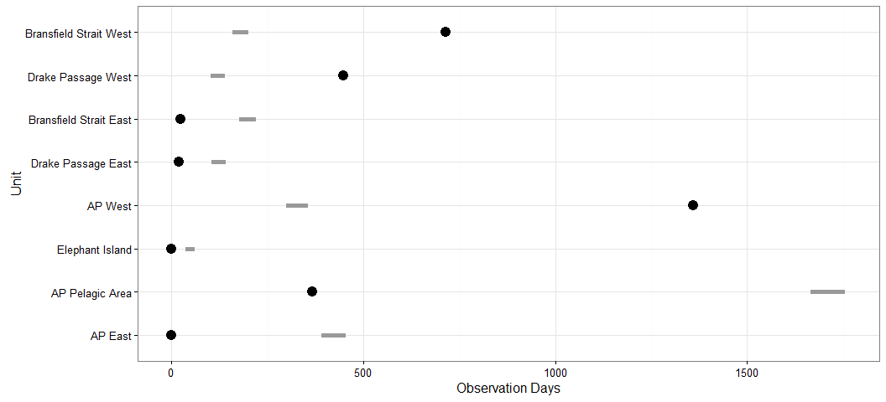

# Antarctic Whale Project: Single Species
Ben Weinstein  
`r Sys.time()`  


#Descriptive Statistics


<!-- -->

##By Month

<!-- -->

##Distance

<!-- -->

##Time 
<!-- -->

##Velocity
<!-- -->

##Angles

<!-- -->

#Correlated random walk

*Process Model*

$$ d_{t} \sim T*d_{t-1} + Normal(0,\Sigma)$$
$$ x_t = x_{t-1} + d_{t} $$

## Parameters

For each individual:

$$\theta = \text{Mean turning angle}$$
$$\gamma = \text{Move persistence} $$

For both behaviors process variance is:
$$ \sigma_{latitude} = 0.1$$
$$ \sigma_{longitude} = 0.1$$

##Behavioral States

$$ \text{For each individual i}$$
$$ Behavior_1 = \text{traveling}$$
$$ Behavior_2 = \text{foraging}$$

$$ \alpha_{i,1,1} = \text{Probability of remaining traveling when traveling}$$
$$\alpha_{i,2,1} = \text{Probability of switching from Foraging to traveling}$$

$$\begin{matrix}
  \alpha_{i,1,1} & 1-\alpha_{i,1,1} \\
  \alpha_{i,2,1} & 1-\alpha_{i,2,1} \\
\end{matrix}
$$

##Environment

Behavioral states are a function of local environmental conditions. The first environmental condition is ocean depth. I then build a function for preferential foraging in shallow waters.

It generally follows the form, conditional on behavior at t -1:

$$Behavior_t \sim Multinomial([\phi_{traveling},\phi_{foraging}])$$

With the probability of switching states:

$$logit(\phi_{traveling}) = \alpha_{Behavior_{t-1}} + \beta_{Month,1} * Ocean_{y[t,]} + \beta_{Month,2} * Coast_{y[t,]}$$

$$logit(\phi_{foraging}) = \alpha_{Behavior_{t-1}} $$

Following Bestley in preferring to describe the switch into feeding, but no estimating the resumption of traveling.

The effect of the environment is temporally variable such that

$$ \beta_{Month,2} \sim ~ Normal(\beta_{\mu},\beta_\tau)$$


##Continious tracks

The transmitter will often go dark for 10 to 12 hours, due to weather, right in the middle of an otherwise good track. The model requires regular intervals to estimate the turning angles and temporal autocorrelation. As a track hits one of these walls, call it the end of a track, and begin a new track once the weather improves. We can remove any micro-tracks that are less than three days.
Specify a duration, calculate the number of tracks and the number of removed points. Iteratively.


How did the filter change the extent of tracks?

<!-- -->

<!-- -->

<!-- --><!-- -->


sink("Bayesian/Multi_RW.jags")
cat("
    model{
    
    #Constants
    pi <- 3.141592653589
    
    ##argos observation error##
    argos_prec[1:2,1:2] <- inverse(argos_sigma*argos_cov[,])
    
    #Constructing the covariance matrix
    argos_cov[1,1] <- 1
    argos_cov[1,2] <- sqrt(argos_alpha) * rho
    argos_cov[2,1] <- sqrt(argos_alpha) * rho
    argos_cov[2,2] <- argos_alpha
    
    for(i in 1:ind){
    for(g in 1:tracks[i]){
    
    ## Priors for first true location
    #for lat long
    y[i,g,1,1:2] ~ dmnorm(argos[i,g,1,1,1:2],argos_prec)
    
    #First movement - random walk.
    y[i,g,2,1:2] ~ dmnorm(y[i,g,1,1:2],iSigma)
    
    ###First Behavioral State###
    state[i,g,1] ~ dcat(lambda[]) ## assign state for first obs
    
    #Process Model for movement
    for(t in 2:(steps[i,g]-1)){
    
    #Behavioral State at time T
    logit(phi[i,g,t,1]) <- alpha_mu[state[i,g,t-1]] + beta[Month[i,g,t-1],state[i,g,t-1]] * ocean[i,g,t] + beta2[Month[i,g,t-1],state[i,g,t-1]] * coast[i,g,t]
    phi[i,g,t,2] <- 1-phi[i,g,t,1]
    state[i,g,t] ~ dcat(phi[i,g,t,])
    
    #Turning covariate
    #Transition Matrix for turning angles
    T[i,g,t,1,1] <- cos(theta[state[i,g,t]])
    T[i,g,t,1,2] <- (-sin(theta[state[i,g,t]]))
    T[i,g,t,2,1] <- sin(theta[state[i,g,t]])
    T[i,g,t,2,2] <- cos(theta[state[i,g,t]])
    
    #Correlation in movement change
    d[i,g,t,1:2] <- y[i,g,t,] + gamma[state[i,g,t]] * T[i,g,t,,] %*% (y[i,g,t,1:2] - y[i,g,t-1,1:2])
    
    #Gaussian Displacement
    y[i,g,t+1,1:2] ~ dmnorm(d[i,g,t,1:2],iSigma)
    }
    
    #Final behavior state
    logit(phi[i,g,steps[i,g],1]) <- alpha_mu[state[i,g,steps[i,g]-1]] + beta[Month[i,g,steps[i,g]-1],state[i,g,steps[i,g]-1]] * ocean[i,g,steps[i,g]] + beta2[Month[i,g,steps[i,g]-1],state[i,g,steps[i,g]-1]] * coast[i,g,steps[i,g]]
    phi[i,g,steps[i,g],2] <- 1-phi[i,g,steps[i,g],1]
    state[i,g,steps[i,g]] ~ dcat(phi[i,g,steps[i,g],])
    
    ##	Measurement equation - irregular observations
    # loops over regular time intervals (t)    
    
    for(t in 2:steps[i,g]){
    
    # loops over observed locations within interval t
    for(u in 1:idx[i,g,t]){ 
    zhat[i,g,t,u,1:2] <- (1-j[i,g,t,u]) * y[i,g,t-1,1:2] + j[i,g,t,u] * y[i,g,t,1:2]
    
    #for each lat and long
    #argos error
    argos[i,g,t,u,1:2] ~ dmnorm(zhat[i,g,t,u,1:2],argos_prec)
    }
    }
    }
    }
    ###Priors###
    
    #Process Variance
    iSigma ~ dwish(R,2)
    Sigma <- inverse(iSigma)
    
    ##Mean Angle
    tmp[1] ~ dbeta(10, 10)
    tmp[2] ~ dbeta(10, 10)
    
    # prior for theta in 'traveling state'
    theta[1] <- (2 * tmp[1] - 1) * pi
    
    # prior for theta in 'foraging state'    
    theta[2] <- (tmp[2] * pi * 2)
    
    ##Move persistance
    # prior for gamma (autocorrelation parameter) in state 1
    gamma[2] ~ dbeta(1.5, 5)		## gamma for state 2
    dev ~ dbeta(1,1)			## a random deviate to ensure that gamma[1] > gamma[2]
    gamma[1] <- gamma[2] + dev 		## gamma for state 1
    
    
    #Monthly Covaraites
    for(x in 1:Months){
    beta[x,1]~dnorm(beta_mu[1],beta_tau[1])
    beta[x,2]<-0
    beta2[x,1]~dnorm(beta2_mu[1],beta2_tau[1])
    beta2[x,2]<-0
    }
    
    ##Behavioral States
    
    #Hierarchical structure across motnhs
    #Intercepts
    alpha_mu[1] ~ dnorm(0,0.386)
    alpha_mu[2] ~ dnorm(0,0.386)
    
    #Variance
    alpha_tau[1] ~ dt(0,1,1)I(0,)
    alpha_tau[2] ~ dt(0,1,1)I(0,)
    
    #Slopes
    ## Ocean Depth
    beta_mu[1] ~ dnorm(0,0.386)
    beta_mu[2] = 0
    
    # Distance coast
    beta2_mu[1] ~ dnorm(0,0.386)
    beta2_mu[2] = 0
    
    #Monthly Variance
    #Ocean
    beta_tau[1] ~ dt(0,1,1)I(0,)
    beta_tau[2] = 0
    
    #Coast
    beta2_tau[1] ~ dt(0,1,1)I(0,)
    beta2_tau[2]  = 0
    
    
    #Probability of behavior switching 
    lambda[1] ~ dbeta(1,1)
    lambda[2] <- 1 - lambda[1]
    
    ##Argos priors##
    #longitudinal argos error
    argos_sigma ~ dunif(0,10)
    
    #latitidunal argos error
    argos_alpha~dunif(0,10)
    
    #correlation in argos error
    rho ~ dunif(-1, 1)
    
    
    }"
    ,fill=TRUE)
sink()


```
##    user  system elapsed 
##    1.85    0.24  302.84
```


##Chains

```
##                         Type     Size    PrettySize  Rows Columns
## jagM          rjags.parallel 29711288 [1] "28.3 Mb"     6      NA
## mdat              data.frame 26066656 [1] "24.9 Mb" 57230      57
## m                      ggmap 13116432 [1] "12.5 Mb"  1280    1280
## d     SpatialPointsDataFrame  7933544  [1] "7.6 Mb"  8130      60
## oxy               data.frame  3443496  [1] "3.3 Mb"  7942      64
## sxy                     list  1994704  [1] "1.9 Mb"    21      NA
## mxy               grouped_df  1871176  [1] "1.8 Mb"  3803      69
## data                    list  1128208  [1] "1.1 Mb"    11      NA
## argos                  array   691176  [1] "675 Kb"     2      12
## obs                    array   691176  [1] "675 Kb"     2      12
```

```
##            used (Mb) gc trigger  (Mb) max used  (Mb)
## Ncells  1496363 80.0    2637877 140.9  2637877 140.9
## Vcells 12484315 95.3   39320772 300.0 56648713 432.2
```

```
##           used (Mb) gc trigger  (Mb) max used  (Mb)
## Ncells 1491440 79.7    2637877 140.9  2637877 140.9
## Vcells 9601044 73.3   31456617 240.0 56648713 432.2
```

<!-- -->


<!-- -->

###Compare to priors

<!-- -->

## Parameter Summary

```
##    parameter         par        mean       lower       upper
## 1   alpha_mu alpha_mu[1] -0.96186842 -3.50549371  1.63657003
## 2   alpha_mu alpha_mu[2]  0.59121895 -1.79674752  3.24489361
## 3       beta   beta[1,1]  0.21538466 -2.85255567  2.88795455
## 4       beta   beta[2,1]  0.53873503 -2.47186522  3.37309464
## 5       beta   beta[3,1]  0.45485619 -2.19903357  3.35863224
## 6       beta   beta[4,1]  0.55599632 -2.24198234  3.48079918
## 7       beta   beta[5,1]  0.16276653 -2.80347699  3.29991559
## 8       beta   beta[1,2]  0.00000000  0.00000000  0.00000000
## 9       beta   beta[2,2]  0.00000000  0.00000000  0.00000000
## 10      beta   beta[3,2]  0.00000000  0.00000000  0.00000000
## 11      beta   beta[4,2]  0.00000000  0.00000000  0.00000000
## 12      beta   beta[5,2]  0.00000000  0.00000000  0.00000000
## 13   beta_mu  beta_mu[1]  0.38788331 -1.76786224  2.55801932
## 14   beta_mu  beta_mu[2]  0.00000000  0.00000000  0.00000000
## 15     beta2  beta2[1,1] -1.85955323 -4.37682736 -0.22298533
## 16     beta2  beta2[2,1] -1.78439248 -4.17171631 -0.49847004
## 17     beta2  beta2[3,1] -1.85084633 -4.18411487 -0.42928758
## 18     beta2  beta2[4,1] -1.73403601 -4.17343944 -0.24105829
## 19     beta2  beta2[5,1] -1.07793301 -4.25671057  0.30968408
## 20     beta2  beta2[1,2]  0.00000000  0.00000000  0.00000000
## 21     beta2  beta2[2,2]  0.00000000  0.00000000  0.00000000
## 22     beta2  beta2[3,2]  0.00000000  0.00000000  0.00000000
## 23     beta2  beta2[4,2]  0.00000000  0.00000000  0.00000000
## 24     beta2  beta2[5,2]  0.00000000  0.00000000  0.00000000
## 25  beta2_mu beta2_mu[1] -1.50654379 -3.75695277 -0.28775758
## 26  beta2_mu beta2_mu[2]  0.00000000  0.00000000  0.00000000
## 27     gamma    gamma[1]  1.06718093  0.78679965  1.41921474
## 28     gamma    gamma[2]  0.37542745  0.19924033  0.53489391
## 29     theta    theta[1] -0.00444458 -0.08423803  0.09554119
## 30     theta    theta[2]  3.29740006  0.34551004  6.17409858
```

<!-- -->

#Behavior and environment

##Hierarchical 

### Ocean Depth
<!-- --><!-- -->

### Distance to Coast
<!-- --><!-- -->

###Interaction

<!-- -->

## By Month

### Depth

<!-- --><!-- -->

Just the probability of feeding when traveling.

<!-- -->

Just mean estimate.

<!-- --><!-- -->

### Coast

<!-- --><!-- -->

Zooming in on the top right plot.
<!-- --><!-- --><!-- -->

Just mean estimate.

<!-- --><!-- -->

#Behavioral Prediction


##Spatial Prediction

<!-- -->

### Per Animal

```
## $`1`
```

<!-- -->

```
## 
## $`2`
```

<!-- -->

##Log Odds of Foraging

### Ocean Depth

<!-- -->

### Distance From Coast

<!-- -->

##Autocorrelation in behavior

<!-- -->

##Behavioral description

##Location of Behavior

<!-- -->

#Environmental Prediction - Probability of Foraging across time


## Bathymetry

<!-- -->

## Distance to coast

<!-- -->

##All variables

<!-- -->

# Overlap with Krill Fishery
<!-- -->

<!-- -->

## By Month


## Change in foraging areas

Jan verus May

Red = Better Foraging in Jan
Blue = Better Foraging in May

<!-- -->

### Variance in monthly suitability

<!-- -->

### Mean suitability

<!-- -->

## Monthly Overlap with Krill Fishery

<!-- -->


```
##                            Type     Size      PrettySize   Rows Columns
## pc                       tbl_df 30309904   [1] "28.9 Mb" 540000      12
## mdat                 data.frame 26066656   [1] "24.9 Mb"  57230      57
## temp                      ggmap 13116048   [1] "12.5 Mb"   1280    1280
## d        SpatialPointsDataFrame  7933544    [1] "7.6 Mb"   8130      60
## oxy                  data.frame  3443496    [1] "3.3 Mb"   7942      64
## sxy                        list  1693456    [1] "1.6 Mb"      2      NA
## mxy                  data.frame  1669496    [1] "1.6 Mb"   3526      70
## allplot              grouped_df  1031880 [1] "1007.7 Kb"  19780       7
## monthras                   list   858576  [1] "838.5 Kb"      5      NA
## mdf                  data.frame   650704  [1] "635.5 Kb"   9515      11
```

```
##            used  (Mb) gc trigger  (Mb)  max used   (Mb)
## Ncells  1621821  86.7    5289763 282.6  16143078  862.2
## Vcells 20087661 153.3  120833612 921.9 271028039 2067.8
```
