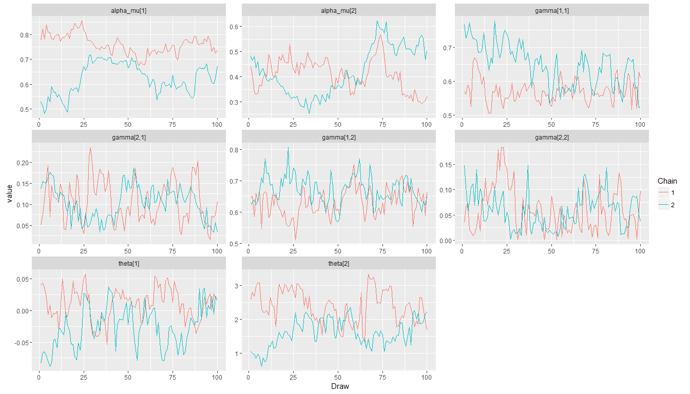
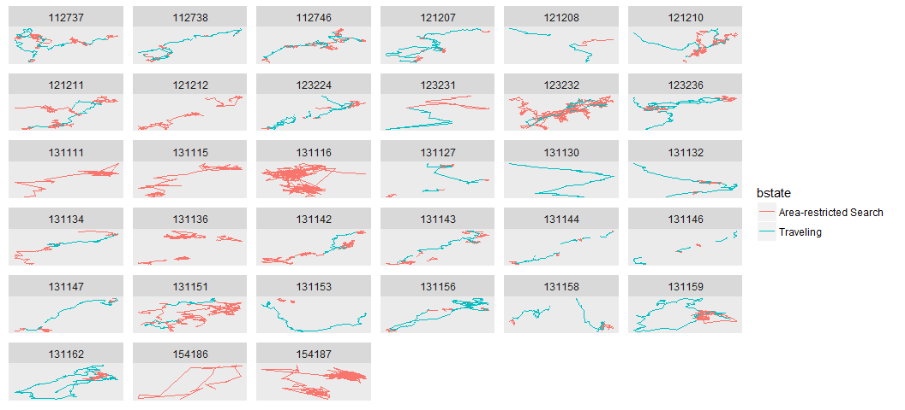
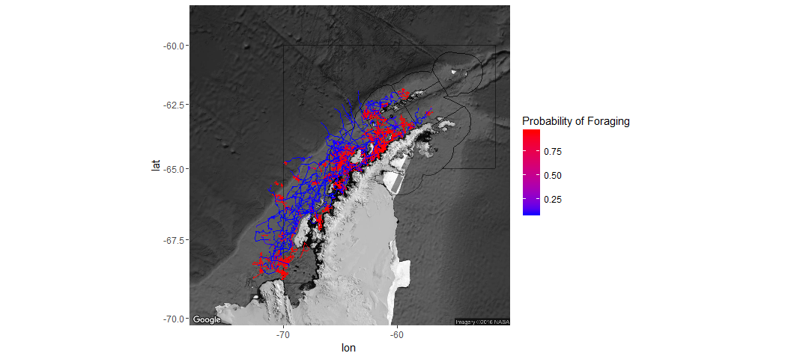
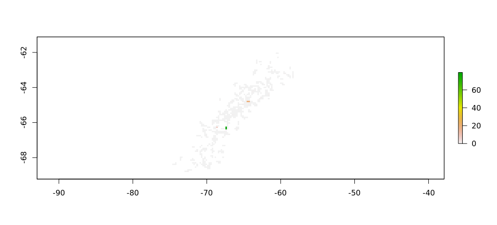

# Antarctic Whale Project: Single Species
Ben Weinstein  
`r Sys.time()`  


#Abstract


#Descriptive Statistics


<!-- -->

##Distance

<!-- -->

##Time 
<!-- -->

##Velocity
<!-- -->

##Angles

<!-- -->

#Correlated random walk

*Process Model*

$$ d_{t} \sim T*d_{t-1} + Normal(0,\Sigma)$$
$$ x_t = x_{t-1} + d_{t} $$

## Parameters

For each individual:

$$\theta = \text{Mean turning angle}$$
$$\gamma = \text{Move persistence} $$

For both behaviors process variance is:
$$ \sigma_{latitude} = 0.1$$
$$ \sigma_{longitude} = 0.1$$

##Behavioral States

$$ \text{For each individual i}$$
$$ Behavior_1 = \text{traveling}$$
$$ Behavior_2 = \text{foraging}$$

$$ \alpha_{i,1,1} = \text{Probability of remaining traveling when traveling}$$
$$\alpha_{i,2,1} = \text{Probability of switching from feeding to traveling}$$

$$\begin{matrix}
  \alpha_{i,1,1} & 1-\alpha_{i,1,1} \\
  \alpha_{i,2,1} & 1-\alpha_{i,2,1} \\
\end{matrix}
$$

##Environment

Behavioral states are a function of local environmental conditions. The first environmental condition is ocean depth. I then build a function for preferential foraging in shallow waters.

It generally follows the form, conditional on behavior at t -1:

$$Behavior_t \sim Multinomial([\phi_{traveling},\phi_{foraging}])$$
$$logit(\phi_{traveling}) = \alpha_{Behavior_{t-1}} + \beta_1 * Ocean_{y[t,]}$$
$$logit(\phi_{foraging}) = \alpha_{Behavior_{t-1}} + \beta_2 * Ocean_{y[t,]}$$


##Continious tracks

The transmitter will often go dark for 10 to 12 hours, due to weather, right in the middle of an otherwise good track. The model requires regular intervals to estimate the turning angles and temporal autocorrelation. As a track hits one of these walls, call it the end of a track, and begin a new track once the weather improves. We can remove any micro-tracks that are less than three days.
Specify a duration, calculate the number of tracks and the number of removed points. Iteratively.


How did the filter change the extent of tracks?

<!-- -->

<!-- -->

<!-- --><!-- -->


sink("Bayesian/Multi_RW.jags")
cat("
    model{
    
    #Constants
    pi <- 3.141592653589
    
    ##argos observation error##
    argos_prec[1:2,1:2] <- inverse(argos_sigma*argos_cov[,])
    
    #Constructing the covariance matrix
    argos_cov[1,1] <- 1
    argos_cov[1,2] <- sqrt(argos_alpha) * rho
    argos_cov[2,1] <- sqrt(argos_alpha) * rho
    argos_cov[2,2] <- argos_alpha
    
    for(i in 1:ind){
      for(g in 1:tracks[i]){

        ## Priors for first true location
        #for lat long
        y[i,g,1,1:2] ~ dmnorm(argos[i,g,1,1,1:2],argos_prec)

        #First movement - random walk.
        y[i,g,2,1:2] ~ dmnorm(y[i,g,1,1:2],iSigma)
        
        ###First Behavioral State###
        state[i,g,1] ~ dcat(lambda[]) ## assign state for first obs
        
        #Process Model for movement
        for(t in 2:(steps[i,g]-1)){
        
        #Behavioral State at time T
        logit(phi[i,g,t,1]) <- alpha_mu[state[i,g,t-1]] + beta_mu[state[i,g,t-1]] * ocean[i,g,t] + beta2_mu[state[i,g,t-1]] * coast[i,g,t]
        phi[i,g,t,2] <- 1-phi[i,g,t,1]
        state[i,g,t] ~ dcat(phi[i,g,t,])
            
        #Turning covariate
        #Transition Matrix for turning angles
        T[i,g,t,1,1] <- cos(theta[state[i,g,t]])
        T[i,g,t,1,2] <- (-sin(theta[state[i,g,t]]))
        T[i,g,t,2,1] <- sin(theta[state[i,g,t]])
        T[i,g,t,2,2] <- cos(theta[state[i,g,t]])
        
        #Correlation in movement change
        d[i,g,t,1:2] <- y[i,g,t,] + gamma[state[i,g,t]] * T[i,g,t,,] %*% (y[i,g,t,1:2] - y[i,g,t-1,1:2])
        
        #Gaussian Displacement
        y[i,g,t+1,1:2] ~ dmnorm(d[i,g,t,1:2],iSigma)
      }

    #Final behavior state
    logit(phi[i,g,steps[i,g],1]) <- alpha_mu[state[i,g,steps[i,g]-1]] + beta_mu[state[i,g,steps[i,g]-1]] * ocean[i,g,steps[i,g]] + beta2_mu[state[i,g,steps[i,g]-1]] * coast[i,g,steps[i,g]]
    phi[i,g,steps[i,g],2] <- 1-phi[i,g,steps[i,g],1]
    state[i,g,steps[i,g]] ~ dcat(phi[i,g,steps[i,g],])
    
    ##	Measurement equation - irregular observations
    # loops over regular time intervals (t)    
    
    for(t in 2:steps[i,g]){
    
    # loops over observed locations within interval t
    for(u in 1:idx[i,g,t]){ 
      zhat[i,g,t,u,1:2] <- (1-j[i,g,t,u]) * y[i,g,t-1,1:2] + j[i,g,t,u] * y[i,g,t,1:2]

        #for each lat and long
          #argos error
          argos[i,g,t,u,1:2] ~ dmnorm(zhat[i,g,t,u,1:2],argos_prec)
          }
        }
      }
    }
    ###Priors###

    #Process Variance
    iSigma ~ dwish(R,2)
    Sigma <- inverse(iSigma)
    
    ##Mean Angle
    tmp[1] ~ dbeta(10, 10)
    tmp[2] ~ dbeta(10, 10)
    
    # prior for theta in 'traveling state'
    theta[1] <- (2 * tmp[1] - 1) * pi
    
    # prior for theta in 'foraging state'    
    theta[2] <- (tmp[2] * pi * 2)
    
    ##Move persistance
    # prior for gamma (autocorrelation parameter) in state 1
    gamma[1] ~ dbeta(10,5)
    
    # prior for gamma in state 2
    gamma[2] ~ dbeta(1,10)
    
    ##Behavioral States
    # Following lunn 2012 p85
    
    #Hierarchical structure
    #Intercepts
    alpha_mu[1] ~ dnorm(0,0.386)
    alpha_mu[2] ~ dnorm(0,0.386)

    #Variance
    alpha_tau[1] ~ dt(0,1,1)I(0,)
    alpha_tau[2] ~ dt(0,1,1)I(0,)

    #Slopes
    ## Ocean Depth
    beta_mu[1] ~ dnorm(0,0.386)
    beta_mu[2] ~ dnorm(0,0.386)

    # Distance coast
    beta2_mu[1] ~ dnorm(0,0.386)
    beta2_mu[2] ~ dnorm(0,0.386)

    #Variance
    #Ocean
    beta_tau[1] ~ dt(0,1,1)I(0,)
    beta_tau[2] ~ dt(0,1,1)I(0,)
    
    #Coast
    beta2_tau[1] ~ dt(0,1,1)I(0,)
    beta2_tau[2] ~ dt(0,1,1)I(0,)
    
    
    #Probability of behavior switching 
    lambda[1] ~ dbeta(1,1)
    lambda[2] <- 1 - lambda[1]

    ##Argos priors##
    #longitudinal argos error
    argos_sigma ~ dunif(0,10)
    
    #latitidunal argos error
    argos_alpha~dunif(0,10)
    
    #correlation in argos error
    rho ~ dunif(-1, 1)
    

    }"
    ,fill=TRUE)
sink()


```
##       user     system    elapsed 
##   1212.037      4.584 122067.216
```

##Chains
<!-- -->

<!-- -->

###Compare to priors

<!-- -->

## Parameter Summary

```
## Source: local data frame [10 x 5]
## Groups: parameter [?]
## 
##    parameter         par         mean         lower       upper
##       (fctr)      (fctr)        (dbl)         (dbl)       (dbl)
## 1   alpha_mu alpha_mu[1] -0.121062919 -0.5289181044  0.38412140
## 2   alpha_mu alpha_mu[2] -2.269367540 -3.2922714312 -1.62113276
## 3   beta2_mu beta2_mu[1]  0.021473080  0.0053168234  0.03456499
## 4   beta2_mu beta2_mu[2]  0.031230604 -0.0036363272  0.07746797
## 5    beta_mu  beta_mu[1] -0.222112604 -0.5807378928  0.18837098
## 6    beta_mu  beta_mu[2] -0.191951711 -1.3149906999  1.03141764
## 7      gamma    gamma[1]  0.861224251  0.8252828618  0.89696877
## 8      gamma    gamma[2]  0.011704986  0.0007335671  0.02990550
## 9      theta    theta[1] -0.002607481 -0.0251237339  0.02262511
## 10     theta    theta[2]  2.848383040  1.7549482402  4.13887458
```

<!-- -->

##Behavior and environment

### Ocean Depth
<!-- --><!-- -->

### Distance to Coast
<!-- --><!-- -->

#Behavioral Prediction


###Correlation in posterior switching and state

<!-- --><!-- -->

##Spatial Prediction

### Per Animal

```
## $`1`
```

<!-- -->

```
## 
## $`3`
```

<!-- -->

```
## 
## $`4`
```

<!-- -->

```
## 
## $`7`
```

<!-- -->

```
## 
## $`8`
```

<!-- -->

```
## 
## $`9`
```

<!-- -->

```
## 
## $`10`
```

<!-- -->

```
## 
## $`11`
```

<!-- -->

```
## 
## $`12`
```

<!-- -->

```
## 
## $`13`
```

<!-- -->

```
## 
## $`14`
```

<!-- -->

```
## 
## $`15`
```

<!-- -->

```
## 
## $`16`
```

<!-- -->

```
## 
## $`17`
```

<!-- -->

```
## 
## $`18`
```

<!-- -->

```
## 
## $`19`
```

<!-- -->

```
## 
## $`20`
```

<!-- -->

```
## 
## $`21`
```

<!-- -->

```
## 
## $`22`
```

<!-- -->

```
## 
## $`23`
```

<!-- -->

```
## 
## $`24`
```

<!-- -->

```
## 
## $`25`
```

<!-- -->

```
## 
## $`26`
```

<!-- -->

```
## 
## $`27`
```

<!-- -->

```
## 
## $`28`
```

<!-- -->

```
## 
## $`29`
```

<!-- -->

```
## 
## $`30`
```

<!-- -->

```
## 
## $`31`
```

<!-- -->

```
## 
## $`32`
```

<!-- -->

```
## 
## $`33`
```

<!-- -->

```
## 
## $`34`
```

<!-- -->

```
## 
## $`35`
```

<!-- -->

```
## 
## $`36`
```

<!-- -->

```
## 
## $`37`
```

<!-- -->

```
## 
## $`38`
```

<!-- -->

```
## 
## $`39`
```

<!-- -->

```
## 
## $`40`
```

<!-- -->

```
## 
## $`41`
```

<!-- -->

```
## 
## $`42`
```

<!-- -->

##Log Odds of Feeding

### Ocean Depth

<!-- -->

### Distance From Coast

<!-- -->

###Interaction

No estimate of uncertainty.
<!-- -->

##Autocorrelation in behavior

<!-- -->

##Behavioral description

## Predicted behavior duration


<!-- -->

##Location of Behavior

<!-- -->

#Environmental Prediction - Probability of feeding


## Bathymetry

### When traveling
<!-- -->

### When Feeding

<!-- --><!-- -->

## Distance to coast

### When traveling
<!-- -->

### When Feeding

<!-- --><!-- -->

##All variables

### When traveling


```
## [[1]]
```

<!-- -->

```
## 
## [[2]]
```

<!-- -->

###When Feeding


```
## [[1]]
```

<!-- -->

```
## 
## [[2]]
```

<!-- -->

#Krill Fishery
<!-- -->


```
##             used   (Mb) gc trigger   (Mb)  max used   (Mb)
## Ncells   1966378  105.1    6459279  345.0   8995720  480.5
## Vcells 497803257 3798.0  825548328 6298.5 825511520 6298.2
```
