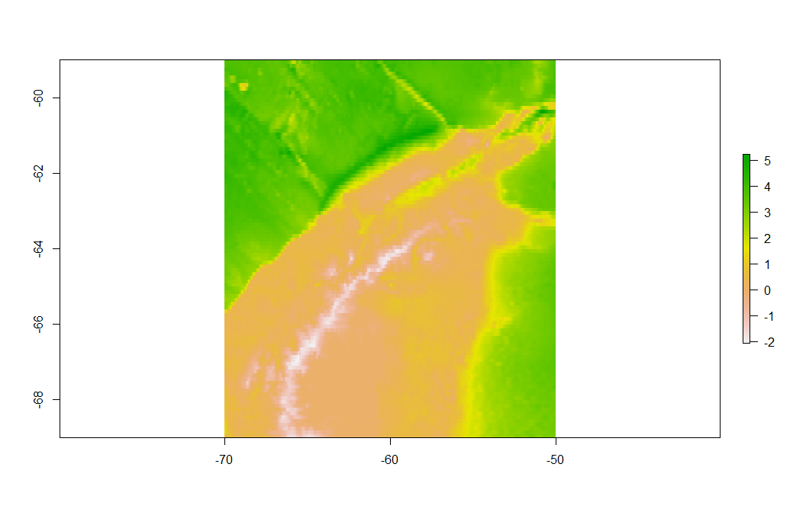
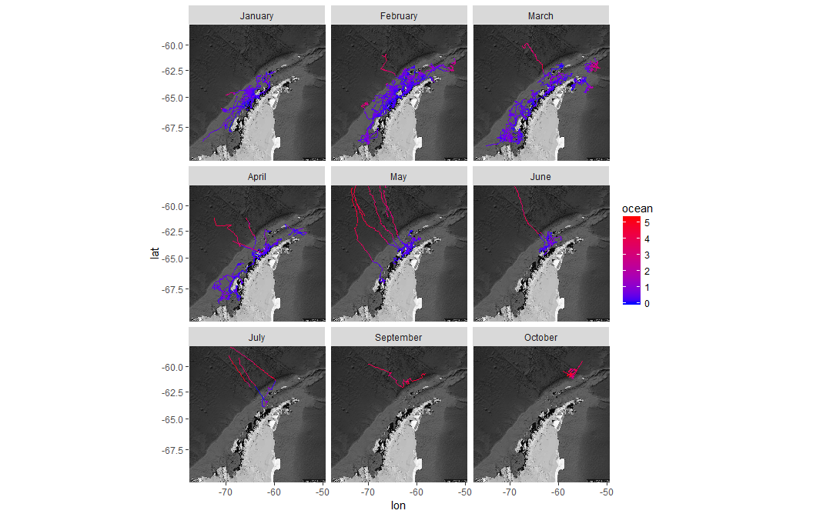
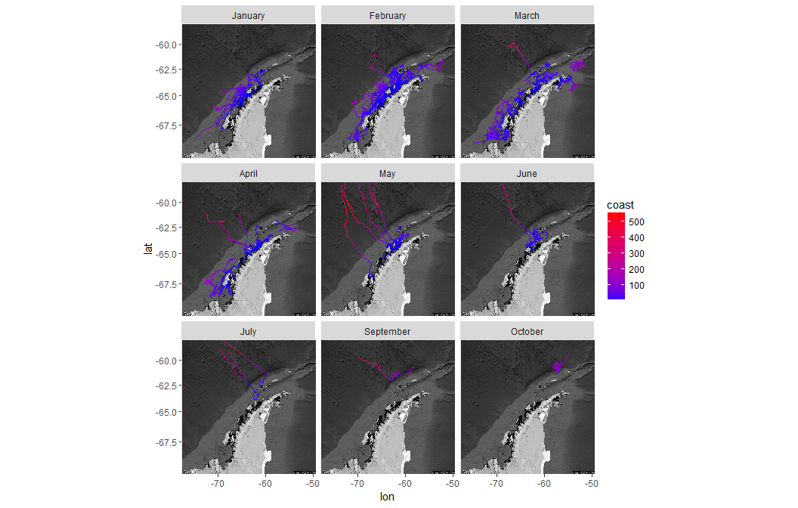
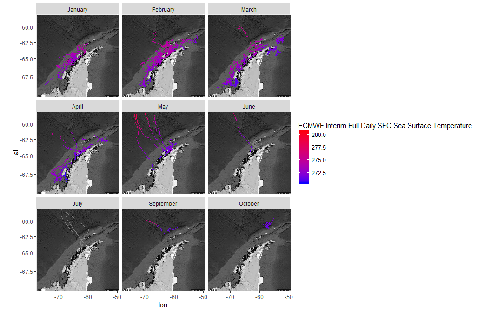
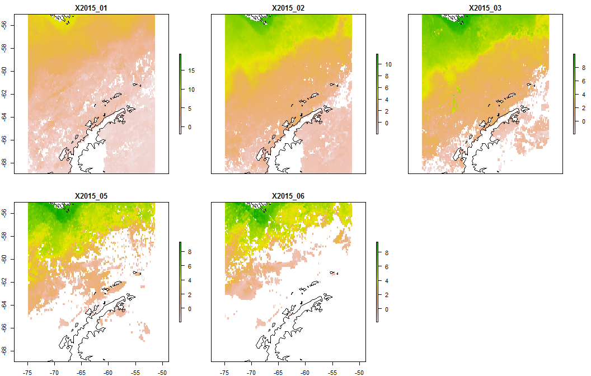
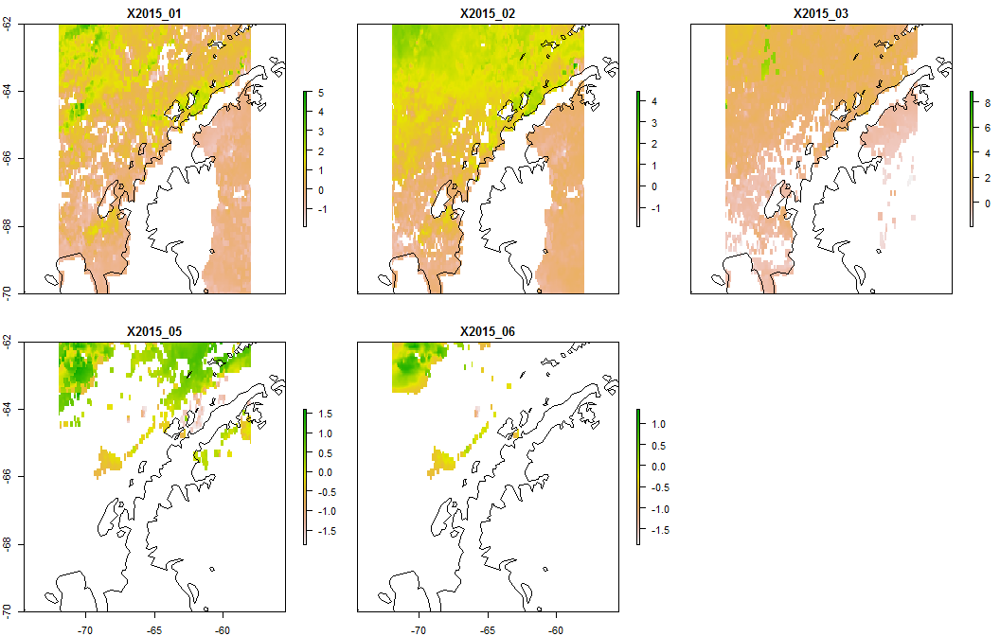
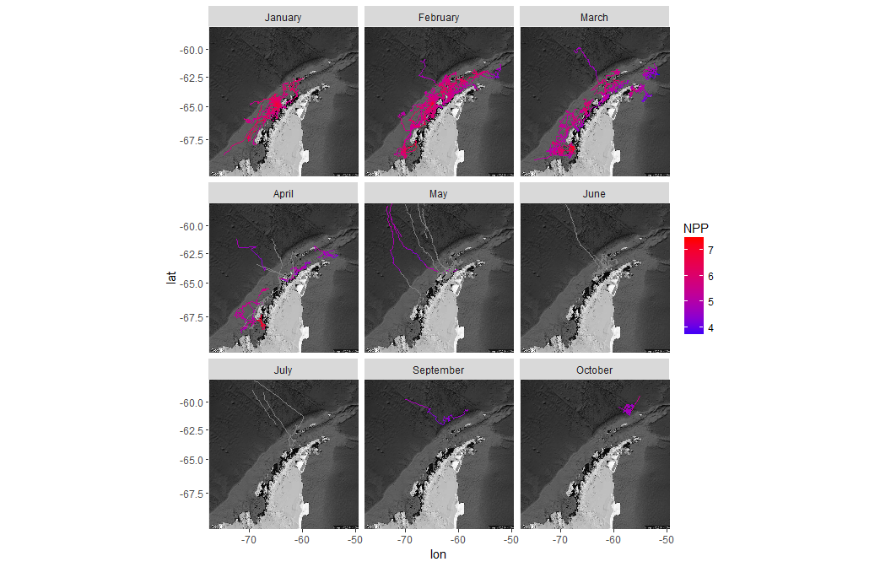
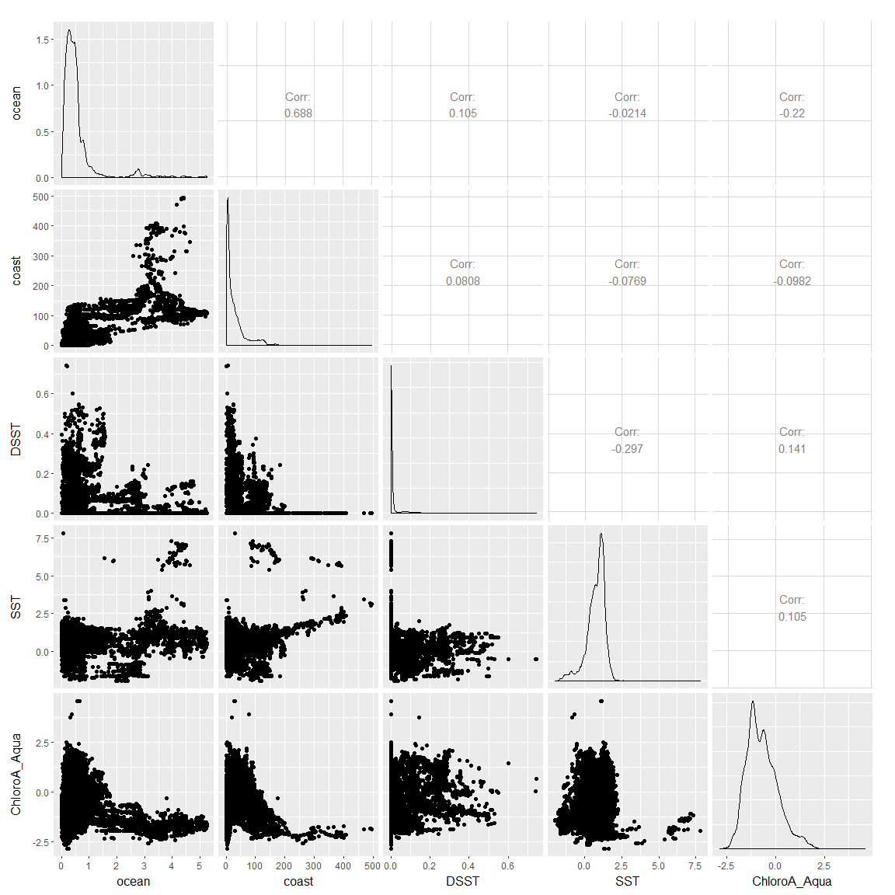

# Antarctic Whale Project: Single Species
Ben Weinstein  
`r Sys.time()`  

# Bathymetry
<!-- --><!-- -->

# Distance to coast

<!-- -->

# Daily Sea surface temperature
<!-- -->

# Monthly Sea surface temperature
<!-- --><!-- -->

Zoom in on just the foraging area
<!-- -->

# Chlorophyll A

##Aqua Sensor
<!-- --><!-- -->

# NPP
<!-- -->

###Correlation matrix
<!-- -->

<!-- -->

